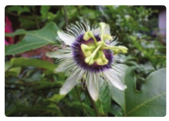

# Angiosperms

In the previous section, the characteristic features of one of the spermatophyte called Gymnosperms were discussed.

Spermatophytes also include plants bearing ovules enclosed in a protective cover called ovary, such plants are called Angiosperms. They constitute major plant group of our earth and are adapted to the terrestrial mode of life. This group of plants appeared during the early cretaceous period (140 million years ago) and dominates the vegetation on a global scale. The sporophyte is the dominant phase and gametophyte is highly reduced.

## Salient features of Angiosperms

- Vascular tissue (Xylem and Phloem) is well developed.
- Flowers are produced instead of con.
- The Ovule remains enclosed in the ovary.
- Pollen tube helps in fertilization, so water is not essential for fertilization.
- Double fertilization is present. The endosperm is triploid.
- Angiosperms are broadly classified into two classes namely Dicotyledons and Monocotyledons.

## Characteristic features of Dicotyledons and Monocotyledons

**Dicotyledons**
**Morphological features**

Reticulate venation is present in the leaves. Presence of two cotyledons in the seed. Primary root radicle persists as tap root. Flowers tetramerous or pentamerous. Tricolpate (3 furrow) pollen is present.

**Anatomical features**

- Vascular bundles are arranged in the form of a ring in stem.
- Vascular bundles are open (Cambium present).
- Secondary growth is present.

**Monocotyledons Morphological features**

Parallel venation is present in the leaves. Presence of single cotyledon in the seed. Radicle doesn’t persist and fibrous root is present.Flowers trimerous. Monocolpate (1 furrow) Pollen is present.

**Anatomical features**.

- Vascular bundles are scattered in the ste.
- Vascular bundles are closed (Cambium absent).
- Secondary growth is absent.

Current Angiosperm Phylogeny Group (APG) System of classification doesn’t recognize dicots as a monophyletic group. Plants that are traditionally classified under dicots are dispersed in several clades such as early Magnolids and Eudicots.