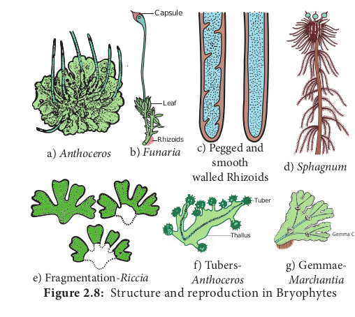
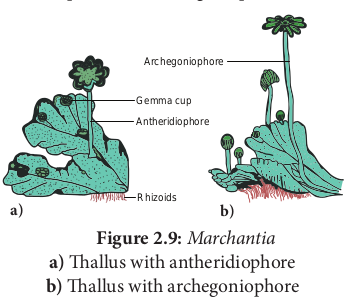
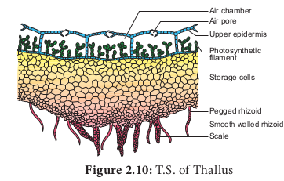
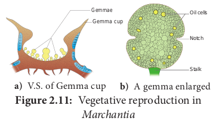
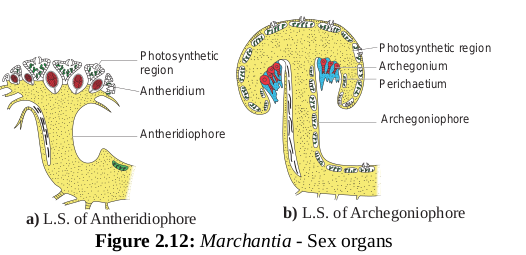
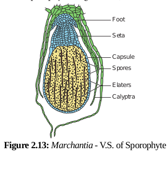
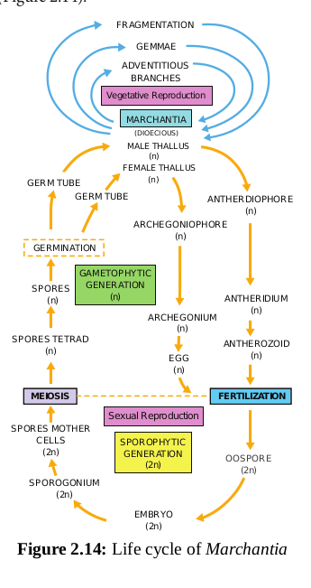

<<<<<<< HEAD:content.en/plant-kingdom/bryophytes/bryophytes.md

# Bryophytes

Amphibians of Plant Kingdom
In the previous chapter, we noticed a wide range of thallus organization in Algae. Majority of them are aquatic. The development of heterotrichous habit, development of parenchyma tissue and dichotomous branching in some algae supports the view that colonization of plants in land occurred in the past. Bryophytes are simplest and most primitive plant groups descended from alga – like ancestors. They are simple embryophytes. Let us learn about the structure and reproduction of these primitive land plants called Bryophytes in detail.

Bryophytes are simplest land inhabiting cryptogams and are restricted to moist, shady habitats. They lack vascular tissue and hence called **‘Non- vascular cryptogams’**. They are also called as ‘**amphibians of plant kingdom’** because they need water for completing their life cycle.

> **Shiv Ram Kashyap (1882-1934)**
> 
> Father of Indian Bryology. He published a book- ‘Liverworts of Western Himalayas and Punjab Plains’ He identified new genera like _Atchinsoniella, Sauchia, Sewardiella_ and _Stephansoniella._

## General characteristic features

- The plant body of bryophyte is gametophyte and is not differentiated into root, stem and leaf like structure.

- Most of them are primitive land dwellers. Some of them are aquatic (_Riella, Ricciocarpus_).

- The gametophyte is conspicuous, long lived phase of the life cycle. Thalloid forms are present in liverworts and Hornworts. In Mosses leaf like, stem like structures are present. In Liverworts thallus grows prostrate on the ground and is attached to the substratum by means of rhizoids. Two types of rhizoids are present namely smooth walled and pegged or tuberculate. Multicellular scales are also present. In Moss the plant body is erect with central axis bearing leaf like expansions. Multicellular rhizoids are present. The structure and reproduction in Bryophytes is given in Figure 2.8

- Vascular tissue like xylem and phloem are completely absent, hence called ‘Non vascular cryptogams’.

- Vegetative reproduction takes place by the formation of adventitious buds (_Riccia fluitans_) tubers develop in _Anthoceros._ In some forms small detachable branches or brood bodies are formed, they help in vegetative reproduction as in _Bryopteris fruticulosa_. In _Marchantia_ propagative organs called gemmae are formed and help in reproduction.

- Sexual reproduction is oogamous. Antheridia and Archegonia are produced in a protective covering and are multicellular.

- The antheridia produces biflagellate antherozoids which swims in thin film of water and reach the archegonium and fuse with the egg to form diploid zygote.

- Water is essential for fertilization.

- The zygote is the first cell of the sporophyte generation. It undergoes mitotic division to form multicellular undifferentiated embryo. The embryogeny is exoscopic (the first division of the zygote is transverse and the apex of the embryo develops from the outer cell). The embryo divides and give rise to sporophyte.

- The sporophyte is dependent on gametophyte.

- It is differentiated into three recognizable parts namely foot, seta and capsule.

- Foot is the basal portion and is embedded in the gametophyte through which water and nutrients are supplied for the sporophyte. The diploid spore mother cells found in the capsule region undergoes meiotic division and give rise to haploid spores. Bryophytes are homosporous. In some sporophytes elaters are present and help in dispersal of spores (Example: _Marchantia_). The spores germinate to produce gametophyte.

- The zygote, embryo and the sporogonium constitute sporophytic phase. The green long living haploid phase is called gametophytic phase. The haploid gametophytic phase alternates with diploid sporophyte and shows heterologous alternation of generation.

## Classification of Bryophytes

Proskauer in the year 1957 classified Bryophytes into 3 Classes namely

i. **Hepaticopsida** (_Riccia, Marchantia, Porella_ and _Riella_)

ii. **Anthocerotopsida** (_Anthoceros_ and _Dendroceros_)

iii. **Bryopsida** (_Funaria, Polytrichum_ and _Sphagnum_).

The outline of the classification is given below



stateDiagram-v2
Bryophyta --> Hepaticopsida
Bryophyta --> Anthocerotopsida
Bryophyta --> Bryopsida
Hepaticopsida --> Liverworts
Anthocerotopsida --> Hornworts
Bryopsida --> Mosses



**Class: Hepaticopsida**
They are lower forms of Bryophytes. They are more simple in structure than mosses and more confined to damp and shady places. They have an undifferentiated thallus. Protonernal stage is absent. Sporophyte is very simple and short lived. In some, the foot and seta are absent. Example _Riccia_.

**Class: Anthocerotopsida**
Gametophyte is an undifferentiated thallus. Rhizoids are unicellular and unbranched. Protonemal stage is absent. Sporophyte is differentiated into foot and capsule and seta is absent Example: _Anthoceros_.

**Class: Bryopsida**
These are higher forms in which the gametophyte is differentiated into ‘stem’ like and ’leaf ’ like parts and the former showing radial symmetry. Rhizoids are multi-cellular and branched. Protonemal stage is present. Sporophyte is differentiated into foot, seta and capsule. They have more differentiated structure than liverworts. They often form dense cushions. Example: _Funaria_.

## Economic importance

Dead thalli of _Sphagnum_ gets accumulated and compressed, hardened to form peat. In northern Europe (Netherlands)peat is used as fuel in commercial scale. Apart from this nitrates, brown dye and tanning materials are derived from peat. _Sphagnum_ and peat are also used in horticulture as packing material because of their water holding capacity. _Marchantia polymorpha_ is used to cure pulmonary tuberculosis. _Sphagnum_, _Bryum_ and _Polytrichum_ are used as food. Bryophytes play a major role in soil formation through succession and help in soil conservation.

> **Do You Know ?**
> _Buxbaumia aphylla_ and _Cryptothallus mirabilis_ are saprophytic bryophytes

## Marchantia

Class - Hepaticopsida
Order - Marchantiales
Family - Marchantiaceae
Genus - _Marchantia_

_Marchantia_ grows in cool moist shady places. _Marchantia polymorpha_ is the common species.

**Gametophyte**

The plant body of Marchantia is a gametophyte. It is prostrate,dorsiventral and dichotomously branched. The thallus on the dorsal surface possess conspicuous median midrib which is marked by a shallow groove on dorsal surface. The dorsal surface appears to have rhomboidal or polygonal diamond shaped areas which indicate the outline of the underlying air chambers of the thallus \(Figure 2.9).

The dorsal surface also shows crescent shaped structures called gemma cups which contain vegetative reproductive structures called gemmae. The apical notch bears an apical cell which helps in the growth of the thallus.The ventral surface the thallus bears multicellular scales and rhizoids which help in fixation and absorption of water and minerals. The rhizoids are of two types namely smooth walled or pegged (tuberculate) type. On maturation the thallus bears erect antheriophores and archegoniophores.

**Internal structure of Thallus**

In transverse section the _Marchantia_ thallus shows three parts namely: epidermis, photosynthetic region and storage region (Figure 2.10).

The epidermis has the upper and lower layers. The upper epidermis is single layered with thin walled parenchymatous cells. The cells possess chloroplasts. The upper epidermis is interrupted by many barrel shaped air pores which communicate with the air chambers. The pore is surrounded by 4 to 8 superimposed tiers of cells. Below the upper epidermis a number of air chambers are present in a single horizontal layer.

The floor of the chambers bears simple or branched green filaments. Cells of filaments are involved in photosynthesis. The photosynthetic region is followed by storage region. It is made up of several parenchymatous cells arranged without intercellular spaces. The cells of this region contain starch grains and protein granules. The lower epidermis possesses rhizoids and multicellular scales.
**Reproduction**
_Marchantia_ reproduces by vegetative and sexual methods.

1.  Vegetative reproduction takes place by progressive death and decay of thallus, formation of adventitious branches and by germination of gemmae. Death and decay of the thallus starts from posterior end. When it reach the point of dichotomy, two apical parts of the thallus get separated. Each one develops into an independent thallus. Adventitious branches are produced on the ventral surface of the gametophyte. The branches get separated from the parent thallus and grow into independent gametophytes. Gemmae are specialized multicellular asexual reproductive bodies. They are formed in small cupules known as gemma cups, present on the dorsal surface of the thallus. Usually the gemmae present on the male thallus form male plants and those on the female thallus give rise to female plants (Figure 2.11).

**1. Sexual reproduction:**
In _Marchantia_, sex organs are borne on special stalked receptacles called the gametophores. Those bearing antheridia are called antheridiophores and archegonia bearing structures are called archegoniophores _(Figure 2.12). Marchantia_ is heterothallic or dioecious. i.e., male and female receptacles are present on different thalli. The sex organs in bryophytes are multicellular. The Male sex organ is called antheridium. It produce biflagellate antherozoids. The Female sex organ is flask shaped called archegonium and produces a single egg. Water is essential for fertilization. The antherozoids are released into water and are attracted towards archegonium through chemotaxis. Although many antherozoids enter the archegonium, only one fuses with the egg to form zygote. The zygote represents the first cell of the sporophytic generation. Zygote develops in to a multicellular structure called sporophyte. (Figure 2.13).

The sporophyte is not free-living but attached to the photosynthetic gametophyte and derives nutrition from it. Sporophyte is differentiated into foot, seta and capsule. The foot is bulbous and is embedded in the gametophyte. It derives nutrition from the gametophyte and transfers to the sporophyte. Seta is short and connects foot and capsule. The capsule consists of single layered jacket layer and encloses numerous haploid spores and elaters. The capsule is covered by protective covering called calyptra. On maturation the capsule dehisces and spores are released. Elaters helps in the dispersal of spores. The spores under favourable conditions germinate and develop into new gametophyte. The haploid gametophytic phase alternates with diploid sporophytic phase, thus the life cycle of _Marchantia_ shows alternation of generation \(Figure 2.14).

=======
>>>>>>> 3ee2295704d22ed4124a53d8ea463aace054e86b:content.en/plant-kingdom/bryophytes.md
