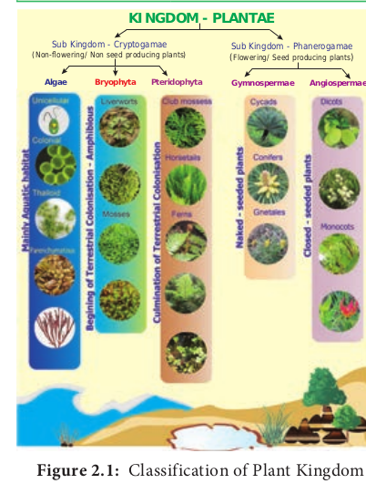

# Classification of Plants

Classification widely accepted for plants now include Embryophyta which is divided into Bryophyta and Tracheophyta. The latter is further divided into Pteridophyta and Spermatophyta (Gymnospermae and Angiospermae). An outline Classification of Plant Kingdom is given in Figure 2.1.

**Table 2.1: Total Number of Plant groups in the World and India**
|Plant group|Number of known species World#|India\*|
|------|-------|------|
|Algae|40,000|7,357|
|Bryophytes|16,236|2,748|
|Pteridophytes|12,000|1,289|
|Gymnosperms|1,012|79|
|Angiosperms|2,68,600|18,386|

