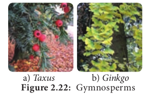

# Gymnosperms

**Naked seed producing Plants**

Michael Crichton’s Science Fiction is a book transformed into a Film of Steven Spielberg (1993) called **Jurassic Park**. In this film you might have noticed insects embedded in a transparent substance called amber which preserves the extinct forms. What is amber? Which group of plants produces Amber?

Amber is a plant secretion which is an efficient preservative that doesn’t get degraded and hence can preserve remains of extinct life forms. The amber is produced by **_Pinites succinifera_**, a Gymnosperm.

In this chapter we shall discuss in detail about one group of seed producing plants called **Gymnosperms**.

Gymnosperms (Gr. Gymnos = naked; sperma= seed) are naked seed producing plants. They were dominant in the Jurassic and Cretaceous periods of Mesozoic era. The members are distributed throughout the temperate and tropical region of the world

## General characteristic features

- Most of the gymnosperms are evergreen,woody trees or shrubs. Some are lianas (_Gnetum_)

- The plant body is sporophyte and is differentiated into root, stem and leaves.

- A well developed tap root system is present. Coralloid roots of _Cycas_ have symbiotic association with blue green algae. In _Pinus_ the roots have mycorrhizae.

- The stem is aerial, erect and branched or unbranched (_Cycas_) with leaf scars.

- In conifers two types of branches namely branches of limited growth (Dwarf shoot) and Branches of unlimited growth (Long shoot) is present.

- Leaves are dimorphic, foliage and scale leaves are present. Foliage leaves are green, photosynthetic and borne on branches of limited growth. They show xerophytic features.

- The xylem consists of tracheids but in _Gnetum_ and _Ephedra_ vessels are present.

- Secondary growth is present. The wood may be **Manoxylic** (Porous, soft, more parenchyma with wide medullary ray -_Cycas_) or **Pycnoxylic** (compact with narrow medullary ray-_Pinus_).

- They are heterosporous. The plant may be monoecious (_Pinus_) or dioecious (_Cycas_).

- Microsporangia and megasporangia are produced on microsporophyll and megasporophyll respectively.

- Male and female cones are produced.

- Anemophilous pollination is present.

- Fertilization is siphonogamous and pollen tube helps in the transfer of male nuclei.

- Polyembryony (presence of many embryo) is present. The naked ovule develops into seed. The **endosperm** is haploid and develop before fertilization.

- The life cycle shows alternation of generation. The sporophytic phase is dominant and gametophytic phase is highly reduced. The photograph of some of the gymnosperms is given in Figure 2.22

## Classification of Gymnosperms

Sporne (1965) classified gymnosperms into 3 classes, 9 orders and 31 families. The classes include i) Cycadospsida ii) Coniferopsida iii) Gnetopsida.

**GYMNOSPERMS**
|Class-I |Class-II |Class-III|
|---|---|---|
|**Cycadopsida**|**Coniferopsida**|**Gnetopsida** |
|Orders: 1. Pteridosper-males 2. Bennettitales 3. Pentoxylales 4. Cycadales|Orders: 1. Cordaitales 2. Coniferales 3. Taxales 4. Ginkgoales|Order: 1. Gnetales|

**General Characters of Main classes: Class I – Cycadopsida**

- Plants are palm-like or fern-like.
- Compound, frond-like pinnate leaves.
- Manoxylic wood.
- Sperms are motile.
- Flower like structures are absent. Strobili are simple. Example: _Cycas, Zamia_.

**Class II – Coniferopsida**

- Tall trees with simple leaves of varied shape.
- Wood is pycnoxylic.
- Cone like strobili are present.
- Motile sperms are absent (except _Ginkgo_ _biloba_). Example: _Pinus_.

**Class III – Gnetopsida**

- Shrubs, trees and lianas.
- Leaves are elliptical or strap-shaped,simple, opposite or whorled.
- Motile sperms are absent.
- Wood contains vessels.
- Strobili is called as inflorescence.
- Flower like structure with perianth is present. Example: _Gnetum, Ephedra_.

## Comparison of Gymnosperm with Angiosperms
**Gymnosperms resemble with angiosperms in the following features**

**Table 2.5: Difference between Gymnosperms and Angiosperms**
|S.No|Gymnosperms|Angiosperms|
|----|----|----|
|1.|Vessels are absent [except Gnetales]|Vessels are present|
|2.|Phloem lacks companion cells|Companion cells are present|
|3.|Ovules are naked |Ovules are enclosed within the ovary|
|4.|Wind pollination only|Insects, wind, water, animals etc., act as pollinating agents|
|5.|Double fertilization is absent |Double fertilization is present|
|6.|Endosperm is haploid |Endosperm is triploid|
|7.|Fruit formation is absent |Fruit formation is present|
|8.|Flowers absent |Flowers present|

## Economic importance of Gymnosperms

**Table 2.6 Economic importance of Gymnosperms**
|S.No|Plants|Products|Uses|
|----|-----|----|----|
|1.|Cycas circinalis, Cycas revoluta |Sago|Starch used as food|
|2.|Pinus gerardiana|Roasted seed|Used as a food|
|3.|Abies balsamea|Resin (Canada Used as mounting medium in balsam)|permanent slide preparation|
|4.|Pinus insularis, Pinus roxburghii|Rosin and Turpentine|Paper sizing and varnishes|
|5.|Araucaria (Monkey's puzzle),Picea and Phyllocladus|Tannins|Bark yield tannins and is used in Leather industries|
|6.|Taxus brevifolia|Taxol|Drug used for cancer treatment|
|7.|Ephedra gerardiana|Ephedrine|For the treatment of asthma,bronchititis|
|8.|Pinus roxburghii |Oleoresin|Used to make soap, varnishesand printing ink|
|9.|Pinus roxburghii, Picea smithiana |Wood pulp|Used to make paper|
|10.|Cedrus deodara|wood|Used to make doors, boats and railway sleepers|
|11.|Cedrus atlantica|oil|used in perfumery|
|12.|Thuja, Cupressus, Araucaria, and Cryptomeria|whole plant|Ornamental plants/Floral Decoration|

## Cycas

Class – Cycadopsida
Order – Cycadales
Family - Cycadaceae
Genus - _Cycas_

It is widely distributed in tropical and sub tropical region of eastern hemisphere of the world. _Cycas revoluta_, _Cycas beddomei_, _Cycas circinalis, Cycas rumphii_ are some of the common species. The plant body is sporophyte and resemble a small palm. The growth is very slow. It is evergreen and xerophytic in nature.

**Sporophyte**
The sporophyte is differentiated into root, stem and leaves. The stem is columnar bearing a crown of spirally arranged pinnately compound leaves (Figure 2.23).

**External features Root**
Two types of roots are found in _Cycas_. They are the tap root and coralloid root.

The primary root persists and forms the tap root. Some of the lateral roots give rise to branches which grow vertically upward below the ground level. They branch repeatedly to form dichotomously branched coral- like roots called coralloid roots. The cortical region of the coralloid root contains the Blue green alga – _Anabaena_ sp. which helps in nitrogen fixation (Figure 2.24).

**Stem**
The stem is columnar, unbranched and woody. It is covered with persistent woody leaf bases. The stem also bears adventitious buds at the base.

**Leaves**
_Cycas_ has two types of leaves
(i) Foliage or assimilatory leaves
(ii) Scale leaves

(i) Foliage or assimilatory leaves

Foliage leaves are large, pinnately compound and form a crown at the top of the stem. Each leaf has 80-100 pairs of sessile leaflets. The apex is acute or spiny. The leaflet has a single midvein. Lateral veins are absent. Circinate vernation is present and young leaves are covered with **ramenta**.

(ii) Scale leaves

Scale leaves are brown, small, triangular and persistent which are protective in function. They are covered with ramenta.

**Internal structure**

**T.S. of Root**

The internal organization of the primary root reveals the following parts. 1. Epiblema,2. Cortex 3. Vascular region (Figure 2.25). Epiblema is the outermost layer and is made up of single layered parenchyma. It is followed by thin walled parenchymatous cortex. The cortex is delimited by single layered endodermis. A multilayered parenchymatous pericycle is present and it surrounds the vascular tissue. The xylem is diarch in young root and tetrarch in older ones. Secondary growth is present. Coralloid root also shows similar structure but the middle cortex is characterized by the presence of Algal zone. Blue green alga called, Anabaena is found in this zone. The xylem is triarch and exarch.

**T.S. of Stem**

The cross section of young stem is irregular in outline due to the presence of persistent leaf bases. It is differentiated into epidermis, cortex and vascular cylinder. It resembles the structure of a dicot stem (Figure 2.26).

The epidermis is the outermost layer and is covered with thick cuticle. It is discontinuous due to the presence of leaf bases. The cortex constitutes the major part and is made up of thin walled parenchymatous cells. The cells are filled with starch grains. Cortex also possesses several mucilage ducts and tannin cells. In young stem the vascular bundles are arranged in the form of a ring. A broad medullary ray is present. The vascular bundles are conjoint, collateral, endarch and open. Xylem is made up of tracheids and phloem consists of sieve tubes and phloem parenchyma. Companion cells are absent. The cortical region shows a large number of leaf traces. The presence of direct leaf traces and girdling leaf trace is the unique feature of _Cycas_ stem. Secondary growth results in polyxylic condition. Phellogen and cork are formed which replace the epidermis. The wood formed belongs to manoxylic type.

**T.S. of Rachis**

The outermost layer is epidermis and is covered by thick cuticle. The hypodermis is made up of two layers of sclerenchyma on the adaxial side and many layered on the abaxial side. The ground tissue is parenchymatous. The peculiar feature of the rachis is the arrangement of vascular bundle i.e., in an inverted Omega shape (Ω) pattern (Figure 2.27). Each vascular bundle is covered by a single layered sclerenchymatous bundle sheath. Vascular bundles are collateral, endarch and open. A diploxylic condition is present in the vascular bundles.(presence of both centripetal and centrifugal xylem).

**T.S. of Leaflet**

The leaflet of Cycas in transverse section shows the presence of upper and lower epidermis. The epidermal cells are thick walled and are covered with thick cuticle. The lower epidermis is not continuous and is interrupted by sunken stomata. The hypodermis consists of sclerenchyma cells to prevent transpiration. The mesophyll is differentiated into palisade and spongy parenchyma. The cells of this layer are involved in photosynthesis. The spongy parenchyma present in close proximity to the lower epidermis bear large intercellular spaces which help in gaseous exchange.

Layers of colourless, elongated cells which run parallel to the leaf surface from the midrib to the margin of the leaflet are seen. These constitute the **Transfusion tissue** that helps in the lateral conduction of water. The vascular bundle has xylem facing upper epidermis and phloem facing lower epidermis. The protoxylem occupies the centre, hence the bundle is mesarch. The vascular bundle has a sclerenchymatous bundle sheath (Figure 2.28).

**Reproduction**

_Cycas_ reproduces by both vegetative and sexual methods.

**Vegetative reproduction**
It takes place by adventitious buds or bulbils. They develop in the basal part of the stem. The bulbils on germination produce new plants.

**Sexual reproduction**
_Cycas_ is dioecious i.e., male and female cones are produced in separate plants. It is heterosporous and produces two types of spores (Figure 2.29).

**Male cone**
The male cone or staminate cone are borne singly on the terminal part of the stem. The growth of the stem is continued by the formation of axillary buds at the base of the cone. The male cone is displaced to one side showing sympodial growth in the stem. Male cones are stalked, compact, oval or conical and woody in structure. It consists of several microphylls which are arranged spirally around a central cone axis.

**Microsporophylls**
Microsporophylls are flat, leaf-like and woody structures with narrow base and expanded upper portion. The upper expanded portion becomes pointed and is called apophysis. The narrow base is attached to the cone axis. Each microsporophyll contains thousands of microsporangia in groups called sori on abaxial (lower) surface. Development of sporangium is of eusporangiate type. The spore mother cell undergoes meiosis to produce halpoid microspores. Each microsporangium bears large number of microspores or pollen grains. Each microspore (Pollen grain) is a rounded, unicellular and uninucleate structure surrounded by outer thick exine and an inner thin intine. The microspore represents the male gametophyte.

**Megasporophylls**
The megasporophylls of Cycas are not organised into cones. They occur in close spirals around the tip of the stem of female plant. The megasporophylls are flat and measuring 15-30 cm in length. Each megasporophyll is differentiated into a basal stalk and an upper leaf like portion. The ovules are attached to the lateral side of the sporophyll. The ovules contain megaspore and it represent the female gametophyte.

_Cycas_ produces the largest ovule of the plant kingdom. The ovules are orthotropous, unitegmic and possess a short stalk. The single integument is very thick and covers the ovule leaving a small opening called _micropyle_. The integument consists of 3 layers, the outer and inner are fleshy (sarcotesta), the middle layer is stony called **sclerotesta**. The inner layer remains fused with the nucellus. The nucellus grows out into a beak-like structure and the upper part dissolves and forms a cavity- like structure called **pollen chamber**. A single megaspore mother cell undergoes meiosis to form four haploid megaspores. The lowermost becomes functional and others get degenerated. The nucellus gets reduced in the form of a thin papery layer in mature seeds and encloses the female gametophyte An enlarged megaspore or the embryo-sac is present within the nucellus. An archegonial chamber with 3-6 archegonia are present in the archegonial chamber below the pollen chamber (Figure 2.30).

**Pollination and Fertilization**
Pollination is carried out by wind and occurs at 3 celled stage(a prothallial cell, a large tube cell and a small generative cell). Pollen grains get lodged in the pollen chamber after pollination. The generative cell divides into a stalk and a body cell. The body cell divides to produce two large multiciliated antherozoids or sperms. During fertilization, one of the male gamete or multiciliated antherozoid fuses with the egg of the archegonium to form a diploid zygote (2n). The endosperm is haploid. The interval between pollination and fertilization is 4- 6 months. The zygote undergoes mitotic division and develops into embryo. The ovule is transformed into seed. The seed has two unequal cotyledons. Germination is hypogeal. The life cycle shows alternation of generations (Figure 2.31).

**Palaeobotany in India**
The National wood fossil park is situated in Tiruvakkarai, a Village of Villupuram district of Tamil Nadu. The park contains petrified wood fossils approximately 20 million years old. The term ‘form genera’ is used to name the fossil plants because the whole plant is not recovered as fossils instead organs or parts of the extinct plants are obtained in fragments. Shiwalik fossil park-Himachal Pradesh, Mandla Fossil park-Madhya Pradesh, Rajmahal Hills– Jharkhand, Ariyalur – Tamilnadu are some of the fossil rich sites of India.

Some of the fossil representatives of different plant groups are given below

Fossil Algae - _Palaeoporella_, _Dimorphosiphon_
Fossil Bryophytes – _Naiadita, Hepaticites, Muscites_
Fossil Pteridophytes – _Cooksonia, Rhynia,, Baragwanthia, Calamites_
Fossil Gymnosperms _– Medullosa, Lepido- carpon, Williamsonia, Lepidodendron_
Fossil Angiosperms – _Archaeanthus, Furcula_

> **Prof. Birbal Sahni (1891-1949)**
>  Father of Indian Palaeobotany. He described Fossil plants from Rajmahal Hills of Eastern Bihar. _Pentoxylon sahnii_, _Nipanioxylon_ are some of the form genera described by him. Birbal Sahni Institute of Palaebotany is located in Lucknow.
