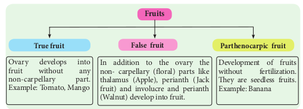
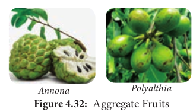
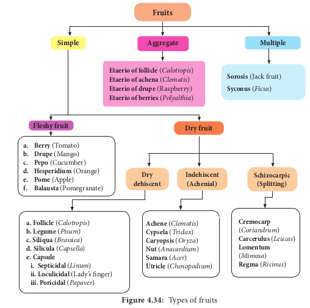

---

**Learning Objectives :**
The learner will be able to

- List the types of Inflorescence.
- Distinguish Racemose and Cymose inflorescenc.
- Dissect a flower and explore the parts of a flower.
- Compare various types of Aestivation.
- Explore various types of Placentation.
- Understands the types of Fruits and seed.
- To differentiate Monocot and Dicot seeds

---

**Chapter Outline**

**4.1.** Inflorescence
**4.2.** Flower
**4.3.** Accessory organs
**4.4.** Androecium
**4.5.** Gynoecium
**4.6.** Construction of floral diagram and floral formula
**4.7.** Fruits
**4.8.** Seed

Flowers have been a universal cultural object for millennia. They are an important aesthetic element in everyday life, and have played a highly symbolic role in our culture throughout the ages. Exchange of flowers marks respect, affection, happiness, and love. However, the biological purpose of the flower is very different from the way we use and perceive. Flower helps a plant to reproduce its own kind. This chapter discusses flowers, their arrangement, fruits and seeds which are the reproductive units of a plant.

**Floriculture**

Floriculture is a branch of Horticulture. It deals with the cultivation of flowers and ornamental crops. The Government of India has identified floriculture as a sunrise industry and accorded the status of 100% export oriented. Agriculture and Processed Food Product Export Development Authority (APEDA) is responsible for export promotion of agricultural and horticultural products from India.

## 

## Construction of floral diagram and floral formula

A floral formula is a simple way to explain the salient features of a flower. The floral diagram is a representation of the cross section of the flower. It represents floral whorls arranged as viewed from above. Floral diagram shows the number and arrangement of bract, bracteoles and floral parts, fusion, overlapping and placentation.

The branch that bears the flower is called **mother axis**.

The side of the flower facing the mother axis is called **posterior side**. The side facing the bract is the anterior side.

The members of different floral whorls are shown arranged in concentric rings.

Br : Bracteate.
Ebr : Ebracteate
Brl : Bracteolate
Ebrl : Ebracteolate

- : Actinomorphic
  % : Zygomorphic
  : Staminate
  : Pistillate
  : Bisexual flower

**s:** d for sepals, ens attached f the ovary Example: ceae.
**K :** Calyx, **K** five sepals, aposepalous, **K(,)** five sepals synsepalous.

**C** : Corolla, C5 five petals, **apopetalous**, C(5) five petals **sympetalous C(**2+3) corolla bilabiate with upper lib two lobes.

**A :** Androecium **A**3 three stamens free, A2+2, Stamens 4, two whorls (**didynamous**) each whorl two stamens (free)

A(9)+1 – stamens ten, two bundles **(diadelphous)** 9 stamens unite to form one bundle,1 stamen form another bundle.

**C**5**A**5—**Epipetalous** represented by an arc. A0 :**Staminode**(sterile stamen) G. Gynoecium or pistil – **G2** – Carpels two,

free **(apocarpous)** G(3) – Carpels three, united **(syncarpous)** G0 – pistillode (sterile carpel)

**Figure 4.26: (a)** _Hibiscus rosa-sinensis_

**Br Brl K (5) C 5 A(∞)G(5)**

**Br Ebrl**

**Male Flower**

•

**Br Ebrl**

**Br Ebrl**

**Ocng"hnqygt Hgocng"hnqygt**

**Figure 4.26: (c)** _Phyllanthus amarus_

**Br Ebrl P3+3 A (3) G 0 Br Ebrl P3+3A 0 G(3)**

G – superior ovary G inferior ovary G**–** – semiinferior ovary ∞ – Indefinite number of units

## Fruits

We know about several kinds of fruits, but by botanical study we will be surprised to know the types of fruits and how they are produced by plants. Fruits are the products of pollination and fertilization, usually containing seeds inside. In common person's perspective a fruit may be defined as an edible product of the entire gynoecium and any floral part which is sweet, juicy or fleshy, coloured, aromatic and enclosing seeds. However the fruit is a fertilized and ripened ovary. The branch of horticulture that deals with the study of fruits and their cultivation is called **pomology**.

### Structure of Fruit

Fruit has a fruit wall. It is otherwise called **pericarp. It is differentiated into outer epicarp**, middle **mesocarp** and inner **endocarp. The inner** part of the fruit is occupied by the seed.

### Types of Fruit

Fruits are classified into three types:

**Simple Fruits**

The fruits are derived from a single ovary of a flower Example: Mango, Tomato. Simple fruits are classified based on the nature of pericarp as follows.

**A. Fleshy Fruit**

The fruits are derived from single pistil where the pericarp is fleshy, succulent and differentiated into

epicarp, mesocarp and endocarp. It is subdivided into the following.

**a)** **Berry**: Fruit develops from bicarpellary or multicarpellary, syncarpous ovary. Here the epicarp is thin, the mesocarp and endocarp remain undifferentiated. They form a pulp in which the seeds are embedded. Example: Tomato, Grapes, Brinjal.

**b)** **Drupe**: Fruit develops from monocarpellary, superior ovary. It is usually one seeded. Pericarp is differentiated into outer skinny epicarp, fleshy and pulpy mesocarp and hard and stony endocarp around the seed. Example: Mango, Coconut.

**c)** **Pepo**: Fruit develops from tricarpellary inferior ovary. Pericarp turns leathery or woody which encloses, fleshy mesocarp and smooth endocarp. Example: Cucumber, Watermelon, Bottle gourd, Pumpkin.

**d)** **Hesperidium**: Fruit develops from multicarpellary, multilocular, syncarpous, superior ovary. The fruit wall is differentiated into leathery epicarp with oil glands, a middle fibrous mesocarp. The endocarp forms distinct chambers, containing juicy hairs. Example: Orange, Lemon.

**e)** **Pome**: It develops from multicarpellary, syncarpous, inferior ovary. The receptacle also develops along with the ovary and becomes fleshy, enclosing the true fruit. In pome the epicarp is thin skin like and endocarp is cartilagenous. Example: Apple, Pear.

**f) Balausta**: A fleshy indehiscent fruit developing from multicarpellary, multilocular inferior ovary whose pericarp is tough and leathery. Seeds are attached irregularly with testa being the edible portion. Example: Pomegranate.

**B. Dry Fruit**

They develop from single ovary where the pericarp is dry and not differentiated into epicarp, mesocarp and endocarp. It is further subdivided into three types.

**1) Dry dehiscent fruit** Pericarp is dry and splits open along the sutures to liberate seeds. They can be classified into following types.

**a) Follicle**: Fruit develops from mono carpellary, superior ovary and dehisces along one suture. Example: _Calotropis._

**b) Legume or pod**: Fruit develops from monocarpellary, superior ovary and dehisces through both dorsal and ventral sutures. Example: _Pisum._

**c) Siliqua**: Fruit develops from bicarpellary, syncarpous, superior ovary initially one chambered but subsequently becomes two chambered due to the formation of false septum (**replum**). The fruit dehisces along two suture. Example: _Brassica._

**d) Silicula**: Fruit similar to siliqua but shorter and broader. Example: _Capsella._

**e) Capsule:** Fruit develops from multicarpellary, syncarpous, superior ovary. Based on the dehiscence pattern they are divided into.

**i)** **Septicidal:** Capsule splitting along septa and valves remaining attached to septa. Example: _Aristolochia._  

**ii)** **Loculicidal:** Capsule splitting along locules and valves remaining attached to septa. Example: _Abelmoschus_.

**iii)** **Poricidal:** Dehiscence through terminal pores. Example: _Papaver_.

**2) Dry indehiscent fruit** Dry fruit which does not split open at maturity. It is subdivided into.

**a) Achene**: Single seeded dry fruit developing from single carpel with superior ovary. Achenes commonly develop from apocarpous pistil, Fruit wall is free from seed coat. Example: _Clematis, Delphinium_.

**b) Cypsela**: Single seeded dry fruit, develops from bicarpellary, syncarpous, inferior ovary with reduced scales, hairy or feathery calyx lobes. Example: _Tridax._

**c) Caryopsis**: It is a one seeded fruit which develops from a monocarpellary,superior ovary. Pericarp is inseparably fused with seed. Example: _Oryza._

**d) Nut**: They develop from mulicarpellary, syncarpous, superior ovary with hard, woody or bony pericap. It is a one seeded fruit. Example: _Anacardium._

**e) Samara**: A dry indehiscent, one seeded fruit in which the pericarp devlops into thin winged structure around the fruit. Example: _Acer._

**f) Utricle**: They develop from bicarpellary, unilocular, syncarpus, superior ovary with pericarp loosely enclosing the seeds. Example: _Chenopodium._

**3) Schizocarpic Fruit** This fruit type is intermediate between dehiscent and indehiscent fruit. The fruit instead of dehiscing, splits into number of segments, each containing one or more seeds. They are of following types.

**a) Cremocarp**: Fruit develops from bicarpellary, syncarpous, inferior ovary and splitting into two one seeded segments known as **mericarps**. Example: Coriander.

**b) Carcerulus:** Fruit develops from bicarpellary, syncarpous, superior ovary and splitting into four one seeded segments known as **nutlets**. Example: _Leucas._

**c) Lomentum:** The fruit is derived from monocarpellary, unilocular ovary. A leguminous fruit, constricted between the seeds to form a number of one seeded compartments that separate at maturity. Example: _Mimosa.\`_

**d) Regma:** They develop from tricarpellary, syncarpous, superior, trilocular ovary and splits into oneseeded cocci which remain attached to carpophore. Example: _Ricinus._

**Aggregate Fruits** Aggregate fruits develop from a single flower having an apocarpous pistil. each of the free carpel develops into a simple fruitlet. A collection of simple fruitlets makes an **Aggregate fruit**. An individual ovary develops into a drupe, achene, follicle or berry. An aggregate of these fruits borne by a single flower is known as an **etaerio**. Example: _Annona, Polyalthia._

**Multiple or Composite Fruit**

A Multiple or composite fruit develops from the whole inflorescence along with its peduncle on which they are borne.

**a) Sorosis: A fleshy multiple fruit which** develops from a spike or spadix. The flowers fused together by their succulent perianth and at the same time the axis bearing them become fleshy or juicy and the whole inflorescence forms a compact mass. Example: Pine apple, Jack fruit.

**Edible Parts of Fruit**
| Type of Fruit |Common Name |Botanical Name |Edible Part |
|------|------|------|------|
| Berry |Tomato |Lycopersicon esculentum |Whole fruit |
| Brinjal |Solanum melongena |Tender fruit |
| Guava |Psidium guajava |Whole fruit |
| Drupe |Mango |Mangifera indica |Mesocarp |
| Coconut |Cocos nucifera |Endosperm (both cellularand liquid) |
| Date |Phoenix dactylifera |Pericarp |
| Pepo |Cucumber |Cucumis sativus |Whole fruit |
| Hesperidium |Citrus (Orange, Lemon) |Citrus sinensis |Juicy hairs on the endocarp |
| Pome |Apple |Pyrus malus |alamus (false fruit) and apart of pericarp |
| Balausta |Pomegranate |Punica granatum |Succulent testa of the seeds |
| Legume |Pea |Pisum sativum |Seed |
| Siliqua |Mustard |Brassica campestris |Seed |
| Poricidal capsule |Poppy |Papaver somniferum |Seeds |
| Loculicidal capsule |Lady’s nger |Abelmoschus esculentus |Tender fruit |
| Cypsela |Sunower |Helianthus annuus |Seed (for oil) |
| Caryopsis |Maize |Zea maize |Seed |
| Paddy |Oryza sativa |Seed |
| Nut |Cashew nut |Anacardium occidentale |Pedicel (false fruit) andcotyledons (true fruit) |
| Cremocarp |Coriander |Coriandrum sativum |Mericarps |
| Lomentum |Touch­me­not |Mimosa pudica |Seed |
| Aggregate fruit |Custard apple |Annona squamosa |Pericarps |
| Composite fruits |
| Sorosis |Jack fruit |Artocarpus heterophyllus |Perianth, seeds |
| Pine apple |Ananas comosus |Perianth, rachis |
| Mulberry |Morus alba |Whole fruit |
| Syconus |Fig |Ficus carica |Whole inorescence |

**Do You Know ?**

- _Lodoicea maldivica_ is the world's largest fruit. The size of mature fruit is 40–50 cm in diameter and weights 15–30 kg.

- Progesterone which supports pregnancy is obtained naturally from a fruit of _Balanites aegyptiaca_ and _Trigonella foenum - graecum_.

**b) Syconus**: A multiple fruit which develops from hypanthodium inflorescence. The receptacle develops further and converts into fleshy fruit which encloses a number of true fruit or achenes which develops from female flower of hypanthodium inflorescence. Example: Ficus ### Functions of Fruit

1. Edible part of the fruit is a source of food and gives energy for animals.

2. They are source of many chemicals like sugar, pectin, organic acids, vitamins and minerals.

3. The fruit protects the seeds from unfavourable climatic conditions and animals.

4. Both fleshy and dry fruits help in the dispersal of seeds to distant places.

5. In certain cases, fruit may provide nutrition to the developing seedling.

6. Fruits provide source of medicine to human.

**Do You Know ?**

- _Lupinus_ _arcticus_ (legume family) of Artic Tundra is the oldest viable seed remained dormant for 10,000 years.

- _Pheonix dactylifera_ (date palm) of king Herod's palace near dead sea has viable seed for 20,000 years.

- Powdered seeds of _Moringa oleifera_ is used to purify water.

---

## Seed

Do all fruits contain seeds? No, triploid fruits do not. The seed is a fertilized mature ovule which possess an embryonic plant, usually stores food material and has a protective coat. After fertilization, changes occur in various parts of the ovule and transforms into a seed.

### Types of Seed

**I.** Based on the number of cotyledons two types of seeds are recognized.

**i. Dicotyledonous seed:** Seed with two cotyledons.

**ii. Monocotyledonous seed:** Seed with one cotyledon.

**II.** Based on the presence or absence of the endosperm the seed is of two types.

**i. Albuminous or Endospermous seed:** The cotyledons are thin, membranous and mature seeds have endosperm persistent and nourishes the seedling during its early development. Example: Castor, sunflower, maize.

**ii. Ex-albuminous or non- endospermous seed:** Food is utilized by the developing embryo and so the mature seeds are without endosperm. In such seeds, colyledons store food and become thick and fleshy. Example: Pea, groundnut.

### Significance of Seeds:

- The seed encloses and protects the embryo for next generation.
- It contains food for the development of embryo.
- It is a means for the dispersal of new individuals of the species.
- A seed is a means for perpetuation of the species. It may lie dormant during unfavorable conditions but germinates on getting suitable conditions.
- Seeds of various plants are used as food, both for animals and men.
- They are the basis of agriculture.  Seeds are the products of sexual reproduction so they provide genetic variation and recombination in a plant.

**Activity** Prepare a diet chart to provide balanced diet to an adolescent (a school going child) which includes food items (fruits, vegetable and seeds) which are non expensive and are commonly available.

**Summary** Inflorescence is a group of flowers present on a common stalk. Inflorescence may be classified into 3 types based on position. Inflorescence classified into racemose, cymose, mixed and special type based on the flower arrangement and branching of axis. Flower is a modified shoot and meant for sexual reproduction. Flower has various parts to enhance reproduction. Flower can be explained by its sex and symmetry. Calyx is outermost whorl of flower and many types. Corolla is second whorl of flower and used for pollination. Corolla may be united or free and has various forms in different flowers. Aestivation is arrangement of sepals, petals in bud condition and is of many types. Androecium is the male part of flower and made up of stamens. Stamens contain filament,anther and connective.

Gynoecium is the female part of flower. Ovary, style and stigma are parts of pistil.According to number of carpels it is divided into monocarpellary, bicarpellary etc. It may be apocarpous or syncarpous. Locule number may be one to many.

The ovary is superior or inferior or semi inferior. Mode of distribution of placenta inside the ovary is placentation. Construction of floral diagram and floral formula for given flower with some examples.

Fruits are the products of pollination and fertilization. Fruit developed from single ovary of flower is called **simple fruit**. Simple fruits are two types based on the fruit wall as simple fleshy and simple dry. An intermediate between dehiscent and indehiscent fruit is called schizocarpic fruit. The simple fruits could be fleshy or dry which could again be dehiscent or indehiscent. Fruits that are developed from multicarpellary, apocarpus pistil is called aggregate. Multiple or composite fruit develops from the flowers of the complete inflorescence. Seed is a ripened ovule which contains the embryo or the miniature of plant body. Seeds with one cotyledon are monocotyledonous and with two cotyledons are dicotyledonous.
