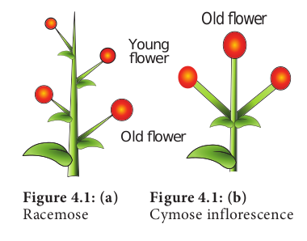
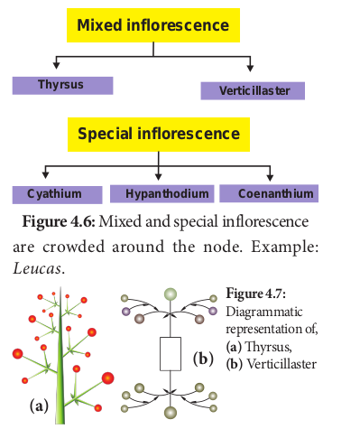
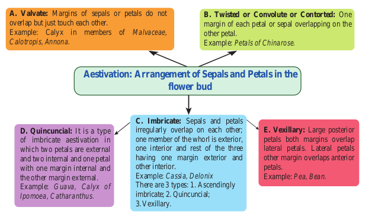
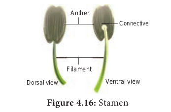
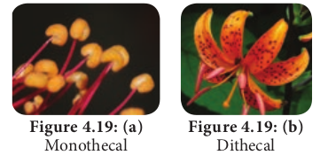
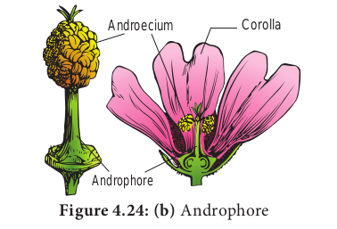
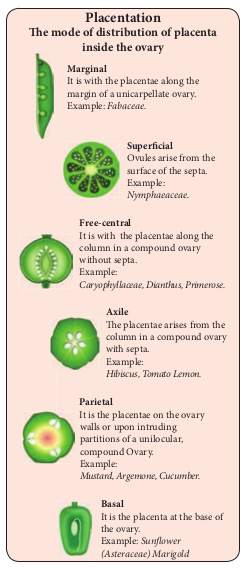

---

**Learning Objectives :**
The learner will be able to

- List the types of Inflorescence. 
- Distinguish Racemose and Cymose inflorescenc. 
- Dissect a flower and explore the parts of a flower. 
- Compare various types of Aestivation. 
- Explore various types of Placentation. 
- Understands the types of Fruits and seed. 
- To differentiate Monocot and Dicot seeds

---

**Chapter Outline** 

**4.1.** Inflorescence 
**4.2.** Flower 
**4.3.** Accessory organs 
**4.4.** Androecium 
**4.5.** Gynoecium 
**4.6.** Construction of floral diagram and floral formula 
**4.7.** Fruits 
**4.8.** Seed

Flowers have been a universal cultural object for millennia. They are an important aesthetic element in everyday life, and have played a highly symbolic role in our culture throughout the ages. Exchange of flowers marks respect, affection, happiness, and love. However, the biological purpose of the flower is very different from the way we use and perceive. Flower helps a plant to reproduce its own kind. This chapter discusses flowers, their arrangement, fruits and seeds which are the reproductive units of a plant.

**Floriculture**

Floriculture is a branch of Horticulture. It deals with the cultivation of flowers and ornamental crops. The Government of India has identified floriculture as a sunrise industry and accorded the status of 100% export oriented. Agriculture and Processed Food Product Export Development Authority (APEDA) is responsible for export promotion of agricultural and horticultural products from India.

----
## Inflorescence

Have you seen a bouquet being used during functions? Group of flowers arranged together on our preference is a bouquet. But an inflorescence is a group of flowers arising from a branched or unbranched axis with a definite pattern. Function of inflorescence is to display the flowers for effective pollination and facilitate seed dispersal. The grouping of flowers in one place gives a better attraction to the visiting pollinators and maximize the energy of the plant.

### Types of Inflorescence 
**Based On Position**

Have you ever noticed the inflorescence arising from different positions? Where is the inflorescence present in a plant? Apex or axil?

Based on position of inflorescences, it may be classified into three major types. They are,

**Terminal**: Inflorescence grows as a part of the terminal shoot. Example: Raceme of _Nerium oleander_

**Axillary**: Inflorescence presents in the axile of the nearest vegetative leaf. Example: _Hibiscus rosa-sinensis_

**Cauliflorous**: Inflorescence developed di rectly from a woody trunk. Example: _Theobro- ma cocoa, Couraupita guinensis_

Observe the inflorescence of Jackfruit and Canon ball tree. Where does it arise?

### Based on branching pattern and other characters

Inflorescence may also be classified based on branching, number and arrangement of flowers, and some specialized structures.

I. **Indeterminate** (**Racemose**) 
II. **Determinate (Cymose)**
III. **Mixed inflorescence**: Inflorescence of some plants show a combination of indeterminate and determinate pattern
IV. **Special inflorescence**: Inflorescence which do not confine to these patterns

|**Racemose** | **Cymose**|
|---|----|
|Main axis of unlimited growth|Main axis of limited growth.|
|Flowers arranged in an acropetal succession|Flowers arranged in a basipetal succession|
|Opening of flowers is centripetal|Opening of flowers is centrifugal|
|Usually the oldest flower at the base of the inflorescence axis.|Usually the oldest flower at the top of the inflorescence axis.|

**I. Racemose** The central axis of the inflorescence (peduncle) possesses terminal bud which is capable of growing continuously and produce lateral flowers is called **Racemose inflorescence**. Old flowers are at the base and younger flowers and buds are towards the apex. It is further divided into 3 types based on growth pattern of main axis.

**1. Main axis elongated**

The axis of inflorescence is elongated and contains pedicellate or sessile flowers on it. The following types are discussed under main axis elongated type.

**a. Simple raceme:** The inflorescence with an unbranched main axis bears **pedicellate flowers** in acropetal succession. Example: _Crotalaria retusa,_ Mustard.

**b.** **Spike:** Spike is an unbranched indeterminate inflorescence with **sessile flowers**. Example: _Achyranthes._

**c.** **Spikelet:** Literally it is a small spike. The Inflorescence is with branched central axis. Each branch is a **spikelet**. Sessile flowers are formed in acropetal succession on the axis. A pair of inflorescence bracts called **glumes** is present at the base. Each sessile flower has a **lemma** (bract) and a **palea** (bracteole). Tepals reduced to colourless scaly leaves (lodicule). Each flower has stamen and pistil only. Example: Paddy, Wheat.

**d.** **Catkin**: **Pendulous spikes** with a long and drooping axis bearing small unisexual or bisexual flowers. It is also called **ament**. Example: _Acalypha hispida_, _Prosopis juliflora._

**e.** **Spadix:** An inflorescence with a fleshy or thickened central axis that possesses many unisexual sessile flowers in acropetal succession. Usually female flowers are found towards the base and male flowers are found at the apex. Entire inflorescence is covered by a brightly coloured or hard bract called a **spathe**. Example: _Amorphophallus_, _Colocasia._

**f.** **Panicle**_:_ A branched raceme is called **panicle**. Example: _Mangifera,_ neem. It is also called **Compound raceme** or **Raceme of Racemes**. 

**2. Main axis shortened:** Inflorescence with reduced growth of central axis. There are two types, namely corymb and umbel.

**a. Corymb:** An inflorescence with shorter pedicellate flowers at the top and longer

pedicellate flowers at the bottom. All flowers appear at the same level to form convex or flat topped racemose inflorescence. Example: _Caesalpinia_. **Compound corymb:** A branched corymb is called **Compound corymb**. Example: Cauliflower.

**b. Umbel:** An inflorescence with indeterminate central axis and pedicellate flowers arise from a common point of peduncle at the apex. Example: _Allium_ _cepa_. **Compound umbel**: It is a branched umbel. Each smaller unit is called **umbellule**.Example: _Daucas carota_, _Coriandrum sativum_. 

**3. Main axis flattened:** The main axis of inflorescence is mostly flattened (convex or concav) or globose. A **head** or **capitulum** is determinate or indeterminate, group of sessile or sub sessile flowers arising on a receptacle, often subtended by an involucre.

**a. Head:** A head is a characteristic inflorescence of Asteraceae and is also found in some members of Rubiaceae and Mimosaceae.

Torus contains two types of florets: 1. Disc floret or tubular floret. 2. Ray floret or ligulate floret. Based on the type of florets present, the heads are classified into two types.

**i. Homogamous head**: 

This type of inflorescence exhibits single kind of florets. Inflorescence has disc florets alone. Example: _Vernonia,_ Ray florets alone. Example: _Launaea_.

**ii. Heterogamous head** 

The inflorescence possesses both types of florets. Example: _Helianthus, Tridax_.
**Disc florets** at the centre of the head are tubular and bisexual, whereas the **ray florets** found at the margin of the head which are ligulate and pistilate (unisexual).

---

The flower and inflorescence are subtended by a lateral appendage called bract. In sunflower, you may notice that the whorl of bracts forms a cup like structure beneath mimicking the calyx. Such whorl of bracts is called involucre. A group of bracts present beneath the sub unit of inflorescence is known as Involucre.

---

**II. Cymose inflorescence.** 

Central axis stops growing and ends in a flower, further growth is by means of axillary buds. Old flowers present at apex and young flowers at base

**1. Simple cyme** (**solitary**)**:** Determinate inflorescence consists of a single flower. It may be terminal or axillary. Example: terminal in _Trillium grandiflorum and axillary in Hibiscus._ **2\. Monochasial Cyme (uniparous): The** main axis ends with a flower. From two lateral bracts, only one branch grows further. It may be **Helicoid** or **Scorpioid.**

**a. Helicoid: A**xis develops on only one side and forms a coil structure atleast at the earlier development stage. Example: _Hamelia_, potato.

**b. Scorpioid:** Axis develops on alternate sides and often becomes a coiled structure. Example: _Heliotropium_. 

**3. Simple dichasium (Biparous**): A central axis ends in a terminal flower; further growth is produced by two lateral buds. Each cymose unit consists of three flowers of which central one is old one. This is true cyme. Example: _Jasminum_. 4. Compound dichasium: It has many flowers. A terminal old flower develops lateral simple dichasial cymes on both sides. Each compound dichasium consists of seven flowers. Example: _Clerodendron_.

A small,simple dichasium is called **cymule** 

**5. Polychasial Cyme (multiparous): The** central axis ends with a flower. The lateral axis branches repeatedly. Example: _Nerium_
---

**Sympodial Cyme**: In monochasial cyme, successive axis at first develop in a zigzag manner and later it develops into a straight pseudo axis. Example:

_Solanum americanum._
---
**III. Mixed Inflorescence** 

Inflorescences in which both racemose and cymose patterns of development occur in a mixed manner. It is of the following two types. **1\. Thyrsus**: It is a ‘**Raceme of cymes**’. Indefinite central axis bears lateral pedicellate cymes, (simple or compound dichasia). Example: _Ocimum_. **2\. Verticillaster**: Main axis bears two opposite lateral sessile cymes at the axil of the node,each of it produces monochasial scorpioid lateral branches so that flowers  

**IV. Special Inflorescence** 

The inflorescence that do not show any of the development pattern types are classified under special type of inflorescence. **1\. Cyathium: Cyathium inflorescence consists** of small unisexual flowers enclosed by a common involucre which mimics a single flower. Male flowers are organised in a scorpioid manner. Female flower is solitary and centrally located on a long pedicel. Male flower is represented only by stamens and female flower is represented only by a pistil. Cyathium may be actinomorphic (Example: _Euphorbia_) or zygomorphic (Example: _Pedilanthus_). Nectar is present in involucre_._

**2. Hypanthodium**: Receptacle is a hollow, globose structure consisting of unisexual flowers present on the inner wall of the receptacle. Receptacle is closed leaving a small opening called **ostiole** which is covered by a series of bracts. Male flowers are present nearer to the ostiole, female and neutral flowers are found in a mixed manner from middle below. Example: _Ficus sp_. (Banyan, Fig and Pipal). 

**3. Coenanthium: Circular disc like fleshy open** receptacle that bears pistillate flowers at the center and staminate flowers at the periphery. Example: _Dorstenia_ 

## Flower

In a plant, which part would you like the most? Of course, it is a flower, because of its colour and fragrance. The flower is a significant diagnostic feature of angiosperms. It is a modified condensed reproductive shoot. The growth of the flower shoot is determinate.

### Whorls of flower

There are two whorls, accessory and essential. Accessory whorl consists of calyx and corolla and essential whorl comprises of androecium and gynoecium.

Flower is said to be **Complete** when it contains all four whorls. An **Incomplete** flower is devoid of one or more whorls.

### Flower sex 

Flower sex refers to the presence or absence of androecium and gynoecium within a flower. 

**1. Perfect or bisexual: If a flower contains** both androecium and gynoecium it is called as a perfect flower. 

**2. Imperfect or unisexual:** When the flower contains only one of the essential whorls is called Imperfect flower. It is of two types:

**i) Staminate flowers**: Flowers with androecium alone.

**ii) Pistillate flowers:** Flowers with gynoecium alone.

**Figure 4.11: (b)** Dioecious

### Plant sex 

Plant sex refers to the presence and distribution of flowers with different sexes in an individual plant. 

**1. Hermaphroditic:** All the flowers of the plant are bisexual. 

**2. Monoecious**: Both male and female flowers are present in the same plant Example: Coconut. 

**3. Dioecious:** Male and Female flowers are present on separate plants. Example: Papaya, Palmyra. 

**4. Polygamous:** The condition in which bisexual and unisexual (staminate/pistillate) flowers occur in a same plant is called **polygamous**. Example: _Musa_, _Mangifera_.

### Flower symmetry

What is the radius of a circle? Cut a paper into round shape, fold it so as to get two equal halves. In how many planes will you get equal halves? In how many planes you can divide a cucumber in two equal halves? A flower is symmetrical when it is divided into equal halves in any plane running through the center. Flower symmetry is an important structural adaptation related to pollination systems.  

**1. Actinomorphic (or) radial or polysymmetric: The flower shows two** mirror images when cut in any plane or radius through the centre.Normally there are more than two planes of symmetry. Example: _Hibiscus, Datura_.

**2. Zygomorphic (bilateral symmetry**) or monosymmetric: The flower can be divided into 2 equal halves in only one plane. Zygomorphic flower can efficiently transfer pollen grains to visiting pollinators. Example: _Pisum_, Bean. 

**3. Asymmetric (amorphic**): Flower lacks any plane of symmetry and cannot be divided into equal halves in any plane. Parts of such flowers are twisted. Example: _Canna indica_.  

## Accessory organs 

Arrangement of whorls
 The position of perianth (sepals, petals, tepals) parts relative to one another is called **perianth arrangement**.

**1. Cyclic or whorled:** All the floral parts are arranged in definite whorls. Example: _Brassica._

**2. Acyclic or spiral:** The floral parts are arranged in spirals on the elongated fleshy torus. Example: _Magnolia_.

**3. Spirocyclic or hemicyclic**: Some parts are in whorls and others parts are in spirals. Example:_Annona, Polyalthia_

### Calyx

Calyx protects the flower in bud stage. Outermost whorl of flower is calyx. Unit of calyx is sepal. Normally green in colour. 

**1. Fusion**: 

**a. Aposepalous** (polysepalous): The flower with distinct sepals. Example: _Brassica, Annona._

**b. Synsepalous:** The flower with united or fused sepals. Example: _Hibiscus_. 

**2. Duration of floral parts:**

What is the green part of brinjal fruit? Have you seen similar to this in any other fruits?

**a. Caducous or fugacious calyx**: Calyx that withers or falls off during the early development stage of flower. Example: _Papaver_.

**b. Deciduous:**
Calyx that falls soon afterthe opening of flower (anthesis) Example: Nelumbo.

**c. Persistant**: 
Calyx that persists and continues to be along with the fruit and forms a cup at the base of the fruit. Example: Brinjal.

**d. Accrescent**: Calyx that is persistent, grows along with the fruit and encloses the fruit either completely or partially. Example: _Physalis_.

**3. Shapes of calyx** Have you noticed the shoe flower’s calyx? It is bell shaped called **Campanulate**. The fruiting calyx is urn shaped in _Withania_ and it is called **urceolate**. In _Datura_ calyx is tube like and it is known as **tubular**. Two lipped calyx is present _in Ocimum_. Sometimes calyx is coloured and called **petaloid.** Example: _Saraca_ and _Mussanda_. In Tridax, calyx is modified into hair like structures are called pappus.

### Corolla

Corolla is the most attractive part in majority of the flowers and is usually brightly coloured. Corolla helps to display the flower and attracts the pollinators. 

**1. Fusion:**

**a. Apopetalous (polypetalous)**: Petals are distinct. Example: _Hibiscus_.

b. **Sympetalous (gamopetalous)**: Petals are fused. Example: _Datura_. 

### Perianth

Can you recall the term homochlamydeous? Undifferentiated calyx and corolla in a flower is called **perianth**. Each member is called **tepal**. If the tepals are distinct they are called **Apotepalous** (Polyphyllous). Example: _Allium sativum._ Fused tepals are called **Syntepalous**_._ (Gamophyllous). Example: Allium cepa.

---

**Lodicule :** Reduced scale like perianth in the members of Poaceae is called lodicule.

---

### Aestivation:

Arrangement of sepals and petals in the flower bud is said to be aestivation.

**Essential Parts of Flower**

## Androecium 

**Androecium:** 
Third whorl of flower is the male reproductive part of the flower. It is composed of stamens(microsporophylls). Each Stamen consist of 3 parts, a. Filament b. Anther c. Connective

**Anther: Upper swollen part with microsporangia.**

**Filament**: Stalk of stamen **Connective**: Tissue connecting anther lobes with filament Anther typically contains two com partments called **thecae** (singular theca).Each theca consists of two microsporangia.Two microsporangia fused to form a **locule.**

Sterile stamens are called **Staminodes**. Example: _Cassia._ **Distinct:** stamens which do not fuse to one another. **Free:** stamens which do not fuse with other parts of flower. **Apostemonous:** flowers with stamens that are free and distinct.

### Fusion of stamens: 

The fusion of stamens fusing among themselves or with other parts of flower. They are of two types.

**1.Connation and  2.Adnation**

**1. Connation**: Refers to the fusion of stamens among themselves. It is of 3 types. **a.** Adelphy. **b.** Syngenecious. **c.** Synandrous.

**a. Adelphy**: Filaments connate into one or more bundles but anthers are free. It may be the following types. 

**1. Monadelphous**: Filaments of stamens connate into a single bundle.Example: Malvaceae (Chinarose, Cotton).
**2. Diadelphous**: Filaments of stamens connate into two bundles. Example: _Fabaceae (pea)_ and _Clitoria_. 

**3. Polyadelphous**: Filaments connate into many bundles. Example: _Citrus_, _Bombax_

**b. Syngenesious**: Anthers connate, filaments free. Example: Asteraceae.

**c. Synandrous**: Filaments and anthers are completely fused. Example: _Coccinea_. 

**2. Adnation**: Refers to the fusion of stamens with other floral parts. Epipetalous : Stamens are adnate to petals .Example: brinjal, _Datura_.

**a. Episepalous:** stamens are adnate to sepals. Example: _Grevillea_ (Silver oak)

**b. Epitepalous** (**epiphyllous**): stamens are adnate to tepals. Example: _Asparagus_.

**c. Gynostegium**:Connation product of stamens and stigma is called **gynostegium**. Example: _Calotropis_ and Orchidaceae.

**d. Pollinium**: Pollen grains are fused together as a single mass Example: _Calotropis_

### Arrangement of stamens relate to length of stamens:

**1. Didynamous:** Four stamens of which two with long filaments and two with short filaments. Example: Ocimum 

**2. Tetradynamous**: Six stamens of which four with long filaments and two with short filaments. Example: Brassica.

**3. Heterostemonous**: stamens are of different lengths in the same flower. Example: _Cassia._ 

### Anther types 

**1. Monothecal :** One lobe with two microsporangia. They are kidney shaped in a cross section. Example: Malvaceae

**2. Dithecal**: It is a typical type,having two lobes with four microsporangia.They are butterfly shaped in cross section. Example: Solanaceae.

### Anther attachment 

**1. Basifixed:(Innate)** Base of anther is
 attached to the tip of filament. Example: _Datura_. 
 
**2. Dorsifixed: Apex of filament is attached** to the dorsal side of the anther. Example: _Hibiscus_. 

**3. Versatile**: Filament is attached to the anther at midpoint. Example: Grasses. 

**4. Adnate**: Filament is continued from the base to the apex of anther. Example: _Nelumbo_

## Gynoecium

Gynoecium or pistil is the female reproductive part of the flower.

A pistil consists of an expanded basal portion called the ovary, an elongated section called a **style** and an apical structure that receives pollen called a **stigma**. Ovary with stipe is called **stipitate ovary.**

**Carpel**: They are components of a gynoecium. Gynoecium is made of one or more carpels. Carpels may be distinct or connate.

### Number of carpel

|**Unicarpellary** (monocarpellary) Single carpel Example: Fabaceae|**Bicarpellary** Two carpels Example: Rubiaceae|
|--|---|
|**Tricarpellary** Three carpels Example: Cucurbitaceae|**Tetracarpellary** Four carpels Example: Lamiaceae.|
|**Multicarpellary** Many carpels Example: Nymphaeceae_._|
|**Apocarpous**|**Syncarpous**|
|A pistil contains two or more distinct carpels. Example: _Annona_.| A pistil contains two or more carpels which are connate. Example: _Citrus_, tomato.|

### Fusion of carpels
It is an important systematic character. Apocarpous gynoecium is generally thought to be ancestral condition in Angiosperms.

### Number of locules

Ovary bears ovules on a specialized tissue called **placenta**. A **septum** is a crosswall or partition of ovary. The walls of ovary and septa form a cavity called **locule**. Like that tetralocular and pentalocular ovaries are present according to the locule numbers four or five. More than one locule ovaries are called **plurilocular**.

### Extension of the condensed internode of the receptacle

**1. Anthophore**:The internodal elongation between calyx and corolla. Example: caryophyllaceae (_Silene conoidea_)

**2. Androphore:** The internodal elongation between the corolla and androecium. Example: _Grewia_.

**Figure 4.24: (b)** Androphore

**3. Gynophore:** The internodal elongation between androecium and gynoecium. Example: _Capparis_.

**4. Gynandrophore** or **Androgynophore**: The unified internodal elongation between corolla and androecium and androecium and gynoecium. Example: _Gynandropsis_.

**Figure 4.24: (d)** Androgynophore

### Ovary position

The position or attachment of ovary relative to the other floral parts. It may be classified into 
**1. Superior ovary:** It is the ovary with the sepals, petals and stamens attached at the base of the ovary. 

**2. Inferior ovary:** It is the ovary with the sepals, petals and stamens attached at the apex of the ovary. 

**3. Half-inferior ovary:** It is the ovary with the sepals, petals and stamens or hypanthium attached near the middle of the ovary.

|**Hypogynous:**|**Epihypogynou**|**Perigynous:**|**Epigynous:**|**Epiperigynous:**|
|---|----|----|----|----|
|The term is used for sepals, petals and stamens attached at the base of a superior ovary. Example: Malvaceae| The term is use petals and stam at the middle o (halfinferior). Fabaceae, Rosa|The term is used for a hypanthium attached at the base of a superior ovary.|The term is use petals and stam at the top of (inferior overy). Apple, Asteraceae.|The term is used for hypanthodium attached at the apex of an inferior ovary.|

### Perianth / Androecial position on thalamus:

It describes placement of the perianth and androecium relative to the ovary and to a hypanthium, if present ( Figure 4.25).

---
**Hypanthium ( Staminal disk)** : a fleshy elevated often nectariferous cup like thalamus

---

## Construction of floral diagram and floral formula

A floral formula is a simple way to explain the salient features of a flower. The floral diagram is a representation of the cross section of the flower. It represents floral whorls arranged as viewed from above. Floral diagram shows the number and arrangement of bract, bracteoles and floral parts, fusion, overlapping and placentation.

The branch that bears the flower is called **mother axis**.

The side of the flower facing the mother axis is called **posterior side**. The side facing the bract is the anterior side.

The members of different floral whorls are shown arranged in concentric rings.

Br : Bracteate. 
Ebr : Ebracteate 
Brl : Bracteolate 
Ebrl : Ebracteolate
+ : Actinomorphic 
% : Zygomorphic
: Staminate
: Pistillate
: Bisexual flower  

**s:** d for sepals, ens attached f the ovary Example: ceae.
**K :** Calyx, **K** five sepals, aposepalous, **K(,)** five sepals synsepalous.

**C** : Corolla, C5 five petals, **apopetalous**, C(5) five petals **sympetalous C(**2+3) corolla bilabiate with upper lib two lobes.

**A :** Androecium **A**3 three stamens free, A2+2, Stamens 4, two whorls (**didynamous**) each whorl two stamens (free)

A(9)+1 – stamens ten, two bundles **(diadelphous)** 9 stamens unite to form one bundle,1 stamen form another bundle.

**C**5**A**5—**Epipetalous** represented by an arc. A0 :**Staminode**(sterile stamen) G. Gynoecium or pistil – **G2** – Carpels two,

free **(apocarpous)** G(3) – Carpels three, united **(syncarpous)** G0 – pistillode (sterile carpel)

**Figure 4.26: (a)** _Hibiscus rosa-sinensis_

**Br Brl K (5) C 5 A(∞)G(5)**

**Br Ebrl**

**Male Flower**

•

**Br Ebrl**

**Br Ebrl**

**Ocng"hnqygt Hgocng"hnqygt**

**Figure 4.26: (c)** _Phyllanthus amarus_

**Br Ebrl P3+3 A (3) G 0 Br Ebrl P3+3A 0 G(3)**  

G – superior ovary G inferior ovary G**–** – semiinferior ovary ∞ – Indefinite number of units

## Fruits

We know about several kinds of fruits, but by botanical study we will be surprised to know the types of fruits and how they are produced by plants. Fruits are the products of pollination and fertilization, usually containing seeds inside. In common person's perspective a fruit may be defined as an edible product of the entire gynoecium and any floral part which is sweet, juicy or fleshy, coloured, aromatic and enclosing seeds. However the fruit is a fertilized and ripened ovary. The branch of horticulture that deals with the study of fruits and their cultivation is called **pomology**. 

### Structure of Fruit

Fruit has a fruit wall. It is otherwise called **pericarp. It is differentiated into outer epicarp**, middle **mesocarp** and inner **endocarp. The inner** part of the fruit is occupied by the seed. 

### Types of Fruit

Fruits are classified into three types:

**Simple Fruits** 

The fruits are derived from a single ovary of a flower Example: Mango, Tomato. Simple fruits are classified based on the nature of pericarp as follows. 

**A. Fleshy Fruit** 

The fruits are derived from single pistil where the pericarp is fleshy, succulent and differentiated into 

epicarp, mesocarp and endocarp. It is subdivided into the following. 

**a)** **Berry**: Fruit develops from bicarpellary or multicarpellary, syncarpous ovary. Here the epicarp is thin, the mesocarp and endocarp remain undifferentiated. They form a pulp in which the seeds are embedded. Example: Tomato, Grapes, Brinjal. 

**b)** **Drupe**: Fruit develops from monocarpellary, superior ovary. It is usually one seeded. Pericarp is differentiated into outer skinny epicarp, fleshy and pulpy mesocarp and hard and stony endocarp around the seed. Example: Mango, Coconut.

**c)** **Pepo**: Fruit develops from tricarpellary inferior ovary. Pericarp turns leathery or woody which encloses, fleshy mesocarp and smooth endocarp. Example: Cucumber, Watermelon, Bottle gourd, Pumpkin. 

**d)** **Hesperidium**: Fruit develops from multicarpellary, multilocular, syncarpous, superior ovary. The fruit wall is differentiated into leathery epicarp with oil glands, a middle fibrous mesocarp. The endocarp forms distinct chambers, containing juicy hairs. Example: Orange, Lemon. 

**e)** **Pome**: It develops from multicarpellary, syncarpous, inferior ovary. The receptacle also develops along with the ovary and becomes fleshy, enclosing the true fruit. In pome the epicarp is thin skin like and endocarp is cartilagenous. Example: Apple, Pear. 

**f) Balausta**: A fleshy indehiscent fruit developing from multicarpellary, multilocular inferior ovary whose pericarp is tough and leathery. Seeds are attached irregularly with testa being the edible portion. Example: Pomegranate.

**B. Dry Fruit** 

They develop from single ovary where the pericarp is dry and not differentiated into epicarp, mesocarp and endocarp. It is further subdivided into three types.

**1) Dry dehiscent fruit** Pericarp is dry and splits open along the sutures to liberate seeds. They can be classified into following types.

**a) Follicle**: Fruit develops from mono carpellary, superior ovary and dehisces along one suture. Example: _Calotropis._

**b) Legume or pod**: Fruit develops from monocarpellary, superior ovary and dehisces through both dorsal and ventral sutures. Example: _Pisum._

**c) Siliqua**: Fruit develops from bicarpellary, syncarpous, superior ovary initially one chambered but subsequently becomes two chambered due to the formation of false septum (**replum**). The fruit dehisces along two suture. Example: _Brassica._

**d) Silicula**: Fruit similar to siliqua but shorter and broader. Example: _Capsella._

**e) Capsule:** Fruit develops from multicarpellary, syncarpous, superior ovary. Based on the dehiscence pattern they are divided into. 

**i)** **Septicidal:** Capsule splitting along septa and valves remaining attached to septa. Example: _Aristolochia._  

**ii)** **Loculicidal:** Capsule splitting along locules and valves remaining attached to septa. Example: _Abelmoschus_.

**iii)** **Poricidal:** Dehiscence through terminal pores. Example: _Papaver_.

**2) Dry indehiscent fruit** Dry fruit which does not split open at maturity. It is subdivided into.

**a) Achene**: Single seeded dry fruit developing from single carpel with superior ovary. Achenes commonly develop from apocarpous pistil, Fruit wall is free from seed coat. Example: _Clematis, Delphinium_.

**b) Cypsela**: Single seeded dry fruit, develops from bicarpellary, syncarpous, inferior ovary with reduced scales, hairy or feathery calyx lobes. Example: _Tridax._

**c) Caryopsis**: It is a one seeded fruit which develops from a monocarpellary,superior ovary. Pericarp is inseparably fused with seed. Example: _Oryza._

**d) Nut**: They develop from mulicarpellary, syncarpous, superior ovary with hard, woody or bony pericap. It is a one seeded fruit. Example: _Anacardium._

**e) Samara**: A dry indehiscent, one seeded fruit in which the pericarp devlops into thin winged structure around the fruit. Example: _Acer._

**f) Utricle**: They develop from bicarpellary, unilocular, syncarpus, superior ovary with pericarp loosely enclosing the seeds. Example: _Chenopodium._

**3) Schizocarpic Fruit** This fruit type is intermediate between dehiscent and indehiscent fruit. The fruit instead of dehiscing, splits into number of segments, each containing one or more seeds. They are of following types.

**a) Cremocarp**: Fruit develops from bicarpellary, syncarpous, inferior ovary and splitting into two one seeded segments known as **mericarps**. Example: Coriander.

**b) Carcerulus:** Fruit develops from bicarpellary, syncarpous, superior ovary and splitting into four one seeded segments known as **nutlets**. Example: _Leucas._

**c) Lomentum:** The fruit is derived from monocarpellary, unilocular ovary. A leguminous fruit, constricted between the seeds to form a number of one seeded compartments that separate at maturity. Example: _Mimosa.\`_

**d) Regma:** They develop from tricarpellary, syncarpous, superior, trilocular ovary and splits into oneseeded cocci which remain attached to carpophore. Example: _Ricinus._

**Aggregate Fruits** Aggregate fruits develop from a single flower having an apocarpous pistil. each of the free carpel develops into a simple fruitlet. A collection of simple fruitlets makes an **Aggregate fruit**. An individual ovary develops into a drupe, achene, follicle or berry. An aggregate of these fruits borne by a single flower is known as an **etaerio**. Example: _Annona, Polyalthia._

**Multiple or Composite Fruit** 

A Multiple or composite fruit develops from the whole inflorescence along with its peduncle on which they are borne. 

**a) Sorosis: A fleshy multiple fruit which** develops from a spike or spadix. The flowers fused together by their succulent perianth and at the same time the axis bearing them become fleshy or juicy and the whole inflorescence forms a compact mass. Example: Pine apple, Jack fruit.

**Edible Parts of Fruit**
| Type of Fruit |Common Name |Botanical Name |Edible Part |
|------|------|------|------|
| Berry |Tomato |Lycopersicon esculentum |Whole fruit |
| Brinjal |Solanum melongena |Tender fruit |
| Guava |Psidium guajava |Whole fruit |
| Drupe |Mango |Mangifera indica |Mesocarp |
| Coconut |Cocos nucifera |Endosperm (both cellularand liquid) |
| Date |Phoenix dactylifera |Pericarp |
| Pepo |Cucumber |Cucumis sativus |Whole fruit |
| Hesperidium |Citrus (Orange, Lemon) |Citrus sinensis |Juicy hairs on the endocarp |
| Pome |Apple |Pyrus malus |alamus (false fruit) and apart of pericarp |
| Balausta |Pomegranate |Punica granatum |Succulent testa of the seeds |
| Legume |Pea |Pisum sativum |Seed |
| Siliqua |Mustard |Brassica campestris |Seed |
| Poricidal capsule |Poppy |Papaver somniferum |Seeds |
| Loculicidal capsule |Lady’s nger |Abelmoschus esculentus |Tender fruit |
| Cypsela |Sunower |Helianthus annuus |Seed (for oil) |
| Caryopsis |Maize |Zea maize |Seed |
| Paddy |Oryza sativa |Seed |
| Nut |Cashew nut |Anacardium occidentale |Pedicel (false fruit) andcotyledons (true fruit) |
| Cremocarp |Coriander |Coriandrum sativum |Mericarps |
| Lomentum |Touch­me­not |Mimosa pudica |Seed |
| Aggregate fruit |Custard apple |Annona squamosa |Pericarps |
| Composite fruits |
| Sorosis |Jack fruit |Artocarpus heterophyllus |Perianth, seeds |
| Pine apple |Ananas comosus |Perianth, rachis |
| Mulberry |Morus alba |Whole fruit |
| Syconus |Fig |Ficus carica |Whole inorescence |

**Do You Know ?**
- _Lodoicea maldivica_ is the world's largest fruit. The size of mature fruit is 40–50 cm in diameter and weights 15–30 kg.

- Progesterone which supports pregnancy is obtained naturally from a fruit of _Balanites aegyptiaca_ and _Trigonella foenum - graecum_.

**b) Syconus**: A multiple fruit which develops from hypanthodium inflorescence. The receptacle develops further and converts into fleshy fruit which encloses a number of true fruit or achenes which develops from female flower of hypanthodium inflorescence. Example: Ficus ### Functions of Fruit
1. Edible part of the fruit is a source of food and gives energy for animals. 

2. They are source of many chemicals like sugar, pectin, organic acids, vitamins and minerals.

3. The fruit protects the seeds from unfavourable climatic conditions and animals.  

4. Both fleshy and dry fruits help in the dispersal of seeds to distant places.

5. In certain cases, fruit may provide nutrition to the developing seedling.

6. Fruits provide source of medicine to human.

**Do You Know ?**

- _Lupinus_ _arcticus_ (legume family) of Artic Tundra is the oldest viable seed remained dormant for 10,000 years.

- _Pheonix dactylifera_ (date palm) of king Herod's palace near dead sea has viable seed for 20,000 years.

- Powdered seeds of _Moringa oleifera_ is used to purify water.

---

## Seed

Do all fruits contain seeds? No, triploid fruits do not. The seed is a fertilized mature ovule which possess an embryonic plant, usually stores food material and has a protective coat. After fertilization, changes occur in various parts of the ovule and transforms into a seed. 

### Types of Seed

**I.** Based on the number of cotyledons two types of seeds are recognized.

**i. Dicotyledonous seed:** Seed with two cotyledons.

**ii. Monocotyledonous seed:** Seed with one cotyledon.

**II.** Based on the presence or absence of the endosperm the seed is of two types.

**i. Albuminous or Endospermous seed:** The cotyledons are thin, membranous and mature seeds have endosperm persistent and nourishes the seedling during its early development. Example: Castor, sunflower, maize.

**ii. Ex-albuminous or non- endospermous seed:** Food is utilized by the developing embryo and so the mature seeds are without endosperm. In such seeds, colyledons store food and become thick and fleshy. Example: Pea, groundnut.  

### Significance of Seeds:

- The seed encloses and protects the embryo for next generation. 
- It contains food for the development of embryo. 
- It is a means for the dispersal of new individuals of the species. 
- A seed is a means for perpetuation of the species. It may lie dormant during unfavorable conditions but germinates on getting suitable conditions.
- Seeds of various plants are used as food, both for animals and men.
- They are the basis of agriculture.  Seeds are the products of sexual reproduction so they provide genetic variation and recombination in a plant.

**Activity** Prepare a diet chart to provide balanced diet to an adolescent (a school going child) which includes food items (fruits, vegetable and seeds) which are non expensive and are commonly available.

**Summary** Inflorescence is a group of flowers present on a common stalk. Inflorescence may be classified into 3 types based on position. Inflorescence classified into racemose, cymose, mixed and special type based on the flower arrangement and branching of axis. Flower is a modified shoot and meant for sexual reproduction. Flower has various parts to enhance reproduction. Flower can be explained by its sex and symmetry. Calyx is outermost whorl of flower and many types. Corolla is second whorl of flower and used for pollination. Corolla may be united or free and has various forms in different flowers. Aestivation is arrangement of sepals, petals in bud condition and is of many types. Androecium is the male part of flower and made up of stamens. Stamens contain filament,anther and connective.

Gynoecium is the female part of flower. Ovary, style and stigma are parts of pistil.According to number of carpels it is divided into monocarpellary, bicarpellary etc. It may be apocarpous or syncarpous. Locule number may be one to many.

The ovary is superior or inferior or semi inferior. Mode of distribution of placenta inside the ovary is placentation. Construction of floral diagram and floral formula for given flower with some examples.

Fruits are the products of pollination and fertilization. Fruit developed from single ovary of flower is called **simple fruit**. Simple fruits are two types based on the fruit wall as simple fleshy and simple dry. An intermediate between dehiscent and indehiscent fruit is called schizocarpic fruit. The simple fruits could be fleshy or dry which could again be dehiscent or indehiscent. Fruits that are developed from multicarpellary, apocarpus pistil is called aggregate. Multiple or composite fruit develops from the flowers of the complete inflorescence. Seed is a ripened ovule which contains the embryo or the miniature of plant body. Seeds with one cotyledon are monocotyledonous and with two cotyledons are dicotyledonous.