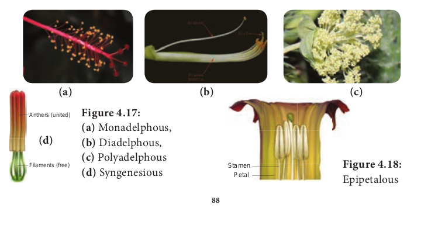
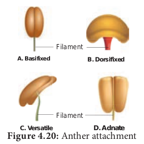

## Androecium

**Androecium:**
Third whorl of flower is the male reproductive part of the flower. It is composed of stamens(microsporophylls). Each Stamen consist of 3 parts, a. Filament b. Anther c. Connective

**Anther: Upper swollen part with microsporangia.**

**Filament**: Stalk of stamen **Connective**: Tissue connecting anther lobes with filament Anther typically contains two com partments called **thecae** (singular theca).Each theca consists of two microsporangia.Two microsporangia fused to form a **locule.**

Sterile stamens are called **Staminodes**. Example: _Cassia._ **Distinct:** stamens which do not fuse to one another. **Free:** stamens which do not fuse with other parts of flower. **Apostemonous:** flowers with stamens that are free and distinct.

### Fusion of stamens:

The fusion of stamens fusing among themselves or with other parts of flower. They are of two types.

**1.Connation and 2.Adnation**

**1. Connation**: Refers to the fusion of stamens among themselves. It is of 3 types. **a.** Adelphy. **b.** Syngenecious. **c.** Synandrous.

**a. Adelphy**: Filaments connate into one or more bundles but anthers are free. It may be the following types.

**1. Monadelphous**: Filaments of stamens connate into a single bundle.Example: Malvaceae (Chinarose, Cotton).
**2. Diadelphous**: Filaments of stamens connate into two bundles. Example: _Fabaceae (pea)_ and _Clitoria_.

**3. Polyadelphous**: Filaments connate into many bundles. Example: _Citrus_, _Bombax_

**b. Syngenesious**: Anthers connate, filaments free. Example: Asteraceae.

**c. Synandrous**: Filaments and anthers are completely fused. Example: _Coccinea_.

**2. Adnation**: Refers to the fusion of stamens with other floral parts. Epipetalous : Stamens are adnate to petals .Example: brinjal, _Datura_.

**a. Episepalous:** stamens are adnate to sepals. Example: _Grevillea_ (Silver oak)

**b. Epitepalous** (**epiphyllous**): stamens are adnate to tepals. Example: _Asparagus_.

**c. Gynostegium**:Connation product of stamens and stigma is called **gynostegium**. Example: _Calotropis_ and Orchidaceae.

**d. Pollinium**: Pollen grains are fused together as a single mass Example: _Calotropis_

### Arrangement of stamens relate to length of stamens:

**1. Didynamous:** Four stamens of which two with long filaments and two with short filaments. Example: Ocimum

**2. Tetradynamous**: Six stamens of which four with long filaments and two with short filaments. Example: Brassica.

**3. Heterostemonous**: stamens are of different lengths in the same flower. Example: _Cassia._

### Anther types

**1. Monothecal :** One lobe with two microsporangia. They are kidney shaped in a cross section. Example: Malvaceae

**2. Dithecal**: It is a typical type,having two lobes with four microsporangia.They are butterfly shaped in cross section. Example: Solanaceae.

### Anther attachment

**1. Basifixed:(Innate)** Base of anther is
attached to the tip of filament. Example: _Datura_.

**2. Dorsifixed: Apex of filament is attached** to the dorsal side of the anther. Example: _Hibiscus_.

**3. Versatile**: Filament is attached to the anther at midpoint. Example: Grasses.

**4. Adnate**: Filament is continued from the base to the apex of anther. Example: _Nelumbo_

