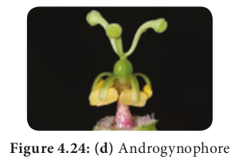

# Gynoecium

Gynoecium or pistil is the female reproductive part of the flower.

A pistil consists of an expanded basal portion called the ovary, an elongated section called a **style** and an apical structure that receives pollen called a **stigma**. Ovary with stipe is called **stipitate ovary.**

**Carpel**: They are components of a gynoecium. Gynoecium is made of one or more carpels. Carpels may be distinct or connate.

## Number of carpel

| **Unicarpellary** (monocarpellary) Single carpel Example: Fabaceae | **Bicarpellary** Two carpels Example: Rubiaceae                                     |
| ------------------------------------------------------------------ | ----------------------------------------------------------------------------------- |
| **Tricarpellary** Three carpels Example: Cucurbitaceae             | **Tetracarpellary** Four carpels Example: Lamiaceae.                                |
| **Multicarpellary** Many carpels Example: Nymphaeceae*.*           |
| **Apocarpous**                                                     | **Syncarpous**                                                                      |
| A pistil contains two or more distinct carpels. Example: _Annona_. | A pistil contains two or more carpels which are connate. Example: _Citrus_, tomato. |

## Fusion of carpels

It is an important systematic character. Apocarpous gynoecium is generally thought to be ancestral condition in Angiosperms.

## Number of locules

Ovary bears ovules on a specialized tissue called **placenta**. A **septum** is a crosswall or partition of ovary. The walls of ovary and septa form a cavity called **locule**. Like that tetralocular and pentalocular ovaries are present according to the locule numbers four or five. More than one locule ovaries are called **plurilocular**.

## Extension of the condensed internode of the receptacle

**1. Anthophore**:The internodal elongation between calyx and corolla. Example: caryophyllaceae (_Silene conoidea_)

**2. Androphore:** The internodal elongation between the corolla and androecium. Example: _Grewia_.

**Figure 4.24: (b)** Androphore

**3. Gynophore:** The internodal elongation between androecium and gynoecium. Example: _Capparis_.

**4. Gynandrophore** or **Androgynophore**: The unified internodal elongation between corolla and androecium and androecium and gynoecium. Example: _Gynandropsis_.

**Figure 4.24: (d)** Androgynophore

## Ovary position

The position or attachment of ovary relative to the other floral parts. It may be classified into
**1. Superior ovary:** It is the ovary with the sepals, petals and stamens attached at the base of the ovary.

**2. Inferior ovary:** It is the ovary with the sepals, petals and stamens attached at the apex of the ovary.

**3. Half-inferior ovary:** It is the ovary with the sepals, petals and stamens or hypanthium attached near the middle of the ovary.

| **Hypogynous:**                                                                                              | **Epihypogynou**                                                               | **Perigynous:**                                                             | **Epigynous:**                                                                     | **Epiperigynous:**                                                           |
| ------------------------------------------------------------------------------------------------------------ | ------------------------------------------------------------------------------ | --------------------------------------------------------------------------- | ---------------------------------------------------------------------------------- | ---------------------------------------------------------------------------- |
| The term is used for sepals, petals and stamens attached at the base of a superior ovary. Example: Malvaceae | The term is use petals and stam at the middle o (halfinferior). Fabaceae, Rosa | The term is used for a hypanthium attached at the base of a superior ovary. | The term is use petals and stam at the top of (inferior overy). Apple, Asteraceae. | The term is used for hypanthodium attached at the apex of an inferior ovary. |

## Perianth / Androecial position on thalamus:

It describes placement of the perianth and androecium relative to the ovary and to a hypanthium, if present ( Figure 4.25).

---

**Hypanthium ( Staminal disk)** : a fleshy elevated often nectariferous cup like thalamus

---
