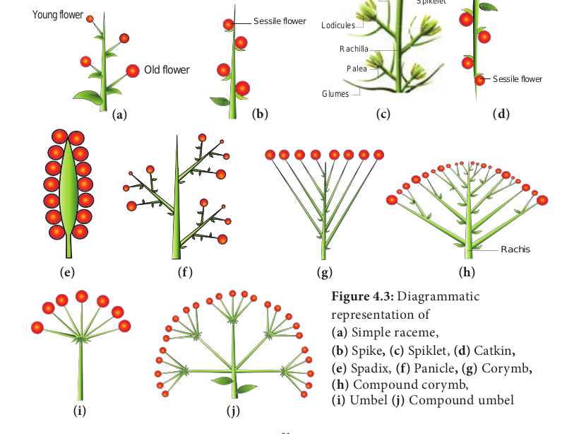
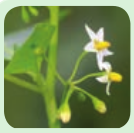
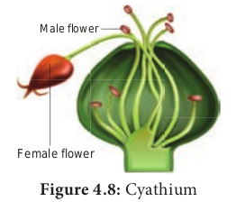

# Inflorescence

Have you seen a bouquet being used during functions? Group of flowers arranged together on our preference is a bouquet. But an inflorescence is a group of flowers arising from a branched or unbranched axis with a definite pattern. Function of inflorescence is to display the flowers for effective pollination and facilitate seed dispersal. The grouping of flowers in one place gives a better attraction to the visiting pollinators and maximize the energy of the plant.

## Types of Inflorescence

**Based On Position**

Have you ever noticed the inflorescence arising from different positions? Where is the inflorescence present in a plant? Apex or axil?

Based on position of inflorescences, it may be classified into three major types. They are,

**Terminal**: Inflorescence grows as a part of the terminal shoot. Example: Raceme of _Nerium oleander_

**Axillary**: Inflorescence presents in the axile of the nearest vegetative leaf. Example: _Hibiscus rosa-sinensis_

**Cauliflorous**: Inflorescence developed di rectly from a woody trunk. Example: _Theobro- ma cocoa, Couraupita guinensis_

Observe the inflorescence of Jackfruit and Canon ball tree. Where does it arise?

## Based on branching pattern and other characters

Inflorescence may also be classified based on branching, number and arrangement of flowers, and some specialized structures.

I. **Indeterminate** (**Racemose**)
II. **Determinate (Cymose)**
III. **Mixed inflorescence**: Inflorescence of some plants show a combination of indeterminate and determinate pattern
IV. **Special inflorescence**: Inflorescence which do not confine to these patterns

| **Racemose**                                                     | **Cymose**                                                      |
| ---------------------------------------------------------------- | --------------------------------------------------------------- |
| Main axis of unlimited growth                                    | Main axis of limited growth.                                    |
| Flowers arranged in an acropetal succession                      | Flowers arranged in a basipetal succession                      |
| Opening of flowers is centripetal                                | Opening of flowers is centrifugal                               |
| Usually the oldest flower at the base of the inflorescence axis. | Usually the oldest flower at the top of the inflorescence axis. |

**I. Racemose** The central axis of the inflorescence (peduncle) possesses terminal bud which is capable of growing continuously and produce lateral flowers is called **Racemose inflorescence**. Old flowers are at the base and younger flowers and buds are towards the apex. It is further divided into 3 types based on growth pattern of main axis.

**1. Main axis elongated**

The axis of inflorescence is elongated and contains pedicellate or sessile flowers on it. The following types are discussed under main axis elongated type.

**a. Simple raceme:** The inflorescence with an unbranched main axis bears **pedicellate flowers** in acropetal succession. Example: _Crotalaria retusa,_ Mustard.

**b.** **Spike:** Spike is an unbranched indeterminate inflorescence with **sessile flowers**. Example: _Achyranthes._

**c.** **Spikelet:** Literally it is a small spike. The Inflorescence is with branched central axis. Each branch is a **spikelet**. Sessile flowers are formed in acropetal succession on the axis. A pair of inflorescence bracts called **glumes** is present at the base. Each sessile flower has a **lemma** (bract) and a **palea** (bracteole). Tepals reduced to colourless scaly leaves (lodicule). Each flower has stamen and pistil only. Example: Paddy, Wheat.

**d.** **Catkin**: **Pendulous spikes** with a long and drooping axis bearing small unisexual or bisexual flowers. It is also called **ament**. Example: _Acalypha hispida_, _Prosopis juliflora._

**e.** **Spadix:** An inflorescence with a fleshy or thickened central axis that possesses many unisexual sessile flowers in acropetal succession. Usually female flowers are found towards the base and male flowers are found at the apex. Entire inflorescence is covered by a brightly coloured or hard bract called a **spathe**. Example: _Amorphophallus_, _Colocasia._

**f.** **Panicle**_:_ A branched raceme is called **panicle**. Example: _Mangifera,_ neem. It is also called **Compound raceme** or **Raceme of Racemes**.

**2. Main axis shortened:** Inflorescence with reduced growth of central axis. There are two types, namely corymb and umbel.

**a. Corymb:** An inflorescence with shorter pedicellate flowers at the top and longer

pedicellate flowers at the bottom. All flowers appear at the same level to form convex or flat topped racemose inflorescence. Example: _Caesalpinia_. **Compound corymb:** A branched corymb is called **Compound corymb**. Example: Cauliflower.

**b. Umbel:** An inflorescence with indeterminate central axis and pedicellate flowers arise from a common point of peduncle at the apex. Example: _Allium_ _cepa_. **Compound umbel**: It is a branched umbel. Each smaller unit is called **umbellule**.Example: _Daucas carota_, _Coriandrum sativum_.

**3. Main axis flattened:** The main axis of inflorescence is mostly flattened (convex or concav) or globose. A **head** or **capitulum** is determinate or indeterminate, group of sessile or sub sessile flowers arising on a receptacle, often subtended by an involucre.

**a. Head:** A head is a characteristic inflorescence of Asteraceae and is also found in some members of Rubiaceae and Mimosaceae.

Torus contains two types of florets: 1. Disc floret or tubular floret. 2. Ray floret or ligulate floret. Based on the type of florets present, the heads are classified into two types.

**i. Homogamous head**:

This type of inflorescence exhibits single kind of florets. Inflorescence has disc florets alone. Example: _Vernonia,_ Ray florets alone. Example: _Launaea_.

**ii. Heterogamous head**

The inflorescence possesses both types of florets. Example: _Helianthus, Tridax_.
**Disc florets** at the centre of the head are tubular and bisexual, whereas the **ray florets** found at the margin of the head which are ligulate and pistilate (unisexual).

The flower and inflorescence are subtended by a lateral appendage called bract. In sunflower, you may notice that the whorl of bracts forms a cup like structure beneath mimicking the calyx. Such whorl of bracts is called involucre. A group of bracts present beneath the sub unit of inflorescence is known as Involucre.

**II. Cymose inflorescence.**

Central axis stops growing and ends in a flower, further growth is by means of axillary buds. Old flowers present at apex and young flowers at base

**1. Simple cyme** (**solitary**)**:** Determinate inflorescence consists of a single flower. It may be terminal or axillary. Example: terminal in _Trillium grandiflorum and axillary in Hibiscus._

**2\. Monochasial Cyme (uniparous): The** main axis ends with a flower. From two lateral bracts, only one branch grows further. It may be **Helicoid** or **Scorpioid.**

**a. Helicoid: A**xis develops on only one side and forms a coil structure atleast at the earlier development stage. Example: _Hamelia_, potato.

**b. Scorpioid:** Axis develops on alternate sides and often becomes a coiled structure. Example: _Heliotropium_.

**3. Simple dichasium (Biparous**): A central axis ends in a terminal flower; further growth is produced by two lateral buds. Each cymose unit consists of three flowers of which central one is old one. This is true cyme. Example: _Jasminum_. 4. Compound dichasium: It has many flowers. A terminal old flower develops lateral simple dichasial cymes on both sides. Each compound dichasium consists of seven flowers. Example: _Clerodendron_.

A small,simple dichasium is called **cymule**

**5. Polychasial Cyme (multiparous):**

The central axis ends with a flower. The lateral axis branches repeatedly. Example: _Nerium_

**Sympodial Cyme**: In monochasial cyme, successive axis at first develop in a zigzag manner and later it develops into a straight pseudo axis. `Example:_Solanum americanum._`

**III. Mixed Inflorescence**

Inflorescences in which both racemose and cymose patterns of development occur in a mixed manner. It is of the following two types.
**1\. Thyrsus**: It is a ‘**Raceme of cymes**’. Indefinite central axis bears lateral pedicellate cymes, (simple or compound dichasia). Example: _Ocimum_.
**2\. Verticillaster**: Main axis bears two opposite lateral sessile cymes at the axil of the node,each of it produces monochasial scorpioid lateral branches so that flowers  

**IV. Special Inflorescence**

The inflorescence that do not show any of the development pattern types are classified under special type of inflorescence.
**1\. Cyathium: Cyathium inflorescence consists** of small unisexual flowers enclosed by a common involucre which mimics a single flower. Male flowers are organised in a scorpioid manner. Female flower is solitary and centrally located on a long pedicel. Male flower is represented only by stamens and female flower is represented only by a pistil. Cyathium may be actinomorphic `(Example: _Euphorbia_) or zygomorphic (Example: _Pedilanthus_). Nectar is present in involucre_._`

**2. Hypanthodium**: Receptacle is a hollow, globose structure consisting of unisexual flowers present on the inner wall of the receptacle. Receptacle is closed leaving a small opening called **ostiole** which is covered by a series of bracts. Male flowers are present nearer to the ostiole, female and neutral flowers are found in a mixed manner from middle below. `Example: _Ficus sp_. (Banyan, Fig and Pipal).`

**3. Coenanthium: Circular disc like fleshy open** receptacle that bears pistillate flowers at the center and staminate flowers at the periphery. `Example: _Dorstenia_`
