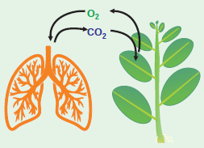

# Chapter Outline

**14.1** Gaseous exchange
**14.2** Structure of ATP
**14.3** Redox reactions
**14.4** Types of Respiration
**14.5** Stages of Respiration
**14.6** Respiratory Quotient
**14.7** Anaerobic Respiration
**14.8** Factors Affecting Respiration
**14.9** Pentose Phosphate Pathway

If you are sleeping under a tree during night time you will feel difficulty in breathing. During night, plants take up oxygen and release carbon dioxide and as a result carbon dioxide will be abundant around the tree. This process of CO2 evolution is called **respiration**. This process takes place during day time also (Figure 14.1). It is accompanied by breakdown of substrates and release of energy. In this chapter, respiration process in plants at cellular level will be dealt with.

>**Plant and Animal Interdependence**
In biosphere, plants and animals are complementary systems which are integrated to sustain life. In plants, oxygen enters through the stomata and it is transported to cells, where oxygen is utilized for energy production. Plants require carbon dioxide to survive, to produce carbohydrates and to release oxygen through photosynthesis. These oxygen molecules are inhaled by human through the nose, which reaches the lungs where oxygen is transported through the blood and it reaches cells. Cellular respiration takes place inside the cell. A specialized respiratory system is present in animals but is absent in plants for delivering oxygen inside the cell. But the cellular respiration stages are similar in both plants and animals which hint at evolutionary divergence.

