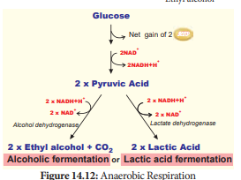
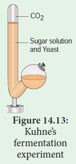
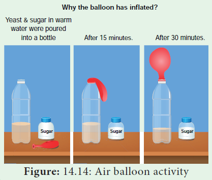

# Anaerobic Respiration 

## Fermentation
Some organisms can respire in the absence of oxygen. This process is called **fermentation or anaerobic**

| **#** | **Alcoholic Fermentation** | **Lactic Acid Fermentation** |
|-------|---------------------------|------------------------------|
| 1     | It produces alcohol and releases CO2 from pyruvic acid. | It produces lactic acid and does not release CO2 from pyruvic acid. |
| 2     | It takes place in two steps. | It takes place in a single step. |
| 3     | It involves two enzymes, pyruvate decarboxylase with Mg+ and alcohol dehydrogenase. | It uses one enzyme, lactate dehydrogenase with Zn++. |
| 4     | It forms acetaldehyde as intermediate compound. | Does not form any intermediate compound. |
| 5     | It commonly occurs in yeast.| Occurs in bacteria, some fungi and vertebrate muscles. |

**respiration** (Figure 14.12). There are three types of fermentation: 
1. Alcoholic fermentation 
2. Lactic acid fermentation 
3. Mixed acid fermentation

**1. Alcoholic fermentation** The cells of roots in water logged soil respire by alcoholic fermentation because of lack of oxygen by converting pyruvic acid into ethyl alcohol and CO2. Many species of yeast (Saccharomyces) also respire anaerobically. This process takes place in two steps:

(i) $$2CH_3COCOOH \xrightarrow[\text{TPP}]{\text{Pyruvate decarboxylase}} 2CH_3CHO + CO_2↑$$ (Pyruvic acid to Acetaldehyde)

(ii) $$2CH_3CHO + NADH + H^+ \xrightarrow{\text{Alcohol dehydrogenase}} 2CH_3CH_2OH + NAD^+$$ (Acetaldehyde to Ethyl alcohol)

**Industrial uses of alcoholic fermentation:** 
1. In bakeries, it is used for preparing bread, cakes, biscuits. 

2. In beverage industries for preparing wine and alcoholic drinks. 

3. In producing vinegar and in tanning, curing of leather. 

4. Ethanol is used to make gasohol (a fuel that is used for cars in Brazil). 

**2. Lactic acid fermentation** Some bacteria (_Bacillus_), fungi and muscles of vertebrates produce lactic acid from pyruvic acid (Table 14.3).

$$2CH_3COCOOH + 2NADH + 2H^+ \xrightarrow{\text{Pyruvic acid}} 2CH_3CHOHCOOH + 2NAD^+$$ (Conversion to Lactic acid)

**3. Mixed acid fermentation** This type of fermentation is a characteristic feature of Enterobacteriaceae and results in the formation of lactic acid, ethanol, formic acid and gases like CO2 and H2.

**Characteristics of Anaerobic Respiration** 
1. Anaerobic respiration is less efficient than the aerobic respiration (Figure 14.12). 

2. Limited number of ATP molecules is generated per glucose molecule (Table 14.4). 

3. It is characterized by the production of CO2 and it is used for Carbon fixation in photosynthesis.

| **Stage** | **Substrate level ATP production** | **Reduced NAD+** | **Total ATP** |
|-----------|------------------------------------|------------------|---------------|
| Glycolysis | 2 | 2* | 8 |
| Anaerobic respiration | 2 | 2 reduced NAD+ re-oxidised | 2 |

>**Demonstration of alcoholic fermentation**
Take a Kuhne’s fermentation tube which consists of an upright glass tube with side bulb. Pour 10% sugar solution mixed with baker’s yeast into the fermentation tube the side tube is filled plug the mouth with lid. After some time, the glucose solution will be fermented. The solution will give out an alcoholic smell and level of solution in glass column will fall due to the accumulation of CO2 gas. It is due to the presence of zymase enzyme in yeast which converts the glucose solution into alcohol and CO2. Now introduce a pellet of KOH into the tube, the KOH will absorb CO2 and the level of solution will rise in upright tube (Figure 14.13).

>**Activity**
Take a bottle filled with warm watermixed with baker’s yeast and sugar.Aftersome time, you will notice water bubblingas yeast produces carbon dioxide. Attacha balloon to the mouth of the bottle. After 30 minutes you’ll notice balloon standing upright (Figure 14.14).