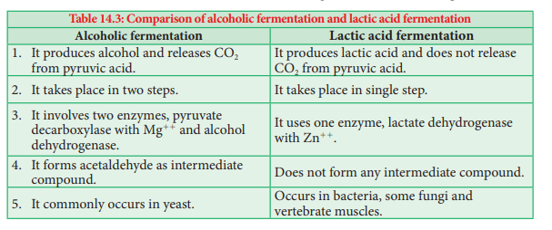
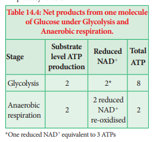

# 14.7 Anaerobic Respiration 

## 14.7.1 Fermentation
Some organisms can respire in the absence of oxygen. This process is called **fermentation or anaerobic**

`table`

**respiration** (Figure 14.12). There are three types of fermentation: 
1. Alcoholic fermentation 
2. Lactic acid fermentation 
3. Mixed acid fermentation

**1. Alcoholic fermentation** The cells of roots in water logged soil respire by alcoholic fermentation because of lack of oxygen by converting pyruvic acid into ethyl alcohol and CO2. Many species of yeast (Saccharomyces) also respire anaerobically. This process takes place in two steps:

`formulae`
`(i) 2CH3COCOOH Pyruvate decarboxylase TPP 2CH3CHO 1 2CO2↑ Pyruvic acid Acetaldehyde`
`(ii) 2CH3CHO 1 2NADH12H1 Alcohol dehydrogenase Acetaldehyde 2CH3CH2OH 1 2NAD1 Ethyl alcohol`

**Industrial uses of alcoholic fermentation:** 
1. In bakeries, it is used for preparing bread, cakes, biscuits. 

2. In beverage industries for preparing wine and alcoholic drinks. 

3. In producing vinegar and in tanning, curing of leather. 

4. Ethanol is used to make gasohol (a fuel that is used for cars in Brazil). 

**2. Lactic acid fermentation** Some bacteria (_Bacillus_), fungi and muscles of vertebrates produce lactic acid from pyruvic acid (Table 14.3).

`formulae`
`2CH3COCOOH 1 2NADH12H1 Pyruvic acid  2CH3CHOHCOOH 1 2NAD1 Lactic acid`

**3. Mixed acid fermentation** This type of fermentation is a characteristic feature of Enterobacteriaceae and results in the formation of lactic acid, ethanol, formic acid and gases like CO2 and H2.

**Characteristics of Anaerobic Respiration** 
1. Anaerobic respiration is less efficient than the aerobic respiration (Figure 14.12). 

2. Limited number of ATP molecules is generated per glucose molecule (Table 14.4). 

3. It is characterized by the production of CO2 and it is used for Carbon fixation in photosynthesis.

`table`

