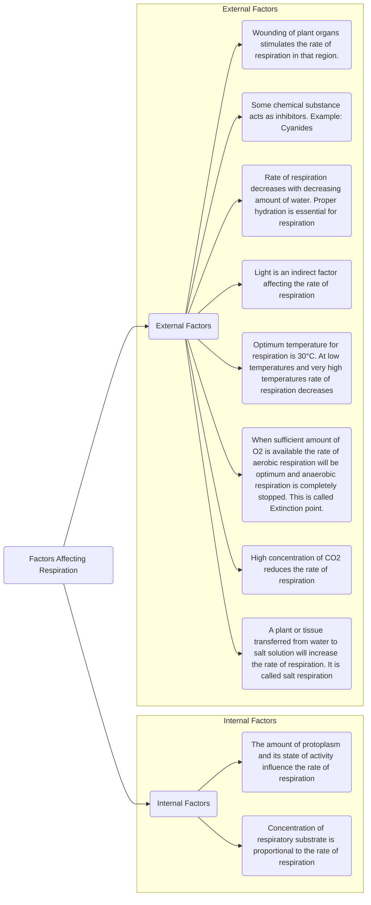

# Factors Affecting Respiration

```mermaid
graph LR
    a(Factors Affecting Respiration)-->b(Internal Factors)
    a-->c(External Factors)
    subgraph Internal Factors
        b-->b1(The amount of protoplasm and its state of activity influence the rate of respiration)
        b-->b2(Concentration of respiratory substrate is proportional to the rate of respiration)
    end
    subgraph External Factors
        c-->c1(Wounding of plant organs stimulates the rate of respiration in that region.)
        c-->c2(Some chemical substance acts as inhibitors. Example: Cyanides)
        c-->c3(Rate of respiration decreases with decreasing amount of water. Proper hydration is essential for respiration)
        c-->c4(Light is an indirect factor affecting the rate of respiration)
        c-->c5(Optimum temperature for respiration is 30°C. At low temperatures and very high temperatures rate of respiration decreases)
        c-->c6(When sufficient amount of O2 is available the rate of aerobic respiration will be optimum and anaerobic respiration is completely stopped. This is called Extinction point.)
        c-->c7(High concentration of CO2 reduces the rate of respiration)
        c-->c8(A plant or tissue transferred from water to salt solution will increase the rate of respiration. It is called salt respiration)
    end
```

>**Check your grasp!** 
>- Why Microorganisms respire anaerobically?
>- Does anaerobic respiration take place in higher plants?
