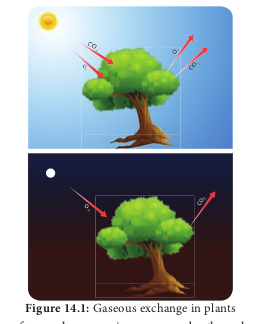

# Gaseous Exchange 

## Respiration
The term respiration was coined by **Pepys** (1966). Respiration is a biological process in which oxidation of various food substances like carbohydrates, proteins and fats take place and as a result of this, energy is produced where O2 is taken in and CO2 is liberated. The organic substances which are oxidised during respiration are called respiratory substrates. Among these, glucose is the commonest respiratory substrate. Breaking of C-C bonds

     

of complex organic compounds through oxidation within the cells leads to energy release. The energy released during respiration is stored in the form of **ATP** (Adenosine Tri Phosphate) as well as liberated heat. Respiration occurs in all the living cells of organisms. The overall process of respiration corresponds to a reversal of photosynthesis.

`formulae`
`C6H12O6 1 6O2 → 6CO2 1 6H2O 1 Energy (686 K cal or 2868 KJ)`

`(1K cal = 4.184 KJ)`

Depending upon the nature of respiratory substrate, **Blackman** divided respiration into,

1. Floating respiration 
2. Protoplasmic respiration

When carbohydrate or fat or organic acid serves as respiratory substrate and it is called **floating respiration.** It is a common mode of respiration and does not produce any toxic product. Whereas respiration utilizing protein as a respiratory substrate, it is called **protoplasmic respiration**. Protoplasmic respiration is rare and it depletes structural and functional proteins of protoplasm and liberates toxic ammonia.  

### Compensation point
At dawn and dusk the intensity of light is low. The point at which CO2 released in respiration is exactly compensated by CO2 fixed in photosynthesis that means no net gaseous exchange takes place, it is called **compensation point**. At this moment, the amount of oxygen released from photosynthesis is equal to the amount of oxygen utilized in respiration. The two common factors associated with compensation point are CO2 and light (Figure 14.2). Based on this there are two types of compensation point. They are CO2 compensation point and light compensation point. C3 plants have compensation points ranging from 40-60 ppm (parts per million) CO2 while those of C4 plants ranges from 1-5 ppm CO2.

