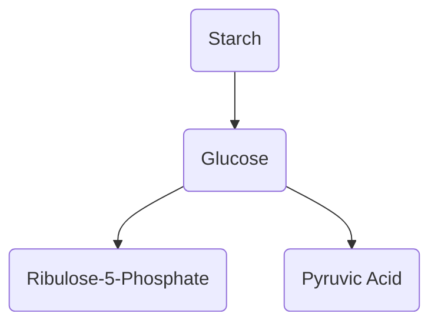
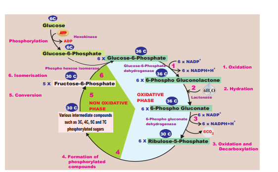

# Pentose Phosphate Pathway (Phospho Gluconate Pathway)

During respiration breakdown of glucose in cytosol occurs both by glycolysis (about 2/3) as well as by oxidative pentose phosphate pathway (about 1/3). Pentose phosphate pathway was described by **Warburg**, **Dickens** and **Lipmann**  (1938). Hence, it is also called **Warburg-Dickens-Lipmann** pathway. It takes place in cytoplasm of mature plant cells. It is an alternate way for breakdown of glucose (Figure 14.15).

It is also known as **Hexose monophosphate shunt (HMP Shunt) or Direct Oxidative Pathway**. It consists of two phases, oxidative phase and non-oxidative phase. The oxidative events convert six molecules of six carbon Glucose-6-phosphate to 6 molecules of five carbon sugar Ribulose-5 phosphate with loss of 6CO2 molecules and generation of 12  NADPH + H+ (not  NADH). The remaining reactions known as **non-oxidative pathway**, convert Ribulose-5-phosphate molecules to various intermediates such as Ribose-5-phosphate(5C), Xylulose5-phosphate(5C), Glyceraldehyde-3- phosphate(3C), Sedoheptulose-7-Phosphate (7C), and Erythrose-4-phosphate (4C). Finally, five molecules of glucose-6- phosphate is regene-rated (Figure 14.16). The overall reaction is:  

`formulae`
`6 x Glucose-6-Phosphate + 12NADP+ + 6H2O`

`5 x Glucose-6-Phosphate + 6CO2 + Pi + 12NADPH 112H+`

The net result of complete oxidation of one glucose-6-phosphate yield 6CO2 and 12NADPH + H+. The oxidative pentose 

phosphate pathway is controlled by glucose- 6-phosphate dehydrogenase enzyme which is inhibited by high ratio of NADPH to NADP+.

Significance of pentose phosphate pathway 

1. HMP shunt is associated with the generation of two important products, NADPH and pentose sugars, which play a vital role in anabolic reactions.

2. Coenzyme NADPH generated is used for reductive biosynthesis and counter damaging the effects of oxygen free radicals

3. Ribose-5-phosphate and its derivatives are used in the synthesis of DNA, RNA, ATP, NAD+, FAD and Coenzyme A.

4. Erythrose is used for synthesis of anthocyanin, lignin and other aromatic compounds.

5. It plays a role on fixation of Co2 in photosynthesis through RUBP.
