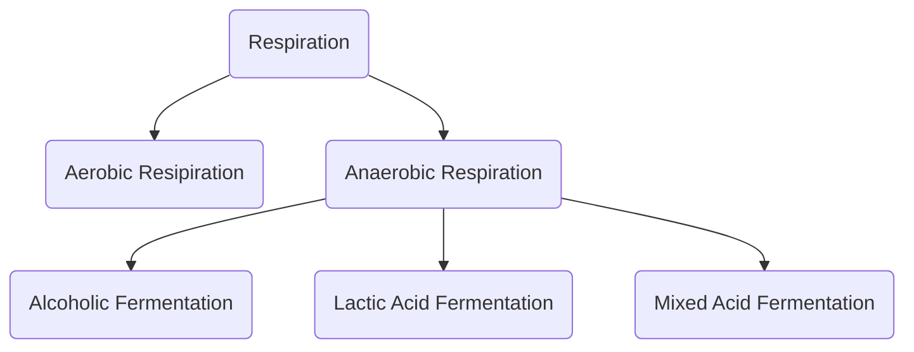

# Types of Respiration
Respiration is classified into two types as aerobic and anaerobic respiration (Figure 14.4)

|    | Aerobic Respiration                                             | Anaerobic Respiration                                      |
|----|-----------------------------------------------------------------|-----------------------------------------------------------|
| 1. | It occurs in all living cells of higher organisms.              | It occurs yeast and some bacteria.                        |
| 2. | It requires oxygen for breaking the respiratory substrate.      | Oxygen is not required for breaking the respiratory substrate. |
| 3. | The end products are CO2 and H2O.                               | The end products are alcohol, and CO2 (or) lactic acid.   |
| 4. | Oxidation of one molecule of glucose produces 36 ATP molecules. | Only 2 ATP molecules are produced.                        |
| 5. | It consists of four stages-glycolysis, link reaction, TCA cycle and electron transport chain. | It consists of two stages-glycolysis and fermentation. |
| 6. | It occurs in cytoplasm and mitochondria. | It occurs only in cytoplasm. |

>**Handy mnemonic**
LEO the lion says GER
LEO - Loss of Electrons is Oxidation
GER - Gain of Electrons is Reduction

## Aerobic respiration
Respiration occurring in the presence of oxygen is called **aerobic respiration**. During aerobic respiration, food materials like carbohydrates, fats and proteins are completely oxidised into CO2, H2O and energy is released. Aerobic respiration is a very complex process and is completed in four major steps:

1. Glycolysis 
2. Pyruvate oxidation (Link reaction) 
3. Krebs cycle (TCA cycle) 
4. Electron Transport Chain (Terminal oxidation). 

### Anaerobic respiration
In the absence of molecular oxygen glucose is incompletely degraded into either ethyl alcohol or lactic acid (Table 14.1). It includes two steps:

1. Glycolysis 
2. Fermentation

>**Do You Know ?**
ATP is not only higher energy compound present in a cell. There are other higher energy compounds also present. Example GTP (Guanosine Tri Phosphate) and UTP (Uridine Tri Phosphate).