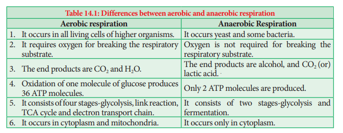

# Types of Respiration
Respiration is classified into two types as aerobic and anaerobic respiration (Figure 14.4)

## Aerobic respiration
Respiration occurring in the presence of oxygen is called **aerobic respiration**. During aerobic respiration, food materials like carbohydrates, fats and proteins are completely oxidised into CO2, H2O and energy is released. Aerobic respiration is a very complex process and is completed in four major steps:

1. Glycolysis 
2. Pyruvate oxidation (Link reaction) 
3. Krebs cycle (TCA cycle) 
4. Electron Transport Chain (Terminal oxidation). 

### Anaerobic respiration
In the absence of molecular oxygen glucose is incompletely degraded into either ethyl alcohol or lactic acid (Table 14.1). It includes two steps:

1. Glycolysis 2. Fermentation

>ATP is not only higher energy compound present in a cell. There are other higher energy compounds also present. Example GTP (Guanosine Tri Phosphate) and UTP (Uridine Tri Phosphate).