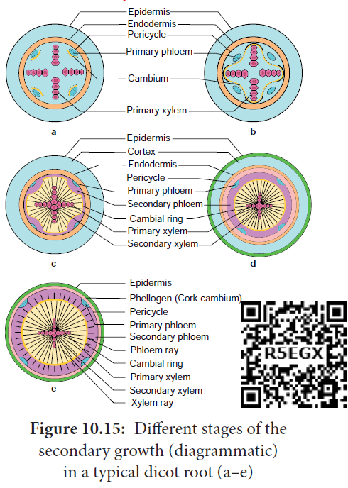
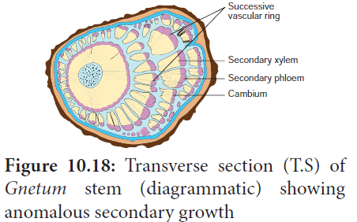
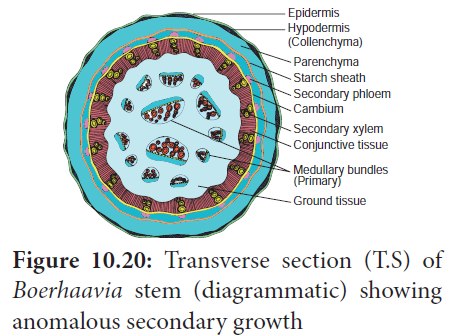
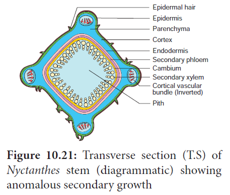

**Chapter Outline**

**10.1** Secondary Growth in Dicot Stem

**10.2** Secondary Growth in Dicot Root

**10.3** Anomalous Secondary Growth

**10.4** Timber

**How do the trees increase their girth?**

We have studied in the previous chapters the primary internal structure of monocots and dicots. If you look at the stem of grass (monocot), it is soft, whereas in the neem (dicot), the stem is very hard and woody, why? It is the secondary growth which confers the hardness to wood of dicot stems and roots. In monocots, usually there is no secondary growth and so they are soft.

The increase in girth is called secondary **growth** or **growth in girth** and we shall discuss the details of secondary growth in this chapter.

The plant organs originating from the apical meristems pass through a period of expansion in length and width. The roots and stems grow in length with the help of apical meristems. This is called primary growth **or longitudinal growth. The gymnosperms** and most angiosperms, including some monocots, show an increase in thickness of stems and roots by means of **secondary growth or latitudinal growth.**

The secondary growth in dicots and gymnosperms is brought about by two lateral meristems.

- Vascular Cambium an.
- Cork Cambium

## Secondary Growth in Dicot Stem

**vascular cambium**
The vascular cambium is the lateral meristem that produces the secondary vascular tissues. i.e., secondary xylem and secondary phloem.

**Origin and Formation of Vascular Cambium**
A strip of vascular cambium that is believed to originate from the procambium is present between xylem and phloem of the vascular bundle. This cambial strip is known as **intrafascicular or fascicular cambium**. In between the vascular bundles, a few parenchymatous cells of the medullary rays that are in line with the fascicular cambium become meristematic and form strips of vascular cambium. It is called **interfascicular cambium**.

This interfascicular cambium joins with the intrafascicular cambium on both sides to form a continuous ring. It is called a vascular cambial ring. The differences between interfascicular and intrafascicular cambia are summarised below:

|              Intrafascicular cambium               |                    Interfascicular cambium                    |
| :------------------------------------------------: | :-----------------------------------------------------------: |
|        Present inside the vascular bundles         |           Present in between the vascular bundles.            |
|          Originates from the procambium.           |              Originates from the medullary rays.              |
| Initially it forms a part of the primary meristem. | From the beginning it forms a part of the secondary meristem. |

**Organization of Vascular Cambium**
The cells of vascular cambium do not fit into the usual description of meristems which have isodiametric cells, with a dense cytoplasm and large nuclei. While the active vascular cambium possesses cells with large central vacuole (or vacuoles) surrounded by a thin, layers of dense cytoplasm.

Further, the most important character of the vascular cambium is the presence of two kinds of initials, namely, **fusiform initials** and **ray initials**.

**Fusiform Initials**
These are vertically elongated cells. They give rise to the longitudinal or axial system of the secondary xylem (treachery elements, fibres, and axial parenchyma) and phloem (sieve elements, fibers, and axial parenchyma).

Based on the arrangement of the fusiform initials, two types of vascular cambium are recognized.

**Storied (Stratified cambium) and Non-Storied (Non-stratified cambium)**

If the fusiform initials are arranged in horizontal tiers, with the end of the cells of one tier appearing at approximately the same level, as seen in tangential longitudinal section (TLS), it is called storied (stratified) cambium. It is the characteristic of the plants with short fusiform initials. Whereas in plants with long fusiform initials, they strongly overlap at the ends, and this type of cambium is called **non- storied (non-startified) cambium.**

**Ray Initials**
These are horizontally elongated cells. They give rise to the ray cells and form the elements of the radial system of secondary xylem and phloem.

**Activity of Vascular Cambium**

The vascular cambial ring, when active, cuts off new cells both towards the inner and outer side. The cells which are produced outward form secondary phloem and inward secondary xylem.

At places, cambium forms some narrow horizontal bands of parenchyma which passes through secondary phloem and xylem. These are the rays.

Due to the continued formation of secondary xylem and phloem through vascular cambial activity, both the primary xylem and phloem get gradually crushed.

**Secondary Xylem**
The secondary xylem, also called wood, is formed by a relatively complex meristem, the vascular cambium, consisting of vertically (axial) elongated fusiform initials and horizontally (radially) elongated ray initials.

The axial system consists of vertical files of treachery elements, fibers, and wood parenchyma. Whereas the radial system consists of rows of parenchymatous cells oriented at right angles to the longitudinal axis of xylem elements.

The secondary xylem varies very greatly from species to species with reference to relative distribution of the different cell types, density and other properties. It is of two types.

**Porous Wood or Hard Wood**

Generally, the dicotyledonous wood, which has vessels is called **porous wood** or **hard wood**. Example: _Morus rubra._

**Non- Porous Wood or Soft Wood**

Generally, the gymnosperm wood, which lacks vessels is known as **non- porous wood** or soft wood. Example: Pinus.

**Differences between Porous Wood and Non-porous Wood**

| **Porous wood or Hard wood, Example: _Morus_** | **Non porous wood or Soft wood, Example: _Pinus_** |
| :--------------------------------------------: | :------------------------------------------------: |
|             Common in angiosperms              |               Common in gymnosperms                |
|       Porous because it contains vessels       |   Non-porous because it does not contain vessels   |

**Annual Rings** The activity of vascular cambium is under the control of many physiological and environmental factors. In temperate regions, the climatic conditions are not uniform throughout the year. In the spring season, cambium is very active and produces a large number of xylary elements having vessels/tracheids with wide lumen. The wood formed during this season is called spring wood or early wood. The tracheary elements are fairly thin walled. In winter, the cambium is less active and forms fewer xylary elements that have narrow vessels/ tracheids and this wood is called **autumn wood or late wood.The treachery elements are with** narrow lumen, very thick walled.

The spring wood is lighter in colour and has a lower density whereas the autumn wood is darker and has a higher density.

The annual ring denotes the combination of early wood and late wood and the ring becomes evident to our eye due to the high density of late wood. Sometimes annual rings are called **growth rings** but it should be remembered all the growth rings are not annual. In some trees more than one growth ring is formed with in a year due to climatic changes.

Additional growth rings are developed within a year due to adverse natural calamities like drought, frost, defoliation, flood, mechanical injury and biotic factors during the middle of a growing season,which results in the formation of more than one annual ring. Such rings are called **pseudo-** or **false- annual rings**.

Each annual ring corresponds to one year’s growth and on the basis of these rings, the age of a particular plant can easily be calculated. The determination of the age of a tree by counting the annual rings is called **dendrochronology**.

**Importance of Studying Growth Rings**.

- Age of wood can be calculated.
- The quality of timber can be ascertained.
- Radio-Carbon dating can be verified.
- Past climate and archaeological dating can be made.
- Provides evidence in forensic investigation.

**Dendroclimatology**
It is a branch of dendrochronology concerned with constructing records of past climates and climatic events by analysis of tree growth characteristics, especially growth rings.

**Differences Between Spring Wood and Autumn Wood**

|          **Spring wood or Early wood**          |            **Autumn wood or Late wood**            |
| :---------------------------------------------: | :------------------------------------------------: |
|       The activity of cambium is faster.        |           Activity of cambium is slower            |
|    Produces large number of xylem elements.     |          Produces a fewer xylem elements.          |
|   Xylem vessels/ trachieds have wider lumen.    |    Xylem vessels/ trachieds have narrow lumen.     |
| Wood is lighter in colour and has lower density | Wood is darker in colour and has a higher density. |

Another feature of wood related to seasonal changes is the diffuse porous and ring porous condition. On the basis of diameter of xylem vessels, two main types of angiosperm woods are recognized.

**Diffuse porous woods**
Diffuse porous woods are woods in which the vessels or pores are rather uniform in size and distribution throughout an annual ring.

Example: _Acer_

**Ring porous woods**
The pores of the early wood are distinctly larger than those of the late wood. Thus rings of wide and narrow vessels occur.

Example: _Quercus_

**Differences Between Diffuse Porous Wood and Ring Porous**

|                      **Wood Diffuse porous wood**                      |                            **Ring porous wood**                            |
| :--------------------------------------------------------------------: | :------------------------------------------------------------------------: |
| This type of wood is formed where the climatic conditions are uniform. | This type of wood is formed where the climatic conditions are not uniform. |
|   The vessels are more or less equal in diameter in any annual ring.   |          The vessels are wide and narrow within any annual ring.           |
|       The vessels are uniformly distributed throughout the wood.       |       The vessels are not uniformly distributed throughout the wood.       |

**Tyloses**
In many dicot plants, the lumen of the xylem vessels is blocked by many balloon- like ingrowths from the neighbouring parenchymatous cells. These balloon-like structures are called **tyloses**.

Usually, these structures are formed insecondary xylem vessels that have last their function i.e., in heart wood.

In fully developed tyloses, starchy crystals, resins, gums, oils, tannins or coloured substances are found.

Wood is also classified into sap wood and **heart wood**.
**Sap Wood and Heart Wood**
Sap wood and heart wood can be distinguished in the secondary xylem. In any tree the outer part of the wood, which is paler in colour, is called sap wood or alburnum. The centre part of the wood, which is darker in colour is called heart wood or duramen. The sap wood conducts water while the heart wood stops conducting water. As vessels of the heart wood are blocked by tyloses, water is not conducted through them. Due to the presence of tyloses and their contents the heartwood becomes coloured, dead and the hardest part of the wood.

From the economic point of view, generally the heartwood is more useful than the sapwood. The timber from the heartwood is more durable and more resistant to the attack of microorganisms and insects than the timber from sapwood.

**Differences Between Sap Wood (alburnum) and Heart Wood (duramen)**

|                **Sap Wood (Alburnum)**                |           **Heart Wood (Duramen)**            |
| :---------------------------------------------------: | :-------------------------------------------: |
|               Living part of the wood.                |            Dead part of the wood.             |
|       It is situated on the outer side of wood        |   It is situated in the centre part of wood   |
|                  It is pale coloured                  |              It is dark coloured              |
|                  Very soft in nature                  |                Hard in nature                 |
|                  Tyloses are absent                   |              Tyloses are present              |
| It is not durable and not resistant to microorganisms | It is more durable and resists microorganisms |

**Secondary Phloem**
The vascular cambial ring produces secondary phloem or bast on the outer side of the vascular bundle.

Just as the secondary xylem, the secondary phloem also has two tissue systems – the axial (vertical) and the radial (horizontal) systems derived respectively from the vertically elongated fusiform initials and horizontally elongated ray initials of vascular cambium. While sieve elements, phloem fibre, and phloem parenchyma represent the axial system, phloem rays represent the radial system. Life span of secondary phloem is less compared to secondary xylem. Secondary phloem is a living tissue that transports soluble organic compounds made during photosynthesis to various parts of plant.

Some commercially important phloem or bast fibres are obtained from the following plants.

i. Flax-_Linum usitatissimum_
ii. Hemp-_Cannabis sativa_
iii. Sun hemp-_Crotalaria juncea_
iv. Jute-_Corchorus capsularis_

**Periderm**
Whenever stems and roots increase in thickness by secondary growth, the periderm, a protective tissue of secondary origin replaces the epidermis and often primary cortex. The periderm consists of phellem, phellogen, and phelloderm.

**Phellem (Cork)**

It is the protective tissue composed of non- living cells with suberized walls and formed centrifugally (outward) by the phellogen (cork cambium) as part of the periderm. It replaces the epidermis in older stems and roots of many seed plants. It is characterized by regularly arranged tiers and rows of cells. It is broken here and there by the presence of lenticels.

**Phellogen (Cork Cambium)**
It is a secondary lateral meristem. It comprises homogenous meristematic cells unlike vascular cambium. It arises from epidermis, cortex, phloem or pericycle (extrastelar in origin). Its cells divide periclinally and produce radially arranged files of cells. The cells towards the outer side differentiate into phellem (cork) and those towards the inside as phelloderm (secondary cortex).

**Phelloderm (Secondary cortex)**
It is a tissue resembling cortical living parenchyma produced centripetally (inward) from the phellogen as a part of the periderm of stems and roots in seed plants.

**Differences Between Phellem and Phelloderm**
| **Phellem (Cork)** | **Phelloderm(Secondary cortex)** |
| :--------------: | :------------------: |
| It is formed on the outer side of phellogen. | It is formed on the inner side of phellogen. |
| Cells are compactly arranged in regular tires and rows without intercellular spaces. | Cells are loosely arranged with intercellular spaces. |
| Protective in function. | As it contains chloroplast, it synthesises and stores food. |
| Consists of non- living cells with suberized walls. | Consists of living cells, parenchymatous in nature and does not have suberin. |
| Lenticels are present. | Lenticels are absent. |

**Bark**
The term ‘bark’ is commonly applied to all the tissues outside the vascular cambium of stem (**i.e., periderm, cortex, primary phloem and secondary phloem**). Bark protects the plant from parasitic fungi and insects, prevents water loss by evaporation and guards against variations of external temperature. It is an insect repellent, decay proof, fireproof and is used in obtaining drugs or spices. The phloem cells of the bark are involved in conduction of food while secondary cortical cells involved in storage. If the phellogen forms a complete cylinder around the stem, it gives rise to **ring barks**. Example: _Quercus._ When the bark is formed in overlapping scale like layers, it is known as **scale bark**. Example: Guava. While ring barks normally do not peeled off, scale barks peeled off.

**Lenticel**
Lenticel is raised opening or pore on the epidermis or bark of stems and roots.

It is formed during secondary growth in stems. When phellogen is more active in the region of lenticels, a mass of loosely arranged thin-walled parenchyma cells are formed. It is called **complementary tissue** or filling tissue.

Lenticel is helpful in exchange of gases and transpiration called **lenticular transpiration**.

## Secondary Growth in Dicot root

Secondary growth in dicot roots is essential to provide strength to the growing aerial parts of the plants. It is similar to that of the secondary growth in dicot stem. However, there is marked difference in the manner of the formation of vascular cambium.

The vascular cambium is completely secondary in origin. It originates from a combination of conjunctive tissue located just below the phloem bundles, and as a portion of pericycle tissue present above the protoxylem to form a complete and continuous wavy ring. This wavy ring later becomes circular and produces secondary xylem and secondary phloem similar to the secondary growth in stems.

**Differences Between Secondary Growth in Dicot Stem and Root**

|                                           **Secondary growth in dicot stem**                                           |                      **Secondary growth in dicot root**                      |
| :--------------------------------------------------------------------------------------------------------------------: | :--------------------------------------------------------------------------: |
|                        The cambial ring formed is circular in cross section from the beginning.                        | The cambial ring formed is wavy in the beginning and later becomes circular. |
| The cambial ring is partially primary (fascicular cambium)and partially secondary (Interfascicular cambium) in origin. |             The cambial ring is completely secondary in origin.              |
|                    Generally, periderm originates from the cortical cells (extrastelar in origin).                     |  Generally, periderm originates from the pericyle. (intrastealar in origin)  |
|                                 More amount of cork is produced as stem is aboveground                                 |      Generally, less amount of cork is produced as root is underground.      |
|                                          Lenticels of periderm are prominent.                                          |                Lenticels of periderm are not very prominent.                 |

## Cambial variants (Anomalous Secondary Growth)

Cambial variants (previously known as **anomalous secondary growth**) is a deviation from normal secondary growth and production of secondary vascular and non-vascular tissues. A normal cambium with abnormal activity, accessory (additional) cambia or abnormally situated cambia with normal activity can produce anomalous secondary growth. The anomalies may be listed as follows,

### Anomalous position of vascular cambium

Unusual shapes in stems are formed by the unusual position of cambium. Example: _Thinonia scandens, Serjania ichthyoctona_ and Bauhinia langsdorffiana.

### Abnormal behaviour of normal cambium

Certain segments of cambia cease to produce secondary xylem. But at the same time, it produces secondary phloem only on the outer side. The remaining cambial segments do the normal activity; As a result, ridged and furrowed steles are formed. Example: _Bignonia._

### Successive cambium

In plants like _Aviccenia, Cycas, Gnetum_ a number of cambial rings arise in succession and produce concentric rings of secondary tissues.

### Interxylary or Included Phloem

The secondary phloem found in the form of strands (islands) embedded in the secondary xylem is called **interxylary** or **included phloem**. Example: _Strychnos, Combretum_ and _Salvadora._

### Presence of medullary bundles along with normal cambial activity

In this type, the normal vascular bundles are arranged in a ring from which a normal cambial ring is formed. In addition, vascular bundles are scattered or found in a ring in the pith or medullary region. These are called medullary **vascular bundles**. Example: _Boerhaavia._

### Presence of cortical bundles along with normal cambial activity

In this type, a ring of vascular bundles are found, from which a normal cambial ring is formed. In addition, in the cortical region additional vascular bundles are found. Example: _Nyctanthes._

### Intraxylary or Internal Phloem

The cambium usually forms primary phloem on the outer side. In some plants,it forms the primary phloem on the inner side along with xylem towards pith. This is called **intraxylary** or **internal**

**Phloem**. Example: _Solanum tuberosum_

### Secondary Growth in Monocot

In some monocotyledons, the stems exhibit secondary growth. Example: _Dracaena_. Here, a secondary thickening meristems (STM) originate from the ground tissue outside of the vascular bundles. STM cuts off cells on the inside from which additional vascular bundles are formed along with parenchyma cells in between the vascular bundles. The STM consists of only one type of cells unlike normal vascular cambium. STM does not produce continuous xylem on the inside but only vascular bundle with xylem and phloem. Also no phloem is formed on the outer side.

### Anomalous primary growth

**I) Absence of vessels in the xylem.**
Usually, vessels are found in the xylem of angiosperms, whereas some plants are lacking vessels in the xylem. Example: _Hydrilla, Winteraceae_ family members.

**II) Scattered Vascular bundles along with cambial activity in dicots.**
In dicot stem, normally the vascular bundles are arranged in a ring, whereas some dicot stems possess scattered vascular bundles in the cortex like monocot stems. Example: _Piper, Peperomia._

**Figure 10.24: Transverse section (T.S) of
Peperomia stem (diagrammatic) showing
anomalous primary growth**

## Timber

Timber is derived from wood logs through the process of sawing. There are many methods of sawing. Among them, rib sawing is the most common method in making timber. Timber is mainly used for carpentry and building houses. In order to enrich the quality of timber, seasoning of wood is done. Timber is the most important tissue that sequestrates atmospheric carbon and this reduces global warming.

### Seasoning of wood

It is the process in which moisture content from the wood is removed. There are two types of seasoning.

**1. Air Seasoning** is the process in which the moisture can be removed without resorting to artificial heat. In this method of artificial seasoning, the cut timber pieces are left exposed in the open air and the moisture is removed naturally and gradually by the heat of the sun. It increases the strength, the combustibility and renders the wood less subject to decay.

**2. Kiln Seasoning** is the process in which the moisture can be removed by artificial method in an enclosed condition. The timber pieces are enclosed in a steam-heater chamber into which air is introduced and circulated by fans, ensuring the removal of moisture uniformly, rapidly and completely.

### Grain, Texture, and Figure of Wood

**Grain**refers to the structural arrangement of wood, while **texture** shows the relative size and quality of the various types of wood. **Figure of wood** refers to the pattern formed by grains in wood when the wood is cut in the longitudinal direction. It depends on the grain and texture and their exposure by direction of sawing.

