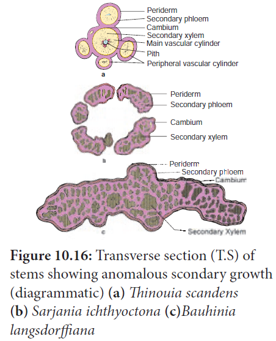
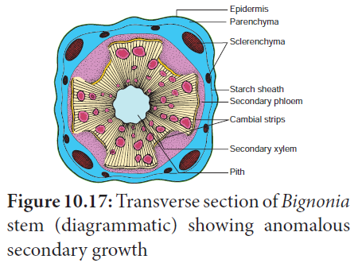
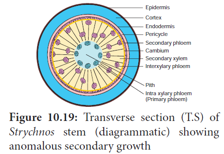
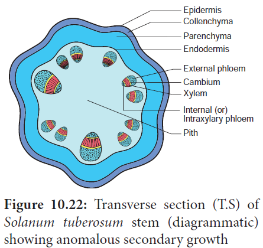
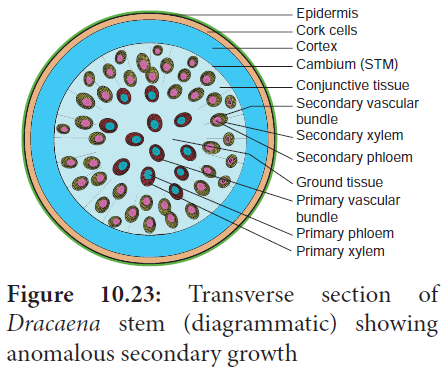

## Cambial variants (Anomalous Secondary Growth)

Cambial variants (previously known as **anomalous secondary growth**) is a deviation from normal secondary growth and production of secondary vascular and non-vascular tissues. A normal cambium with abnormal activity, accessory (additional) cambia or abnormally situated cambia with normal activity can produce anomalous secondary growth. The anomalies may be listed as follows,

### Anomalous position of vascular cambium

Unusual shapes in stems are formed by the unusual position of cambium. Example: _Thinonia scandens, Serjania ichthyoctona_ and Bauhinia langsdorffiana.

### Abnormal behaviour of normal cambium

Certain segments of cambia cease to produce secondary xylem. But at the same time, it produces secondary phloem only on the outer side. The remaining cambial segments do the normal activity; As a result, ridged and furrowed steles are formed. Example: _Bignonia._

### Successive cambium

In plants like _Aviccenia, Cycas, Gnetum_ a number of cambial rings arise in succession and produce concentric rings of secondary tissues.

### Interxylary or Included Phloem

The secondary phloem found in the form of strands (islands) embedded in the secondary xylem is called **interxylary** or **included phloem**. Example: _Strychnos, Combretum_ and _Salvadora._

### Presence of medullary bundles along with normal cambial activity

In this type, the normal vascular bundles are arranged in a ring from which a normal cambial ring is formed. In addition, vascular bundles are scattered or found in a ring in the pith or medullary region. These are called medullary **vascular bundles**. Example: _Boerhaavia._

### Presence of cortical bundles along with normal cambial activity

In this type, a ring of vascular bundles are found, from which a normal cambial ring is formed. In addition, in the cortical region additional vascular bundles are found. Example: _Nyctanthes._

### Intraxylary or Internal Phloem

The cambium usually forms primary phloem on the outer side. In some plants,it forms the primary phloem on the inner side along with xylem towards pith. This is called **intraxylary** or **internal**

**Phloem**. Example: _Solanum tuberosum_

### Secondary Growth in Monocot

In some monocotyledons, the stems exhibit secondary growth. Example: _Dracaena_. Here, a secondary thickening meristems (STM) originate from the ground tissue outside of the vascular bundles. STM cuts off cells on the inside from which additional vascular bundles are formed along with parenchyma cells in between the vascular bundles. The STM consists of only one type of cells unlike normal vascular cambium. STM does not produce continuous xylem on the inside but only vascular bundle with xylem and phloem. Also no phloem is formed on the outer side.

### Anomalous primary growth

**I) Absence of vessels in the xylem.**
Usually, vessels are found in the xylem of angiosperms, whereas some plants are lacking vessels in the xylem. Example: _Hydrilla, Winteraceae_ family members.

**II) Scattered Vascular bundles along with cambial activity in dicots.**
In dicot stem, normally the vascular bundles are arranged in a ring, whereas some dicot stems possess scattered vascular bundles in the cortex like monocot stems. Example: _Piper, Peperomia._

**Figure 10.24: Transverse section (T.S) of
Peperomia stem (diagrammatic) showing
anomalous primary growth**

