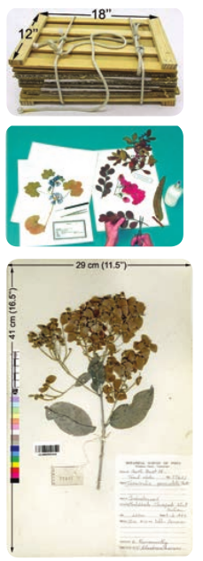

# Herbarium – Preparation and uses

Herbaria are store houses of preserved plant collections. Plants are preserved in the form of pressed and dried specimens mounted on a sheet of paper. Herbaria act as a centre for research and function as sources of material for systematic work.

**Preparation of herbarium Specimen**

Herbarium Specimen is defined as a pressed and dried plant sample that is permanently glued or strapped to a sheet of paper along with a documentation label.

Preparation of herbarium specimen includes the following steps.
**1. Plant collection:** Field collection, Liquid preserved collection, Living collection, Collection for molecular studies.
**2. Documentation of field site data**
**3. Preparation of plant specimen**
**4. Mounting herbarium specimen**
**5. Herbarium labels.**
**6. Protection of herbarium sheets against mold and insects**

**Uses of Herbarium**

1. Herbarium provides resource material for systematic research and studies.
2. It is a place for orderly arrangement of voucher specimens.
3. Voucher specimen serves as a reference for comparing doubtful newly collected fresh specimens.
4. Voucher specimens play a role in studies like floristic diversity, environmental assessment, ecological mechanisms and survey of unexplored areas.
5. Herbarium provides opportunity for documenting biodiversity and studies related to the field of ecology and conservation biology.

**Kew Herbarium**

Kew Garden is situated in South West London that houses the “largest and most diverse botanical and mycological collections in the world” founded in the year 1840. Living collection includes more than 30,000 different kinds of plants. While herbarium which is one of the largest in the world has over seven million preserved plant specimens. The library contains more than 7,50,000 volumes and the illustrations and also a collection of more than 1,75,000 prints, books, photographs, letters, manuscripts, periodicals, maps and botanical illustrations.

  **Preparation of herbarium Specimen**

1. **Plant Collection**
 Plant specimen with flower or fruit is collected

2. **Documentation of field site data** 
Certain data are to be recorded at the time of plant collection. It includes date, time, country, state, city, specific locality information, latitude, longitude, elevation and land mark information. These data will be typed onto a herbarium label.

3. **Preparation of plant specimen**
 Plant specimen collected from the field is pressed immediately with the help of portable field plant press. plant specimen is transferred to a standard plant press (12” x 18”) which between two outer 12” x 18” frames and secured by two straps.

4. **Mounting herbarium specimen** 
The standard size of herbarium sheet is used for mounting the specimen (29cm x 41cm). specimens are affixed to herbarium sheet with standard white glue or solution of Methyl cellulose.

5. **Herbarium label** 
Herbarium label size is generally 4-5’’ wide and 2-3’’ tall. A typical label contains all in- formation like habit, habitat, vegetation type, land mark information, latitude, longitude, image document, collection number, date of collection and name of the collector.

6. **Protection of herbarium sheets against mold and insects**
Apply cation of 2% Mercuric chloride, Naphthalene, DDT, carbon disulphide. Fu- migation using formaldehyde. Presently deep freezing(**\-20oC**) method is followed through- out the world.

---

**Do You Know ?**
World’s smallest water – lily _Nymphaea thermarum_ was saved from extinction when it was grown from seed at Kew in 2009.

---

**International Herbarium**

| **S .No** | **Herbarium**                                                  | **Year Established** | **Acronym** | **Number of specimens** |
| --------- | -------------------------------------------------------------- | -------------------- | ----------- | ----------------------- |
| 1.        | _Museum National d’Histoire Naturelle_, Pari France            | 1635                 | P ,PC       | 10,000,000              |
| 2.        | New York Botanical Garden, Bronx, New York, U.S.A              | 1891                 | NY          | 72,00,000               |
| 3.        | Komarov Botanical Institute, St.Petersburg (Leningrad), Russia | 1823                 | LE          | 71,60,000               |
| 4.        | Royal Botanic Gardens, Kew, England, U.K                       | 1841                 | K           | 70,00,000               |

**National Herbarium**

| **S. No** | **Herbarium**                                                                                | **Year Established** | **Acronym** | **Number of specimens** |
| --------- | -------------------------------------------------------------------------------------------- | -------------------- | ----------- | ----------------------- |
| 1.        | Madras Herbarium BSI campus, Coimbatore                                                      | 1955                 | MH          | 4,08,776                |
| 2.        | Central National Herbarium West Bengal                                                       | 1795                 | CAL         | 2,00,000                |
| 3.        | Jawaharlal Nehru Tropical Botanical Garden and Research Institute Thiruvananthapuram, Kerala | 1979                 | TBGRI       | 30,500                  |
| 4.        | Presidency College Herbarium, Chennai                                                        | 1844                 | PCM         | 15,000                  |

