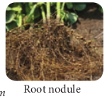
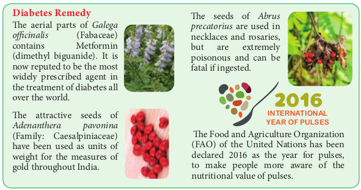
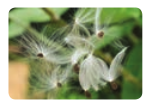
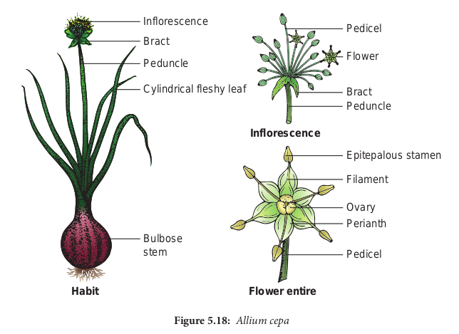

# Selected Families of Angiosperms

**Dicot Families**

5.13.1 Family: Fabaceae (Pea family) Systematic position

**APG classication Bentham and Hooker classication**
| Kingdom |Plantae |Kingdom |Plantae |
|------|------|------|------|
| Clade |Angio-sperms |Class |Dicotyledonae |
| Clade |Eudicots |Sub-class |Polypetalae |
| Clade |Rosids |Series |Calyciorae |
| Order |Fabales |Order |Rosales |
| Family |Fabaceae |Family |Fabaceae |

**General characters**

**Distribution:** Fabaceae includes about 741 genera and more than 20,200 species. The members are cosmopolitan in distribution but abundant in tropical and subtropical regions.

**Habit:** All types of habits are represented in this family. Mostly herbs (_Crotalaria_), prostrate (_Indigofera enneaphylla)_ erect (_Crotalaria verrucosa_), shrubs (_Cajanus_ _cajan_), small trees (_Sesbania_), climbers (_Clitoria_), large tree (_Pongamia, Dalbergia_), woody climber (_Mucuna_), hydrophyte (_Aeschynomene aspera_) commonly called **pith plant.**

**Root:** Tap root system, roots are nodulated, have tubercles c o n t a i n i n g nitrogen – fixing bacteria (_Rhizobium leguminosarum)_

**Stem:** Aerial, herbaceous, woody (_Dalbergia_) twining or climbing (_Clitoria)_.

**Leaf:** Leaf simple or unifoliate (_Desmodium gangeticum_) bifoliate (_Zornia diphylla,_), Trifoliate (_Lablab_ _purpureus)_, alternate, stipulate, leaf base, **pulvinate**, reticulate venation terminal leaflet modifies into a **tendril** in _Pisum sativum._

**Inflorescence:** Raceme (_Crotalaria verrucosa_), panicle (_Dalbergia latifolia_) axillary solitary (_Clitoria ternatea_)

**Flowers:** Bracteate, bracteolate, pedicellete, complete, bisexual, pentamerous, heterochlamydeous, zygomorphic hypogynous or sometimes perigynous.

**Calyx:** Sepals 5, green, synsepalous, more or less united in a tube and persistant, valvate or imbricate, odd sepal is anterior in position.

**Corolla:** Petals 5, apopetalous, unequal and **papilionaceous**, **vexillary** or **descendingly imbricate** aestivation, all petals have claw at the base. The outer most petal is large called **standard petal** or **vexillum**, Lateral 2 petals are lanceolate and curved. They are called **wing petals** or **alae**. Anterior two petals are partly fused and are called **keel petals** or **carina** which encloses the stamens and pistil.

**Androecium:** Stamens 10, diadelphous, usually 9+1 (_Clitoria ternatea_). The odd stamen is posterior in position. In _Aeschynomene aspera_, the stamens are fused to form two bundles each containing five stamens (5)+(5). Stamens are **monadelphous** and **dimorphic** ie. 5 stamens have longer filaments and other 5 stamens have shorter filaments thus the stamens are found at two levels and the shape of anthers also varies in (_Crotalaria verrucosa)_. (5 anthers are long and lanceolate, and the other 5 anthers are short and blunt). Anthers are dithecous,

**Gynoecium:** Monocarpellary, unilocular, ovary superior, with two alternating rows of ovules on marginal placentation. Style simple and bent, stigma flattened or feathery.

**Fruit:** The characteristic fruit of Fabaceae is a legume (_Pisum sativum)_, sometimes indehiscent and rarely a lomentum (_Desmodium)_. In _Arachis hypogea_ the fruit is _**geocarpic**_ (fruits develops and matures under the soil). After fertilization the stipe of the ovary becomes meristematic and grows down into the soil. This ovary gets buried into the soil and develops into fruit.

Seed: Endospermic or non- endospermic (_Pisum sativum_), mostly **reniform**.

**Botanical description of _Clitoria ternatea_ (Sangu pushpam)**

**Habit:** Twining climber

**Root:** Branched tap root system having nodules.

**Stem:** Aerial, weak stem and a twiner

**Leaf:** Imparipinnately compound, alternate, stipulate showing reticulate

**Economic Importance**

venation. Leaflets are stipellate. Petiolate and stipels are pulvinated.

**Inflorescence:** Solitary and axillary **Flower:** Bracteate, bracteolate, bracteoles

usually large, pedicellate, heterochlamydeous, complete, bisexual, pentamerous, zygomorphic and hypogynous.

**Calyx:** Sepals 5, synsepalous, green showing valvate aestivation. Odd sepal is anterior in position.

**Corolla:** Petals 5, white or blue apopetalous, irregular papilionaceous corolla showing descendingly imbricate aestivation.

**Androecium:** Stamens 10, diadelphous (9)+1, nine stamens fused to form a bundle and the tenth stamen is free. Anthers are dithecous, basifixed, introse and dechiscing by longitudinal slits.

**Gynoecium:** Monocarpellary, uni- locular, with many ovules on mariginal placentation, ovary superior, style simple and incurved with feathery stigma.

**Fruit:** Legume

**Seed:** Non-endospermous, reniform. Floral Formula: **Dt0.Dtn0.'.""."M\*7+.E7.C\*;+-3.I3**

| Economic importance | Binomial                                                                                                                      | Useful part                    | Uses                                                                                                                             |
| ------------------- | ----------------------------------------------------------------------------------------------------------------------------- | ------------------------------ | -------------------------------------------------------------------------------------------------------------------------------- |
| Food plants         | Lablab purpureus (field bean)Sesbania grandiflora (agathi)Cyamopsis tetragonoloba(cluster bean)                               | TenderfruitsLeavesTenderfruits | VegetableGreensVegetable                                                                                                         |
| Oil Plants          | Arachis hypogea (ground nut)Pongamia pinnata (pungam)                                                                         | SeedsSeeds                     | Oil extracted from the seeds is edible andused for cooking.Pongam oil has medicinal value and is usedin the preparation of soap. |
| TimberPlants        | Dalbergia latifolia (rose wood)Pterocarpus santalinus(red sandalwood)P.marsupium (வேங்கை)                                     | Timber                         | Timber is used for making furniture, cabi-net articles and as building materials.                                                |
| MedicinalPlants     | Crotalaria albidaPsoralea corylifolia(கார்போக அரிசி)Glycyrrhiza glabra(Licorice root / அதிமதுரம்)Mucuna pruriens (பூனைக்காலி) | RootsSeedsRootsSeeds           | Used as purgativeUsed in leprosy and leucodermaImmuno modulaterNeurological remedy                                               |
| Fibre Plants        | Crotalaria juncea(sunhemp / சணப்ப) Sesbania sesban (aegyptiaca)                                                               | Stemfibres(Bast)               | Used for making ropes.                                                                                                           |
| Pith Plant          | Aeschynomene aspera                                                                                                           | Stem pith                      | Used for packing, handicraft and fishingfloats                                                                                   |
| Dye Plants          | Indigofera tinctoria (Avuri)Clitoria ternateaButea monosperma                                                                 | LeavesFlowersand seedsFlowers  | Indigo dye obtained from leaves is used tocolour printing and in paints.Blue dye is obtainedNatural dye                          |
| OrnamentalPlants    | Butea frondosa(Flame of the forest),Clitoria ternatea,Lathyrus odoratus(Sweet pea) andLupinus hirsutus (Lupin)                | Entireplant                    | Grown as ornamental plants.                                                                                                      |

## Family: Apocynaceae (milk weed family) (including Asclepiadaceae)

**Systematic position**

**APG classification Bentham and Hooker classification**

| Kingdom | Plantae     | Kingdom   | Plantae       |
| ------- | ----------- | --------- | ------------- |
| Clade   | Angiosperms | Class     | Dicotyledonae |
| Clade   | Eudicots    | Sub-class | Gamopetalae   |
| Clade   | Asterides   | Series    | Bicarpellatae |
| Order   | Gentianales | Order     | Gentianales   |
| Family  | Apocynaceae | Family    | Apocynaceae   |

**General Characters Distribution:**

This family is represented by 345 genera, 4,675 species. Mostly tropical and subtropical whereas a few species found in temperate region.

**Habit:** Herb (_Catharanthus)_, shrub, (_Nerium)_, tree (_Alstonia_), woody twiner (_Allamanda_) succulent, (_Adenium_) with milky sap in laticiferous vessels.

**Root:** Branched tap root system
**Stem:** The stems are succulent in some taxa(_Stapelia, caralluma_), usually erect, branched solid, glabrous, rarely tube like and thick.

**Leaves**: Simple, entire, rarely stipulate(_Tabernae montana_) exstipulate, opposite decusate (Calotropis) or alternate (Thevetia) or ternate (Nerium), .

**Inflorescence: A Panicle, dichasial cyme,** often umbelliform in (Asclepiadoids) or raceme, or axillary cluster of two flowers each (_Catharanthus_).

**Flowers:** Bracteate, bracteolate, pedicellate, complete, bisexual, actinomorphic, zygo- morphic in (_Ceropegia)_ heterochlamydeous, penta- merous, hypogynous but rarely perigynous or epigynous

**Calyx:** Sepals 5, synsepalous valvate or quincuncial (Thevetia), odd sepal posterior.

**Corolla:** Petals 5, sympetalous united into a tube, salver or funnel shaped; twisted or rarely valvate, often hairy within or contain some corona like out growths at the mouth of the corolla tube.

**Androecium:** Stamens 5 , alternipetalous, often epipetalous, In Asclepiadoids the stamens are connate to the styles to form a _Ceropegia spp_

**gynostegium**, pollen grains of each theca of an anther are fused into a waxy mass called pollinium. The right pollinium of each anther attached to the left pollinium of the adjacent anther by a hair like translator, translator arms (**retinacula**) attached together with the gland like structure called **corpusculum**. Anthers are dithecous, basifixed, introse; dehisce longitudinally.

**Gynoecium:** Bicarpellary, carpels apically united, superior, 1 to 2 locule with 2 to many ovules in each locule on marginal placentation. Style one and simple, stigma is characteristically thickened, massive and bilobed. A nectariferous disc is often present around or at the base of the gynoecium, (_Catharanthus_).

**Fruit: The fruit is variable and can be a** berry (_Landolphia_), drupe (_Cerbera_) follicle (_Asclepias_), capsule (_Allamanda_).

**Seed: Seeds are endospermous often** with crown of hairs.

**Botanical description of Catharanthus roseus**

**Habit:** Erect ever blooming ornamental plant with milky latex.

**Root:** Branched tap root system

**Economic importance of the family Apocynace**

| **S. No** | **Economic importance** | **Binomial**                                               | **Useful part**   | **Uses**                                                                                                                                                                                                 |
| --------- | ----------------------- | ---------------------------------------------------------- | ----------------- | -------------------------------------------------------------------------------------------------------------------------------------------------------------------------------------------------------- |
| 1         | **Food plant**          | \_Carissa carandas (பெரும்களா) \_Carissa spinarum(சிறுகளா) | Fruits            | Edible and used in pickles                                                                                                                                                                               |
| 2         | **Medicinal plant**     | _Rauvolfia serpentina_ (Indian snake root /sarpag)         | Shoot Dried roots | To treat hypertension and mental disorders Alkaloid (reserpine) obtained from the dried roots, of the plant can lower the blood pressure and used as sedative for patients suffering from Schizophrenia. |

**Stem:** Aerial, erect, cylindrical reddish green, glabrous and branched.

**Leaves:** Usually simple, opposite decussate, exstipulate, subsessile, or petiolate, elliptic – ovate,entire, mucronate, unicostate reticulate venation.

**Inflorescence:** cymose, axillary pairs. **Flower:** Ebracteate, Ebracteolate, subsessile,complete, bisexual, heterochlamydeous, actinomorphic, hypogynous, pentamerous, rosy purple, white or pink.

**Calyx:** Sepals 5, slightly synsepalous, green showing valvate aestivation.

**Corolla:** Petals 5, sympetalous, throat of corolla tube hairy forming a corona, twisted (hypocrateriform).

**Androecium:** Stamens 5, apostemanous, epipetalous, inserted at the mouth of the corolla tube, filaments short, anthers sagittate, dithecous, dorsifixed, introse.

**Gynoecium:** Bicarpellary, apocarpous, ovaries superior, unilocular, ovules many, placentation marginal, style simple, stigma hour-glass shaped. Two scaly nectaries are present, one on the anterior and another on the posterior side of the ovary.

**Fruit:** A pair of elongated follicles. Floral Formula: **Ebr.,Ebrl., , ,K (5),C(5),A5,G(2)**

| S. No | Economic importance | Binomial                                               | Useful part      | Uses                                                                                                                                                                                            |
| ----- | ------------------- | ------------------------------------------------------ | ---------------- | ----------------------------------------------------------------------------------------------------------------------------------------------------------------------------------------------- |
| 1     | Food plant          | Carissa carandas (பெரும்களா)Carissa spinarum (சிறுகளா) | Fruits           | Edible and used in pickles                                                                                                                                                                      |
| 2     | Medicinal plant     | Rauvola serpentina(Indian snake root /sarpagandha)    | ShootDried roots | To treat hypertension andmental disordersAlkaloid (reserpine)obtained from the driedroots, of the plant canlower the blood pressureand used as sedative forpatients suering fromSchizophrenia. |

## Family: Solanaceae (Potato Family / Night shade family)

**Systematic Position**

**APG system of classification**

**Bentham and Hooker system of classification**

| Kingdom | Plantae     | Kingdom           | Plantae       |
| ------- | ----------- | ----------------- | ------------- |
| Clade   | Angiosperms | Class             | Dicotyledonae |
| Clade   | Eudicot     | Subclass          | Gamopetalae   |
| Clade   | Asterids    | Series            | Bicarpellatae |
| Clade   | Solanales   | Order             | Polemoniales  |
| Family  | Solanaceae  | Family Solanaceae |

**General Characters**
**Distribution:**

Family Solanaceae includes about 88 genera and about 2650 species, of these Solanum is the largest genus of the family with about 1500 species. Plants are worldwide in **Habit:** Mostly annual herbs, shrubs, small trees (_Solanum violaceum_) lianas with prickles (_Solanum trilobatum_)

---

**Root:** Branched tap root system.

**Stem:** Herbaceous or woody; erect or twining, or creeping; sometimes modified into tubers (_Solanum tuberosum_) it is covered with Spines (_Solanum tuberosum)_

**Leaves:** Alternate, simple, rarely pinnately compound (_Solanum tuberosum_ )and _Lycopersicon esculentum_, exstipulate, opposite or sub-opposite in upper part, unicostate reticulate venation. Yellowish verbs present in _Solanum tuberosum_

**Inflorescence:** Generally axillary or terminal cymose (_Solanum_) or solitary flowers (_Datura stramonium_). Extra axillary

APG system of classification Bentham and Hookersystem of classification
| Kingdom |Plantae |Kingdom |Plantae |
|------|------|------|------|
| Clade |Angiosperms |Class |Dicotyledonae |
| Clade |Eudicot |Subclass |Gamopetalae |
| Clade |Asterids |Series |Bicarpellatae |
| Clade |Solanales |Order |Polemoniales |
| Family |Solanaceae |Family |Solanaceae |

**Flowers:** Bracteate or ebracteate, pedicellate, bisexual, heterochlamydeous, pentamerous actinomorphic or weakly zygomorphic due to oblique position of ovary, hypogynous.

**Calyx:** Sepals 5, Synsepalous, valvate persistent (_Solanum americanum_), often accrescent. (_Physalis_)

**Corolla:** Petals 5, sympetalous, rotate, tubular (_Solanum_) or bell- shaped (_Atropa_) or infundibuliform (_Petunia_) usually alternate with sepals; rarely bilipped and zygomorphic (_Schizanthus_) usually valvate, sometimes convolute (_Datura_).

**Androecium:** Stamens 5, epipetalous, filaments usually unequal in length, stamens only 2 in _Schizanthus_ (others 3 are reduced to staminode)_,_ Anthers dithecous, dehisce longitudinally or poricidal.

**Gynoecium:** Bicarpellary, syncarpous obliquely placed, ovary superior, bilocular but looks tetralocular due to the formation of false septa, numerous ovules in each locule on axile placentation.

**Fruit:** A capsule or berry. (_Datura_ _&_ _Petunia, Lycopersicon esculentum, Capsicum_)

**Seed:** Endospermous.

**Botanical description of _Datura metel_**

**Habit:** Large, erect and stout herb. **Root:** Branched tap root system. **Stem:** Stem is hollow, green and herbaceous with strong odour.

**Leaf:** Simple, alternate, petiolate, entire or deeply lobed, glabrous exstipulate showing unicostate reticulate venation.

**Inflorescence:** Solitary and axillary cyme.

**Flower:** Flowers are large, greenish white, bracteate, ebracteolate, pedicellate, complete, heterochlamydeous, pentamerous, regular, actinomorphic, bisexual and hypogynous.

**Calyx:** Sepals 5, green synsepalous showing valvate aestivation. Calyx is mostly persistent, odd sepal is posterior in position.

**Corolla:** petals 5, greenish white, sympetalous, plicate (folded like a fan) showing twisted aestivation, funnel shaped with wide mouth and 10 lobed.

**Androecium:** Stamens 5, free from one another, epipetalous, alternipetalous and are inserted in the middle of the corolla tube. Anthers are basifixed, dithecous, with long filament, introse and longitudinally dehiscent.

**Gynoecium:** Ovary bicarpellary, syncarpous superior ovary, basically bilocular but tetralocular due to the formation of false septum. Carpels are obliquely placed and ovules on swollen axile placentation. Style simple long and filiform, stigma two lobed.

**Fruit:** Spinescent capsule opening by four apical valves with persistent calyx.

**Seed:** Endospermous. **Floral Formula:** **Dt0.Gdtn0.""".""".M\*7+.E\*7+.C7.I\*4+**

| Economic importance of the family solanaceae |
|------|------|------|------|------|
| S.No. |Economicimportance |Binomial |Useful part |Uses |
| 1. |Food plant |Solanum tuberosum (potato)Lycopersicon esculentum(tomato)Solanum melongena(brinjal)Capsicum annuum (bellpeppers & chilli papers)C. frutescens (ƒள�ொÞ)Physalis peruviana (capegooseberry / கசொCக¤தக�ொˆ) |Undergroundstem tubersRipened fruitsTender fruitsFruitsFruit |Used as vegetables and also usedfUosr ted ahe ps derod liciouctio un os veg f settar acbh.leand eaten raw.Cooked and eaten asvegetable.Used as vegetables andpowdered chilli is the driedpulverized fruit which is usedas spice to add pungency orpiquancy and flavour to dishes.Used as delicious fruit. |

_Cestrum diurnum_ (Day Jasmine) _Cestrum nocturnum_ (Night Jasmine) _Nicotiana alata Petunia hybrida_, _Schizanthus pinnatus_

## Family: Euphorbiaceae (Castor Family / Spurge Family)

**(In APG classification Peraceae, Phyllanthaceae and Picrodendraceae are excluded from the family Euphorbiaceae)**

**Systematic position**

APG Classification |Bentham and HookerClassification
| Kingdom |Plantae |Kingdom |Plantae |
|------|------|------|------|
| Clade |Angiosperms |Class |Monocotyledons |
| Clade |Monocots |Series |Coronarieae |
| Order |Liliales |Order |Liliales |
| Family |Liliaceae |Family |Liliaceae |

**General characters Distribution:** Euphorbiaceae includes 214 genera and about 5600 species. The plants of this family are found throughout the world. Well represented in Africa and South America.

**Habit:** Herbs (_Phyllanthus amarus_), mostly shrubs (_Ricinus communics, Jatropha gossypifolia) or tree (Emblica officinalis),_

**Useful part Uses**

A powerful alkaloid ‘atropine’ obtained from root is used in belladonna plasters, tinctures etc. for relieving pain and also for dialating pupils of eyes for eye –testing. Stramonium drug obtained from the leaves and roots of this is used to treat asthma and whooping cough. Used to treat cough.

twiners (_Tragia involucrata_) some are xerophytic (_Euphorbia_) with cactus – like (phylloclades) plants usually contain milky or watery sap.

**Root**: Well branched tap root system. **Stem**: Aerial, erect or prostrate

(_E.prostrata_), herbaceous or woody. Stem becomes modified into flattened, leaf-like and becomes succulent in several species of Euphorbia. Such modified stem is called phylloclades. Cylindrical, branched, solid or hollow, usually contain latex either milky (_E.tirucalli_) or watery (_Jatropha curcas_).

**Leaf:** Stipulate or exstipulate. Mostly simple, alternate, often reduced or deciduous as in several species of _Euphorbia_, palmately lobed in (_Ricinus)_ or deeply lobed in (_Manihot)_. The stiplues are modified into a pair of spines (_E.splendens_) or glandular hairs (_Jatropha curcas). The leaves around the cyathium_ inflorescence become beautifully coloured in _E.pulcherrima_ (Paalperukki tree) with unicostate or multicostate reticulate venation.

**Inflorescence: The inflorescence of** Euphorbiaceae varies greatly, Terminal compound raceme – _Croton, Ricinus,_ Catkin – _Acalypha hispida_ Cyme - _Jatropha,_ solitary axillary – _Phyllanthus asperulatus,_ cyathium – _Euphorbia_ species.

Cyathium is an unique and special inflorescence of this family.

**Flowers:** Bracteate, ebracteolate, generally unisexual, homochlamydeous, rarely heterochlamydeous, monoecious or dioecious, actinomorphic, rarely zygomorphic, hypogynous, rearly perigynous.

**Perianth:** Tepals 0 to 5 **biseriate** (male flowers of Croton bonplandianum) uniseriate or aphyllous (_Euphorbia_), valvate or imbricate when present, apophyllous or synphyllous.

**Androecium:** Stamens are 1 to many. In _Euphorbia_ a single stalked stamen represents a single male flower. In Ricinus, usually 5 stamens are present, but each stamen is profusely branched. In \_Jatroph_a, they are arranged in two whorls each of 5 stamens. The anthers are dithecous, dehisce either by transverse or longitudinal slits.

**Gynoecium:** Tricarpellary, rarely bicarpellary (_Bridelia_), tetra or pentacarpellary (_Wielandia_), syncarpous, ovary superior, rarely semi-inferior, ovules one or two in each locule on axile placentation, Styles 3, each split into two feathery stigma. Nectaries are usually present, gynoecium is present as a pistillode in staminate flowers.

**Fruit**: Fruits are capsule or schizocarp. It breaks violently and dehisce into three one seeded cocci called regma (_Ricinus_ ), drupe in (Emblica officinalis) and berry or samara.

**Seed:** Seeds are endospermous. In _Ricinus_ knob-like caruncle develops from the micropyle,that absorbs and temporarily retains water enabling germination. **Botanical Description Of _Ricinus communis_ (Castor)**

**Habit**: Tall perennial shrub

**Root:** Branched tap root system

**Stem:** Aerial, erect, cylindrical, branched and hollow, solid at the base, glabrous,

**Leaf:** Simple, petiolate, hollow, exstipulate,alternate, broad, palmately lobed, usually 7-9 lobes, serrate, palmately reticulate divergent venation.

**Inflorescence:** Terminal panicle.

**Male Flower** Bracteate, ebracteolate,pedicellate, male flowers (open for one day) towards lower portion of the inflorescence, actinomorphic, incomplete.

**Perianth:** Tepals 5, apophyllous, uniseriate, green, valvate aestivation, odd tepal posterior in position.

**Androecium:** Stamens numerous each stamen profusely branched, anthers globose basifixed.

**Gynocium:** usually absent rarely represented by pistillode.

**Female Flower** Bracteate, ebracteolate, pedicellate, female flowers (open for fourteen days) found towards the apical portion of inflorescence, actinomorphic, incomplete and hypogynous.

**Perianth:** Tepals 3, apophyllous, green valvate.

**Androecium**: Absent but staminode is present.

**Gynoecium**: Tricarpellary, syncarpous, ovary superior, distinctly trilobed, trilocular, covered with spiny outgrowth, single large ovule in each locule on axile placentation, style three with three bifid stigma.

**Fruit**: A schizocarp with spiny outgrowth, splits into three one seeded cocci.

**Seed:** Endospermous, knob-like caruncle develops from the micropyle, that absorbs

---

Note: Earlier Musaceae was a large family with 6 genera viz. _Musa, Ensete, Ravenala, Strelitzia, Orchidantha_ and _Heliconia_. In APG only Musa and Ensete are retained while _Ravenala, Strelitzia, Orchidantha_ and _Heleconia_ are separated.

---

**General Characters**
**Distribution**

Musaceae includes only 2 genera (_Musa_ and _Ensete) and 81 species. The members of this_ family are mainly wet tropical lowlands from West Africa to Pacific (southern Japan to Queensland). (_Musa_ is the most common plant of the family found in India)

**Habit:** Large perennial herbs perennating by means of rhizome ( _Musa paradisiaca_), raraly trees (_Ravenala madagascariensis)_.

**Root:** Fibrous adventitious root system. **Stem:** In _Musa_ the real stem is found underground called rhizomatous (dichotomously branching in atleast some spp). The apparent aerial erect, unbranched tall pseudostem is formed by the long stiff and sheathy leaf bases which are rolled around

**Leaf:** Simple with long and strong petiole, the leaf blade is large and broad with sheathy leaf base. The leaf is exstipulate. Oval, obtuse or oblong with a stout midrib, entire, numerous parallel veins extending up to the margin, rolled in bud. Phyllotaxy is spiral in _Musa_ and distichous i.e. leaves are arranged alternately in two opposite vertical rows in _Ravenala_.

**Inflorescence: Terminal or axillary thyrse** of one to many monochasial branched spadix in Musa, Usually the flowers are protected by large brightly coloured, spirally arranged, boat shaped bract called spathe. Compound cyme in _Ravenala._

**Flowers:** Bracteate, ebracteolate, sessile, trimerous, unisexual or bisexual or polygamous, when unisexual the flowers are monoecious. Flowers are zygyomorphic and epigynous. (In Musa flowers are polygamous i.e. staminate flowers, pistilate flowers and bisexual flowers are present in the same plant).

**Perianth:** Tepals 6, biseriate, arranged in two whorls of 3 each and homochlamydeous, 3 +3 syntepalous. In most of the species of _Musa,_ the three outer tepals and two lateral tepals of the inner whorl are fused to form 5 toothed tube like structure called **abaxial lip**. The posterior inner median tepal alone is free, which is distinctly broad and membranous called **labellum**.

**Androecium:** Stamens 5 or 6, arranged in two whorls of 3 each opposite and adnate to the tepals. In _Musa,_ only 5 stamens are fertile and the inner posterior stamen is either absent or represented by a staminode. In _Ravenala,_ all the six stamens are fertile. Filaments free, anthers linear, dithecous dehisce by longitudinal slits, and with sticky pollen.

**Gynoecium:** Tricarpallary, syncarpous, trilocular ovary inferior, ovules many, axile, placentation, style filiform, stigma three lobed septal nectaries are present.

**Fruit:** Elongated thesh (_musa_) berry containing numerous seeds, fruits forming compact bunches, seeds with copious and small embryo in _Musa_. Capsule in _Ravenala._

**Seed:** Larges, starch rich Endosperm (Ensete).

**Botanical Description of _Musa paradisiaca._**

**Habit:** Monocarpic gigantic peremial herb.

**Root:** Fibrous adventitious root system.

**Stem: The real stem is underground** called rhizomatous. The apparent, aerial erect unbranched pseudostem is formed by the long, stiff and sheathy leaf bases which are rolled around one another to form an aerial pseudostem. The central axis that is concealed at the bottom of the pseudostem is called shaft. The shaft elongates, pierces through the pseudostem and produces an inflorescence terminally.

**Leaf:** Simple with a long and strong petiole. The leaf blade is large and broad with sheathy leaf base. Leaf exstipulate and obtuse pinnately parallel venation which extends upto the leaf margin phyllotaxy is spiral.

**Inflorescence: Terminal branched spadix.** Flowers are protected by large, brightly coloured spirally arranged, boat shaped bracts called spathe. When the flowers open, spathe rolls back and falls off.

**Flower:** Bracteate, ebracteolate, sessile, trimerous, unisexual or bisexual, flowers are zygomorphic and epigynous.

**Perianth:** Tepals 6, biseriate, 3+3 syntepalous, arranged in two whorls of 3 each and homochlamydeous, the three tepals of the outer whorl and the two lateral tepals of the inner whol are fused by valvate aestivation to form 5 toothed tube like structure called abaxial lip, the posterior inner median tepal is distinctly broad membrancus and free called labellum.

**Androecium:** Stamens 6, arranged in two whorls of 3 each, arranged opposite to the tepals. Only five stamens are fertile and the inner posterior stamen is either absent or represented by staminode. Anthers are dithecous and dehisce by vertical slits. Filament is simple and filiform and rudimentary ovary or pistillode is often present in the male flower.

**Gynoecium:** Tricarpellary, syncarpous, the median carpel anterior, trilocular, ovary inferior, numerous ovules on axile placentation. Style is simple and filiform, stigma trilobed.

**Fruit: An elongated fleshy berry and** seeds are not produced in cultivated varieties.

Floral Formula

Male flower:
**Br,Ebrl,%, ,P(3+2)+1,A3+3,G0**.

Female flower:
**Br,Ebrl,%, ,P(3+2)+1,A0,G(3).**

Bisexual flower:
**Br,Ebrl,%, ,P(3+2)+1,A3+3,G(3).**

## Family: Liliaceae (Lily Family)

**Systematic position**

| APG Classification | Bentham and HookerClassification |
| ------------------ | -------------------------------- | ------- | -------------- |
| Kingdom            | Plantae                          | Kingdom | Plantae        |
| Clade              | Angiosperms                      | Class   | Monocotyledons |
| Clade              | Monocots                         | Series  | Coronarieae    |
| Order              | Liliales                         | Order   | Liliales       |
| Family             | Liliaceae                        | Family  | Liliaceae      |

## 

Note: Liliaceae of Bentham and Hooker included _Allium, Gloriosa, Smilax, Asparagus, Scilla, Aloe, Dracaena_ etc. Now under APG, it includes only **_Lilium_** and **_Tulipa_**. All others are placed under different families.

---

**General Characters Distribution:** Liliaceae are fairly large family comprising about 15 genera and 550 species. Members of this family are widely distributed over most part of the world.

**Habit:** Mostly perennial herbs persisting by means of a sympodial rhizome (_Polygonatum)_, by a bulb (_Lilium_) corm (_Colchicum_), shrubby or tree like (_Yucca_ and _Dracaena_). Woody climbers, climbing with the help of stipular tendrils in _Smilax_. Trees in (_Xanthorrhoea),_ succulents (_Aloe)_.

**Root: Adventitious and fibrous, and** typically contractile.

**Stem:** Stems usually bulbous, rhizomatous in some, aerial, erect (_Dracaena_) or climbing (_Smilax)_ in _Ruscus_ the ultimate branches are modified into phylloclades, In Asparagus stem is modified into cladodes and the leaves are reduced to scales.

**Leaf:** Leaves are radical (_Lilium_) or **cauline** (_Dracaena_), usually alternate, opposite (Gloriosa), sometimes fleshy and hollow, reduced to scales (_Ruscus_ and _Asparagus). The venation is parallel but_ in species of _Smilax_ it is reticulate. Leaves are usually exstipulate, but in _Smilax_, two tendrils arise from the base of the leaf, which are considered modified stipules.

**Inflorescence: Flowers are usually borne** in simple or branched racemes (_Asphodelus_) spikes in _Aloe_, huge terminal panicle in _Yucca_, solitary and axillary in _Gloriosa_, solitary and terminal in _Tulipa._

**Flowers: Flowers are often showy,** pedicellate, bracteate, ebracteolate, except _Dianella_ and _Lilium_, bisexual, actinomorphic, trimerous, hypogynous, rarely unisexual (_Smilax_) and are dioecious, rarely tetramerous (_Maianthemum_), slightly zygomorphic (_Lilium_) and hypogynous.

**Perianth:** Tepals 6 biseriate arranged in two whorls of 3 each, apotepalous or rarely syntepalous as in _Aloe._ Usually petaloid or sometimes sepaloid, odd tepal of the outer whorl is anterior in position, valvate or imbricate, tepals more than six in _Paris quadrifolia_.

**Androecium:** Stamens 6, arranged in 2 whorls of 3 each, rarely stamens are 3 (_Ruscus_), 4 in _Maianthemum,_ or up to 12, apostamenous, opposite to the tepals, sometimes epitepalous; filaments distinct or connate, anthers dithecous, basifixed or versatile, extrose, or introse, dehiscing usually by vertical slit and sometimes by terminal pores; rarely **synstamenous** (_Ruscus_).

**Gynoecium:** Tricarpallary, syncarpous, the odd carpel usually anterior, ovary superior, trilocular, with 2 rows of numerous ovules on axile placextation; rarely unilocular with parietal placentation, style usually one; stigmas 1 or 3; rarely the ovary is inferior (_Haemodorum_), nectar – secreting **septal glands** are present in the ovary.

**Fruit:** Fruit usually a septicidal or loculicidal capsule or a berry as in _Asparagus_ and _Smilax._

**Botanical description of _Allium cepa_** (In APG classification, _Allium cepa_ is placed under the family Amaryllidaceae)

**Habit:** Perennial herb with bulb.

**Root:** Fibrous adventitious root system **Stem:** Underground bulb

**Leaf:** A cluster of radical leaves emerges from the underground bulb, cylindrical and fleshy having sheathy leaf bases with parallel venation.

**Inflorescence: Scapigerous i.e. the** inflorescence axis (peduncle) arising from the ground bearing a cluster of flowers at its apex. Pedicels are of equal length, arising from the apex of the peduncle which brings all flowers at the same level.

**Flower:** Small, white, bracteate, ebracteolate, pedicellate, complete, trimerous,Bulbose stem actinomorphic and hypogynous. Flowers are protandrous.

**Perianth:** Tepals 6, white, arranged in two whorls of three each, syntepalous showing valvate aestivation.

**Androecium:** Stamens 6, arranged in two whorls of three each, epitepalous, apostamenous /free and opposite to tepals. Anthers dithecous, basifixed, introse, and dehiscing longitudinally.

**Gynoecium:** Tricarpellary and syncarpous. Ovary superior, trilocular with two ovules in each locule on axile placentation. Style simple, slender with simple stigma.

**Fruit:** A loculicidal capsule.
**Seed:** Endospermous
**Floral Formula:** **Br.,Ebrl., , ,P(3+3) A 3+3,G(3)**

| S.No | Economic importance  | Binomial                                                                                                                                                          | Useful part  | Uses                                                                                                                                             |
| ---- | -------------------- | ----------------------------------------------------------------------------------------------------------------------------------------------------------------- | ------------ | ------------------------------------------------------------------------------------------------------------------------------------------------ |
| 1    | Food plant           | Allium cepa                                                                                                                                                       | Bulbs        | Used as vegetable, stimulative, diuretic, expectorant with bactericidal properties.                                                              |
|      |                      | Allium sativum                                                                                                                                                    | Bulbs        | Used as condiment and alsogood for heart.                                                                                                        |
|      |                      | Asparagus officinalis                                                                                                                                             | Fleshyshoots | Used as vegetables.                                                                                                                              |
| 2.   | Medicinal plant      | Aloe vera                                                                                                                                                         | Leaves       | Gelatinous glycoside called aloin from succulent leaves are used in soothing lotions, piles and inflammations, hemorrhoidal salves and shampoos. |
|      |                      | Asparagus racemosus                                                                                                                                               | Roots        | Medicinal oil is prepared from the root is used for nervous and rheumatic complaints and also in skin diseases.                                  |
|      |                      | Colchichum luteum                                                                                                                                                 | Roots        | Used in the treatment of gout and rheumatism.                                                                                                    |
|      |                      | Gloriosa superba                                                                                                                                                  | Tubers       | Tubers helpful in promoting labour pains in women.                                                                                               |
| 3.   | Fibre yielding plant | Phormium tenax                                                                                                                                                    | Fibre        | Used for cordage, fishing net,mattings, twines.                                                                                                  |
| 4.   | Raticides            | _Urginea indica_                                                                                                                                                  | Bulbs        | Used for killing rats.                                                                                                                           |
|      | Insecticides         | _Veratrum album_                                                                                                                                                  | Bulbs        | Used as insecticide.                                                                                                                             |
| 5.   | Polyploidy           | Colchicum luteum                                                                                                                                                  | corm         | ColColchicine (alkaloid) used to induce polyploidy.                                                                                              |
| 6.   | Ornamental plants    | Agapanthus africanus(African Lily)_Gloriosa superba_(Malabar glory lily)_Lilium giganteum\_\_Ruscus aculeatus_ (Butchers Broom)_Yucca alcifolia_ and _Y.gloriosa_ | plant        | Some of the well known garden ornamentals.**Can you identify this?** a. Name the family. b. Write the binomial. c. List the economic uses.       |

---

**Do You Know ?**
In _Yucca_ the cross-pollination _Pronuba yuccasella_. Fully ope are visited by the female moth moth collects a lot of pollen another flower. Life history of this moth is pollination mechanism in _Yucca_.

---

**Summary**

Taxonomy deals with the identification,naming and classification of plants. But systematics deals with evolutionary relationship between the organisms in addition to taxonomy. Taxonomic hierarchy was introduced by Carolus Linnaeus. It also includes ranks. Species is the fundamental unit of taxonomic classification. Species concept can be classified into two groups based on the process of evolution and product of evolution. There are three types of species, morphological, biological and phylogenetic species. Taxonomic aids are the tools for the taxonomic study such as keys, flora, revisions, catalogues, botanical gardens and herbaria. Botanical gardens serve different purposes. They have aesthetic value, offers scope for botanical research, conservation of rare species and propagation of many species. Botanical survey of India explores and documents biodiversity all over India. It has 11 regional centres in India. Herbarium preparation includes plant collection, documentation of field data, preparation of plant specimens, mounting and labelling. There are several national and international herbaria. National herbaria include MH, PCM, CAL etc. Kew herbarium is the world’s largest one.

Classification is the basis for cataloguing and retrieving information about the tremendous diversity of flora. It helps us to know about different varieties, their phylogenetic relationship and exact position. Some important systems of classification are fall in to three types; artificial,natural and phylogenetic. Carolus Linnaeus outlined an artificial system of classification in “_Species Plantarum_” in 1753. The first scheme of classification based on overall similarities was presented by Antoine Laurent De Jessieu in 1789. A widely followed natural system of classification was proposed by George Bentham (1800 - 1884) and Joseph Dalton Hooker. This system was not intended to be phylogenetic. One of the earliest phylogenetic systems of classification was jointly proposed by Adolf Engler and Karl A Prantl in a monumental work “**_Die Naturelichen Pflanzen Familien_**”. Arthur Cronquist proposed phylogenetic classification of flowering plants based on a wide range of taxonomic characters including anatomical and phytochemical of phylogenetic importance in his book titled “The evolution and classification of flowering plants.” Angiosperm phylogeny group (APG) classification is the most recent classification of flowering plants based on phylogenetic data. APG system is an evolving and currently accepted system across the world and followed by all the leading taxonomic institutions and practising taxonomists.

Cladistics is the methodology, used to classify organisms into monophyletic groups, consisting of all the descents of the common ancestors. The outcome of a cladistic analysis is a cladogram and is constructed to represent the best hypothesis of phylogenetic relationships. Chemotaxonomy is the scientific approach of classification of plants on the basis of their biochemical constituents in them. Utilization of the characters of chromosome for the taxonomic inference is known as karyotaxonomy. The application of serology in solving taxonomic problems is called serotaxonomy. Molecular Taxonomy is the branch of phylogeny that analyses hereditary molecular differences, mainly in DNA nuclear and chloroplast sequences, to gain information and to establish genetic relationship between the members of different taxonomic categories. Different molecular markers like allozymes, mitochondrial DNA, microsatellites, RAPDs, AFLPs, single nucleotide polymorphism- (SNP), microchips or arrays are used in analysis. Molecular Taxonomy unlocks the treasure chest of information on evolutionary history of organisms. It plays a vital role in phytogeography, which ultimately helps in genome mapping and biodiversity conservation. DNA barcoding is a taxonomic method that uses a very short genetic sequence from a standard part of a genome. It helps in identification of organisms.
