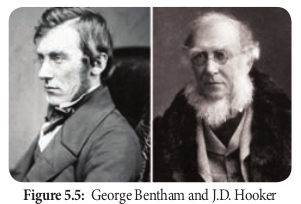

# Types of classification

Taxonomic entities are classified in three ways. They are artificial classification, natural classification and phylogenetic classification.

## Artificial system of classification

Carolus Linnaeus (1707 -1778) was a great Swedish Botanist and said to be the “**Father**

24 classes recognized by Linnaeus in his _Species Plantarum_ (1753) on the basis of stamens.
|**No.** | **Classes** | **Characters**|
|---|----|---|
|1|Monandria |stamen one |  
|2|Diandria | stamens two|
|3|Triandria| stamens three|
|4|Tetrandria| stamens four|
|5|Pentandria| stamens five|
|6|Hexandria| stamens six|
|7|Heptandria| stamens seven|
|8|Octandria| stamens eight|
|9|Ennandria | stamens nine|
|10|Decandria|stamens ten|
|11|Dodecandria|stamens 11-19|
|12|Icosandria|stamens 20 or more, on the calyx|
|13|Polyandria|stamens 20 or more, on the receptacle|
|14|Didynamia |stamens didynamous; 2 short, 2 long|
|15|Tetradynamia|stamens tetradyna- mous; 4 long, 2 short|
|16|Monadelphia|stamens monadelphous; united in 1 group|
|17|Diadelphia|stamens diadelphous; united in 2 groups|
|18|Polyadelphia|stamens polyadelphous; united in 3 or more groups|
|19|Syngenesia|stamens syngenesious; united by anthers only |
|20|Gynandria|stamens united with the gynoecium|
|21|Monoecia|plants monoecious|
|22|Dioecia|plants dioecious|
|23|Polygamia|plants polygamouS|
|24|Cryptogamia|flowerless plants|

**of Taxonomy**.” He outlined an artificial system of classification in “**_Species Plantarum_**” in 1753, wherein he listed and described 7,300 species and arranged in 24 classes mostly on the basis of number, union (adhesion and cohesion), length, and distribution of stamens. The classes were further subdivided on the basis of carpel characteristics into orders. Hence the system of classification is also known as **sexual** **system of classification**.

This system of classification though artificial, was continued for more than 100 years after the death of Linnaeus, due to its simplicity and easy way of identification of plants.

However the system could not hold good due to the following reasons.

1. Totally unrelated plants were kept in a single group, whereas closely related plants were placed in widely separated groups. Example:

a. Zingiberaceae of monocotyledons and Anacardiaceae of dicotyledonous were placed under the class **Monandria** since these possess single stamens.

b. _Prunus_ was classified along with _Cactus_ because of the same number of stamens.

No attempts were made to classify plants based on either natural or phylogenetic relationships which exist among plant groups.

## Natural system

Botanists who came after Linnaeus realised that no single character is more important than the other characters. Accordingly an approach to a natural system of classification sprouted in France. The first scheme of classification based on overall similarities was presented by **Antoine Laurent de Jessieu** in 1789.

**Bentham and Hooker system of classification**

A widely followed natural system of classification considered the best was proposed by two English botanist **George Bentham** (1800 – 1884) and **Joseph Dalton Hooker** (1817–1911). The classification was published in a three volume work as “_Genera Plantarum_” (1862–1883) describing 202 families and 7569 genera and 97,205 species. In this system the seeded plants were classified into 3 major classes such as Dicotyledonae, Gymnospermae and Monocotyledonae.

**Class I Dicotyledonae:** Plants contain two cotyledons in their seed, leaves with reticulate venation, tap root system and tetramerous or pentamerous flowers come under this class. It includes three sub-classes – **Polypetalae, Gamopetalae** and **Monochlamydeae**.

**Sub-class 1.** Polypetalae: Plants with free petals and dichlamydeous flowers come under polypetalae. It is further divided into three series – **Thalamiflorae, Disciflorae** and **Calyciflorae**.

**Series (i) Thalamiflorae:** Plants having flowers with dome or conical shaped thalamus and superior ovary are included in this series. It includes 6 orders and 34 families.

**Series (ii) Disciflorae:** Flowers having prominent disc shaped thalamus with superior ovary come under this series. It includes 4 orders and 23 families.

**Series (iii) Calyciflorae:** It includes plants having flowers with cup shaped thalamus and with inferior or sometimes with half inferior ovary. Calyciflorae includes 5 orders and 27 families.

**Sub-class 2. Gamopetalae:** Plants with united petals, which are either partially or completely fused to one another and dichlamydeous are placed under Gamopetalae. It is further divided into three series – Inferae, Heteromerae and Bicarpellatae.

**Series (i) Inferae:** The flowers are epigynous and with inferior ovary. Inferae includes 3 orders and 9 families.

**Series (ii) Heteromerae:** The flowers are hypogynous, superior ovary and with more than two carpels. Heteromerae includes 3 orders and 12 families.

**Series (iii) Bicarpellatae:** The flowers are hypogynous, superior ovary and with two carpels. Bicarpellatae includes 4 orders and 24 families.

**Sub-class 3. Monochlamydeae:** Plants with incomplete flowers either apetalous or

with undifferentiated calyx and corolla are placed under Monochlamydeae. The sepals and petals are not distinguished and they are called **perianth.** Sometimes both the whorls are absent. Monochlamydeae includes 8 series and 36 families.

**Class II Gymnospermae:** Plants that contain naked seeds come under this class. Gymnospermae includes three families – Gnetaceae, Coniferae and Cycadaceae.

**Class III Monocotyledonae:** Plants contain only one cotyledon in their seed, leaves with parallel venation, fibrous root system and trimerous flowers come under this class. The Monocotyledonae has 7 series and 34 families.

The Bentham and Hooker system of classification is still supposed to be the best system of classification. It has been widely practiced in colonial countries and herbaria of those countries were organised based on this system and is still used as a key for the identification of plants in some herbaria of the world due to the following reasons.

- Description of plants is quite accurate and reliable, because it is mainly based on personal studies from actual specimens and not mere comparisons of known **facts.**

- As it is easy to follow, it is used as a key for the identification of plants in several herbaria of the world. Though it is a natural system, this system was not intended to be phylogenetic.

## Phylogenetic system of classification

The publication of the **_Origin of Species_** (1859) by **Charles Darwin** has given stimulus for the emergence of phylogenetic system of classification. **I Adolph Engler and Karl A Prantl system of classification**

One of the earliest phylogenetic system of classification of the entire plant Kingdom was jointly proposed by two German botanists **Adolph Engler** ( 1844 -1930) and **Karl A Prantl** (1849 - 1893). They published their

classification in a monumental work “**_Die Naturelichen Pflanzen Familien_**” in 23 volumes (1887-1915)

In this system of classification the plant kingdom was divided into 13 divisions. The first 11 divisions are Thallophytes, twelfth division is **Embryophyta Asiphonogama** (plants with embryos but no pollen tubes; Bryophytes and Pteridophytes) and the thirteenth division is **Embryophyta Siphonogama** (plants with embryos and pollen tubes) which includes seed plants.

**II Arthur Cronquist system of classification Arthur Cronquist** (1919 - 1992) an eminent American taxonomist proposed phylogenetic classification of flowering plants based on a wide range of taxonomic characters including anatomical and phytochemical characters of phylogenetic importance. He has presented his classification in 1968 in his book titled “**The evolution and classification of flowering plants**.” His classification is broadly based on the Principles of phylogeny that finds acceptance with major contemporary authors.

Cronquist classified the angiosperms into two main classes **Magnoliopsida** (=dicotyledons) and **Liliopsida** (= monocotyledons). There are 6 subclasses,64 orders, 320 families and about 165,000 species in Magnoliopsida, whereas in Liliopsida there are 5 sub classes, 19 orders, 66 families and about 50,000 species.

Cronquist system of classification also could not persist for a long time because, the system is not very useful for identification and cannot be adopted in herbaria due to its high phylogenetic nature.

## Angiosperm phylogeny group (APG) classification

The most recent classification of flowering plants based on **phylogenetic data** was set in the last decade of twentieth century. Four versions of Angiosperm Phylogenetic Group classification (APG I, APG II, APG III & APG IV) have been published in 1998, 2003, 2009 and 2016 respectively. Each version supplants the previous version. Recognition of **monophyletic** group based on the information received from various disciplines such as gross morphology, anatomy, embryology, palynology, karyology, phytochemistry and more strongly on molecular data with respect to DNA sequences of two chloroplast genes (\_atp_B and \_rbc_L) and one nuclear gene (nuclear ribosomal 18s DNA).

The most recent updated version, APG IV (2016) recognised 64 orders and 416 families. Of these, 416 families 259 are represented in India.

The outline of APG IV classification is given below.

Angiosperms are classified into three clades early angiosperms, monocots and eudicots. Early angiosperms are classified into **8 orders** and **26 families** (**ANA**\-clade + magnoliids + Chloranthales)

**A**mborellales
**N**ymphaeales
**A**ustrobaileyales

- Seeds generally always with two cotyledons.
- Presence of ethereal oils.
- Leaves are always simple net-veined.
- Each floral whorls with many parts. - Perianth usually spirally arranged or parts in threes.
- Stamens with broad filaments.
- Anthers tetrasporangiate.
- Pollen monosulcate.
- Nectaries are rare.
- Carpels usually free and
- Embryo very small.

Monocots are classified into 11 orders and 77 families (basal monocots + lilioids + commelinids)

- Seeds with single cotyledon.
- Primary root short-lived.
- Single adaxial prophyll.
- Ethereal oils rarely present.
- Mostly herbaceous, absence of vascular cambium.
- Vascular bundles are scattered in the stem.
- Leaf simple with parallel-veined.
- Floral parts usually in threes.
- Perianth often composed of tepals.
- Pollen monosulcate.
- Styles normally hollow and
- Successive microsporogenesis.

---

**Changes in earlier taxonomic understanding.**

The newly proposed APG classification system has b on the concept of primitive flowering plant familie.

- The real Ranalean families, especially the arborescent ones are no more the primitive families.But as per APG classification system, Am Magnoliaceae and Chloranthaceae form the early angiosperms.
- Monocots are recognised as a monophyletic group and enceterminology is retained.
- Dicots are polyphyletic group and as a result the outdated.
- Liliaceae (Sensu lato) is split into 14 families.
- Molluginaceae and Gisekiaceae are recognise separately from Aizoaceae.
- Euphorbiaceae (s.l.) are split in to Phyllanthace.
- Asclepiadaceae are merged with Apocynaceae .
- Many genera that were conventionally treated under and _Vitex_ are transferred to Lamiaceae based on the modified circumscription of these families.

Eudicots are divided into 45 orders and 313 families (early diverging eudicots + super rosids + super asterids).

- Seeds with always two cotyledons.
- Nodes trilacunar with three leaf traces.
- Stomata anomocytic.
- Ethereal oils rarely present.
- Woody or herbaceous plants.
- Leaves simple or compound, usually net-veined.
- Flower parts mostly in twos, fours or fives.
- Microsporogenesis simultaneous.
- Style solid and
- Pollen tricolpate.

APG system is an evolving system that might undergo change periodically based on the new sets of data from various disciplines of Botany. It is the currently accepted system across the world and followed by all the leading taxonomic institutions and practising taxonomists. However, it is yet to percolate into the Indian botanical curriculum.

Classification reflects the state of our knowledge at a given point of time. It will continue to change as we acquire new information.

---

**Do You Know ?**

A significant number of major herbaria, including Kew are changing the order of their collections in accordance with APG. The influential world checklist of selected plant families (also from kew) is being updated to the APG III system.

A recent photographic survey of the plants of USA and Canada is organized according to the APG III system.

In UK, the latest edition of the standard flora of the British Isles written by Stace is based on the APG III system.

---
