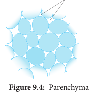
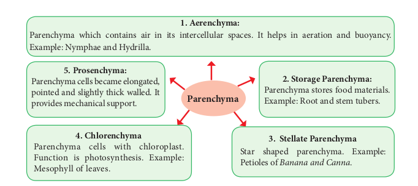
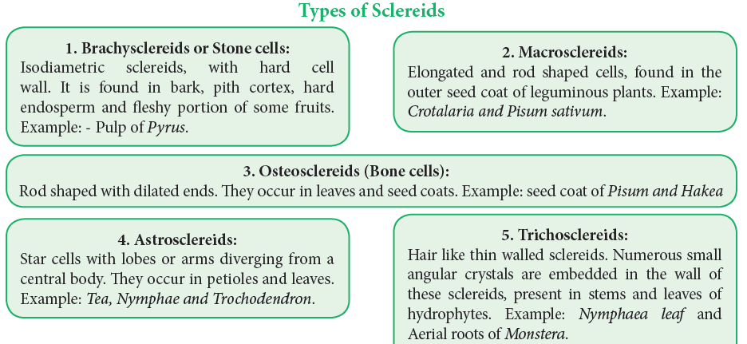
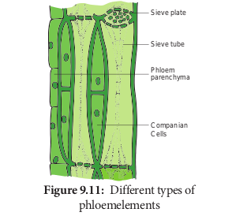
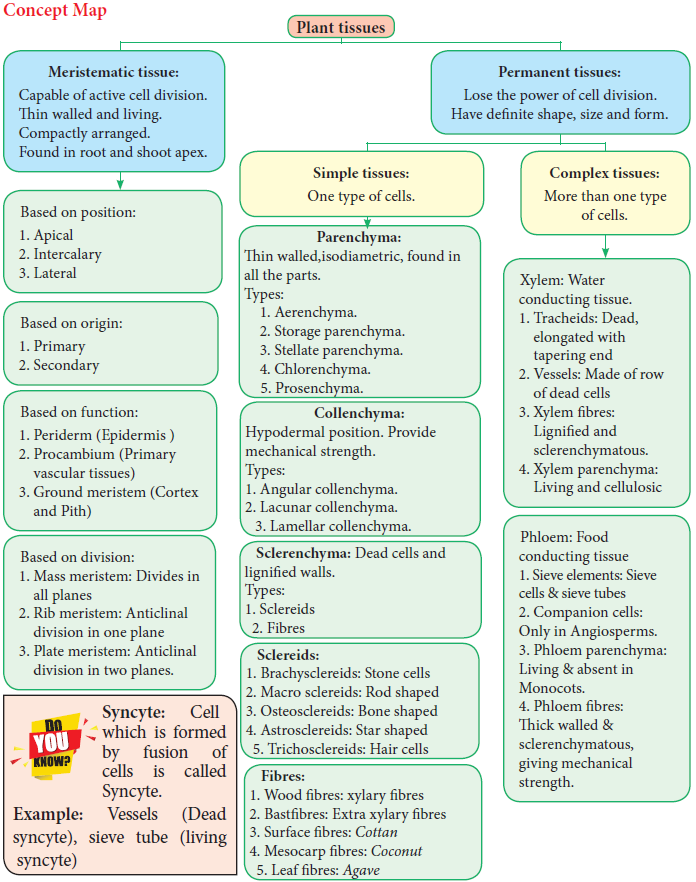
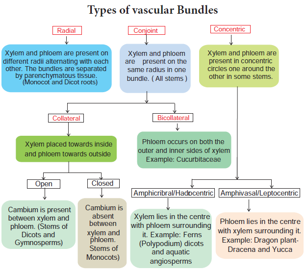

# Chapter Outline

**9.1** Meristematic tissue
**9.2** Permanent tissues
**9.3**The tissue system
**9.4**Epidermal tissue system
**9.5** Fundamental tissue system
**9.6** Vascular tissue system
**9.7** Comparision of primary structure

This chapter introduces the internal structure of higher plants. The study of internal structure and organisation of plant is called Plant Anatomy (_Gk: Ana _\= _as under; temnein_ \= _to cut_). Plants have cells as the basic unit. The cells are organised into tissues. The tissues in turn are organised into organs. The different organs in a plant have different internal structures. It is studied by means of dissection and microscopic examination.

**The Tissues**
A Tissue is a group of cells that are alike in origin, structure and function. The study of tissues is called Histology. A plant is made up of different types of tissues.

There are two principal groups:

1. Meristematic tissues
2. Permanent tissues

## Meristematic Tissue

### Characteristics and classification

The characters of meristematic tissues:
(Gr\*. Meristos-**\*Divisible**)

The term meristem was coined by **C. Nageli** 1858.

- The meristematic cells are isodiametric and they may be, oval, spherical or polygonal in shape.

- They generally have dense cytoplasm with prominent nucleus.

- Generally the vacuoles are either small or absent.

- Their cell wall is thin, elastic and made up of cellulose.

- These are most actively dividing cells.

- Meristematic cells are self-perpetuating.

      **Classification of Meristem**

  Meristem has been classified into several types on the basis of position, origin, function and division.

**Theories of Meristem Organization and Function**
Many anatomists illustrated the root and shoot apical meristems on the basis of number and arrangement and accordingly proposed the following theories – An extract of which is discussed below.

**Shoot Apical Meristem Apical Cell Theory** Apical cell theory is proposed by **Hofmeister** (1852) and supported by **Nageli** (1859). A single apical cell is the structural and functional unit.

This apical cell governs the growth and development of whole plant body. It is applicable in Algae, Bryophytes and in some Pteridophytes.

**Histogen Theory**
Histogen theory is proposed by **Hanstein** (1868) and supported by **Strassburgur.** The shoot apex comprises three distinct zones.

1. **Dermatogen:** It is the outermost layer. It gives rise to epidermis.
2. **Periblem:** It is middle layer. That gives rise
   to cortex.
3. **Plerome:** It is innermost layer. Which gives rise to stele

**Tunica Corpus Theory**
Tunica corpus theory is proposed by **A. Schmidt** (1924). Two zones of tissues are found in apical meris tem.

1. **The tunica**: It is the peripheral zone of shoot apex, that forms epidermis.

2. **The corpus**: It is the inner zone of shoot apex,that forms cortex and stele of shoot.

**Root Apical Meristem**
Root apex is present opposite to the shoot apex. The roots contain root cap at their apices and the apical meristem is present below the root cap. The different theories proposed to explain root apical meristem organization are given below.
**Apical Cell Theory**
Apical cell theory is proposed by **Nageli.** The single apical cell or apical initial composes the root meristem. The apical initial is tetrahedral in shape and produces root cap from one side. The remaining three sides produce epidermis, cortex and vascular tissues. It is found in vascular cryptogams.

**Histogen Theory**
Histogen theory is proposed by **Hanstein (1868)** and supported by **Strassburgur**. The histogen theory as appilied to the root apical meristem speaks of four histogen in the meristem. They are respectively,

i. **Dermatogen:** It is the outermost layer. It gives rise to root epidermis.

ii. **Periblem:** It is the middle layer. It gives rise to cortex.

iii. **Plerome:** It is innermost layer. It gives rise to stele

iv. **Calyptrogen:** It gives rise to root cap.

**Korper Kappe Theory**
Korper Kappe theory is proposed by **Schuepp**. There are two zones in root apex – Korper and Kappe

1. **Korper zone** forms the body.
2. **Kappe zone** forms the cap. This theory is equivalent to tunica corpus theory of shoot apex.The two divisions are distinguished by the type of T (also called Y) divisions. Korper is characterised by inverted T divisions and kappe by straight T divisions.

**Quiescent Centre Concept**
Quiescent centre concept was proposed by **Clowes** (1961) to explain root apical meristem activity. This centre is located between root cap and differentiating cells of the roots. The apparently inactive region of cells in root promeristem is called quiescent centre. It is the site of hormone synthesis and also the ultimate source of all meristematic cells of the meristem.

## Permanent Tissues

The Permanent tissues develop from apical meristem. They lose the power of cell division either permanently or temporarily. They are classified into two types:

1. Simple permanent tissues.
2. Complex permanent tissues.

**Simple Permanent Tissues**
Simple tissues are composed of one type of cells only. The cells are structurally and functionally similar. It is of three types.

1. Parenchyma
2. Collenchyma
3. Sclerenchyma

**Parenchyma (Gk: _Para_\-beside; _enehein_\- to pour)**

_Parenchyma_ is generally present in all organs of the plant. It forms the ground tissue in a plant. Parenchyma is a living tissue and made up of thin walled cells. The cell wall is made up of cellulose. Parenchyma cells may be oval, polyhedral, cylindrical, irregular, elongated or armed. The tissue normally has prominent intercellular spaces and may store various types of materials like, water, air, ergastic substances.

Occsionally Parenchyma cells which store resin, tannins, crystals of calcium carbonate, calcium oxalate are called idioblasts. Parenchyma is of different types and some of them are discussed as follows.

**Collenchyma (Gk. Colla-glue; enchyma – an infusion** Collenchyma is a simple, living mechanical tissue. Collenchyma generally occurs in hypodermis of dicot stem. It is absent in the roots and also occurs in petioles and pedicels. The cells are elongated and appear polygonal in cross section. The cell wall is unevenly thickened.It contains more of hemicellulose and pectin besides cellulose. It provides mechanical support and elasticity to the growing parts of the plant. Collenchyma consists of narrow cells. It has only a few small chloroplast or none. Tannin maybe present in collenchyma.Based on pattern of pectinisation of the cell wall, there are three types of collenchyma.

**Types of Collenchyma**

**1. Angular collenchyma** It is the most common type of collenchyma with irregular arrangement and thickening at the angles where cells meet. Example: Hypodermis of _Datura_ and _Nicotiana_

**2. Lacunar collenchyma** The collenchyma cells are irregularly arranged. Cell wall is thickened on the walls bordering intercellular spaces. Example: Hypodermis of _Ipomoea_

**3. Lamellar collenchyma** The collenchyma cells are arranged compactly in layers(rows). The Cell wall is thickened only at tangential wall. devoid of thickened at radial walls. These thickening appear as successsive tangential layers. Example: Hypodermis of Helianthus

**Diagramatic structures**

**Annular Collenchyma:** Duchaigne (1955) reported another type called Annular collenchyma in petiole of Nerium. The lumen is more or less circular in shape.

**Sclerenchyma (Gk. Sclerous- hard: enchyma-an infusion)**
The sclerenchyma is dead cell and lacks protoplasm. The cells are long or short, narrow thick walled and lignified secondary walls. The cell walls of these cells are uniformly and strongly thickened. sclerenchymatous cells are of two types:

1. Sclereids
2. Fibres

**Sclereids (Stone Cells)**
Sclereids are dead cells, usually these are isodiametric but some are elongated too. The cell wall is very thick due to lignification. Lumen is very much reduced. The pits may simple or branched. Sclereids are mechanical in function. They give hard texture to the seed coats, endosperms etc., Sclereids are classified into the following types.

**Sclerenchyma Found in Some Fruits**

**Fibres**
Fibres are very much elongated sclerenchyma cells with pointed tips. Fibres are dead cells and have lignified walls with narrow lumen. They have simple pits. They provide mechanical strength and protect them from the strong wind. It is also called supporting tissues. Fibres have a great commercial value in cottage and textile industries.

**Fibres are of five types**

1. **Wood Fibres or Xylary Fibres**
   These fibres are associated with the secondary xylem tissue. They are also called xylary fibres. These fibres are derived from the vascular cambium. These are of two types. a. Libriform fibres b. Fibre tracheids

2. **Bastfibres or Extra Xylary Fibres**
   These fibres are present in the phloem. Natural Bast fibres are strong and cellulosic. Fibres obtaining from the phloem or outer bark of jute, kenaf, flax and hemp plants. The so called pericyclic fibres are actually phloem fibres.

3. **Surface Fibres**
   These fibres are produced from the surface of the plant organs. Cotton and silk cotton are the examples.They occur in the testa of seeds.

4. **Mesocarp Fibres**
   Fibres obtained from the mesocarp of drupes like coconut.

5. **Leaf Fibres**
   Fibres obtained from the leaf of \_Musa, Agave and Sensciveria.

**Fibres in Our Daily Life**
Economically fibres may be grouped as follows

1. **Textile Fibres:** Fibres utilized for the manufacture of fabrics, netting and cordage etc.
   a. **Surface Fibres**: Example: Cotton.
   b. **Soft Fibres**: Example: Flax, Jute and Ramie
   c. **Hard fibres:** Example: Sisal, Coconut,Pineapple, Abaca _etc._

2. **Brush fibre:** Fibres utilized for the manufacture of brushes and brooms.

3. **Rough weaving fibres:** Fibres utilized in making baskets, chairs, mats etc.

4. **Paper making fibres:** Wood fibres utilized for paper making.

5. **Filling fibres:** Fibres used for stuffing cushions, mattresses, pillows, furniture etc. Example: _Bombax_ and Silk cotton.

**Complex Tissues**
A complex tissue is a tissue with several types of cells but all of them function together as a single unit. It is of two types – xylem and phloem.
**Xylem or Hadrome**
The xylem is the principal water conducting tissue in a vascular plant. The term xylem was introduced by **Nageli**(1858) and is derived from the Gk. _Xylos_ – wood. The xylem which is derived from Procambium is called **primary xylem** and the xylem which is derived from vascular cambium is called **secondary xylem**. Early formed primary xylem elements are called protoxylem, whereas the later formed primary xylem elements are called metaxylem.

Protoxylem lies towards the periphery and metaxylem that lies towards the centre is called **Exarch.** It is common in _roots._

Protoxylem lies towards the centre and meta xylem towards the periphery this condition is called **Endarch**. It is seen in _stems._

Protoxylem is located in the centre surrounded by the metaxylem is called **Centrarch**. In this type only one vascular strand is developed. Example: _Selaginella sp._

Protoxylem is located in the centre surrounded by the metaxylem is called **Mesarch**.In this type several vascular strands are developed. Example: _Ophioglossum sp._

**Xylem Consists of Four Types of Cells**

1. Tracheids

2. Vessels or Trachea

3. Xylem Parenchyma

4. Xylem Fibres

**Tracheids**
Tracheids are dead, lignified and elongated cells with tapering ends. Its lumen is broader than that of fibres. In cross section, the tracheids are polygonal.

There are different types of cell wall thickenings due to the deposition of secondary wall substances. They are annular (ring like), spiral (spring like), scalariform (ladder like) reticulate (net like) and pitted (uniformly thick except at pits). Tracheids are imperforated cells with bordered pits on their side walls. Only through this conduction takes place in Gymnosperms. They are arranged one above the other. Tracheids are chief water conducting elements in Gymnosperms and Pteridophytes. They also offer mechanical support to the plants.

**Vessels or Trachea**
Vessels are elongated tube like structure. They are dead cells formed from a row of vessel elements placed end to end. They are perforated at the end walls. Their lumen is wider than Tracheids. Due to the dissolution of entire cell wall, a single pore is formed at the perforation plate. It is called **simple perforation plate**, Example: _Mangifera_. If the perforation plate has many pores, it is called **multiple perforation plate**. Example _Liriodendron._

The secondary wall thickening of vessels are annular, spiral, scalariform, reticulate, or pitted as in tracheids, Vessels are chief water conducting elements in Angiosperms and absent in Pteridophytes and Gymnosperms. In G*netum* of Gymnosperm*,* vessels occur. The main function is conduction of water, minerals and also offers mechanical strength.

**Xylem Fibre**
The fibres of sclerenchyma associated with the xylem are known as xylem fibres. Xylem fibres are dead cells and have lignified walls with narrow lumen. They cannot conduct water but being stronger provide mechanical strength. They are present in both primary and secondary xylem. Xylem fibres are also called libriform fibres.

The fibres are abundantly found in many plants. They occur in patches, in continuous bands and sometimes singly among other cells. Between fibres and normal tracheids, there are many transitional forms which are neither typical fibres nor typical tracheids. The transitional types are designated as **fibre- tracheids**. The pits of fibre-tracheids are smaller than those of vessels and typical tracheids.

**Xylem Parernchyma**
The parenchyma cells associated with the xylem are known as xylem parenchyma. These are the only living cells in xylem tissue. The cell wall is thin and made up of cellulose. Parenchyma arranged longitudinally along the long axis is called **axial parenchyma**.

Ray parenchyma is arranged in radial rows. Secondary xylem consists of both axial and ray parenchyma, Parenchyma stores food materials and also helps in conduction of water.

**Phloem to leptome**
Phloem is the food conducting complex tissues of vascular plants. The term phloem was coined by **C. Nageli** (1858). The Phloem which is derived from procambium is called primary phloem and the phloem which is derived from vascular cambium is called secondary phloem. Early formed primary phloem elements are called **protophloem** whereas the later formed primary phloem elements are called **metaphloem**. Protophloem is short lived. It gets crushed by the developing metaphloem.

**Phloem Consists of Four Types of Cells**

1. Sieve elements

2. Companion cells

3. Phloem parenchyma

4. Phloem fibres

**Sieve Elements**
Sieve elements are the conducting elements of the phloem. They are of two types, namely sieve cells and sieve tubes.

**Sieve Cells**
These are primitive type of conducting elements found in Pteridophytes and Gymnosperms. Sieve cells have sieve areas on their lateral walls only. They are not associated with companion cells.

**Sieve Tubes** Sieve tubes are long tube like conducting elements in the phloem. These are formed from a series of cells called sieve tube elements. The sieve tube elements are arranged one above the other and form vertical sieve tube. The end wall contains a number of pores and it looks like a sieve. So it is called as sieve plate. The sieve elements show nacreous thickenings on their lateral walls. They may possess simple or compound sieve plates The function of sieve tubes are believed to be controlled by campanion cells.

In mature sieve tube, nucleus is absent. It contains a lining layer of cytoplasm. A special protein (P. Protein = Phloem Protein) called slime body is seen in it. In mature sieve tubes, the pores in the sieve plate are blocked by a substance called **callose** (callose plug). The conduction of food material takes place through cytoplasmic strands. Sieve tubes occur only in Angiosperms.

**Companion Cells**
The thin walled, elongated, specialized parenchyma cells, which are associated with the sieve elements, are called companion cells. These cells are living and they have cytoplasm and a prominent nucleus. They are connected to the sieve tubes through pits found in the lateral walls. Through these pits cytoplasmic connections are maintained between these elements. These cells are helpful in maintaining the pressure gradient in the sieve tubes. Usually the nuclei of the companion cells serve for the nuclei of sieve tubes as they lack them. The companion cells are present only in Angiosperms and absent in Gymnosperms and Pteridophytes. They assist the sieve tubes in the conduction of food materials.

**Phloem Parenchyma**
The parenchyma cells associated with the phloem are called phloem parenchyma. These are living cells. They store starch and fats. They also contain resins and tannins in some plants. Primary phloem consists of axial parenchyma and secondary phloem consists of both axial and ray parenchyma. They are present in Pteridophytes,Gymnosperms and Dicots.

**Phloem Fibres (or) Bast Fibres**
The fibres of sclerenchyma associated with phloem are called phloem fibres or bast fibres. They are narrow, vertically elongated cells with very thick walls and a small lumen. Among the four phloem elements, phloem fibres are the only dead tissue. These are the strengthening as well as supporting cells.

![![different types of tissues]](differenttypesoftissues.png)

**Difference Between Meristematic Tissue and Permanent Tissue**

|       Meristematic Tissue        |           Permanent Tissue           |
| :------------------------------: | :----------------------------------: |
|     Cells divide repeatedly      |            Do not divide             |
|    Cells are undifferentiated    |    Cells are fully differentiated    |
| Cells are small and Isodiametric | Cells are variable in shape and size |
| Intercellular spaces are absent  |   Intercellular spaces are present   |
|       Vacuoles are absent        |         Vacuoles are present         |
|       Cell walls are thin        |    Cell walls maybe thick or thin    |
| Inorganic inclusions are absent  |   Inorganic inclusions are present   |

**Difference Between Collenchyma and Sclerenchyma**

|              Collenchyma               |            Sclerenchyma            |
| :------------------------------------: | :--------------------------------: |
|              Living Cell.              |             Dead cell.             |
|          Contains Protoplas.           |       Do not have protoplas.       |
|       Cell walls are cellulosi.        |      Cell walls are lignifie.      |
| Thickening of cell wall is not unifor. | Thickening of cell wall is unifor. |
|       Keeps the plant body sof.        |  Keeps plant body stiff and har.   |
|      Sometimes it has chloroplast      |      Do not have chloroplast       |

**Difference between Fibre and Sclereids**

|               Fibre                |                       Sclereids                       |
| :--------------------------------: | :---------------------------------------------------: |
|             Long cell.             |                      Short cell.                      |
|   Narrow, Elongated pointed end.   |                Usually short and broa.                |
|         Occurs in bundle.          |        Occurs individually or in small group.         |
|        Commonly unbranche.         |                    Maybe branche.                     |
| Derived directly from meristematic | Develops from secondary sclerosis of parenchyma cells |

**Difference between Tracheids and Fibres**

| Not much elongate. | Very long cell. |
| Possess oblique end wall. | Possess tapering end wall. |
| Cell walls are not as thick as Fibre. | Cell wall are thick and lignifie. |
| Possess various types of thickening. | Possess only pitted thickening. |
| Responsible for the conduction and also mechanical support | Provide only mechanical support |

**Difference Between Sieve Cells and Sieve Tub**

|                             Sieve Cells                             |                                                     Sieve Tub                                                      |
| :-----------------------------------------------------------------: | :----------------------------------------------------------------------------------------------------------------: |
|                       Have no companion cell.                       |                                                Have companion cell.                                                |
|              The sieve areas do not form sieve plate.               |                                    The sieve areas are confined to sieve plate.                                    |
|             The sieve areas are not well differentiate.             |                                      The sieve areas are well differentiate.                                       |
| They are elongated cells and are quite long with tapering end walls | They consist of vertical cells placed one above the other forming long tubes connected at the walls by sieve pores |
|                 The sieve are smaller and numerou.                  |                                        The sieve pores are longer and fewe.                                        |
|               Found in Pteridophytes and Gymnosperms                |                                                Found in Angiosperms                                                |

## The Tissue System

**Introduction to Tissue System, Types and Characteristics of tissue System**

As you have learnt, the plant cells are organised into tissues, in turn the tissues are organised into organs. Different organs in a plant show differences in their internal structure. This part of chapter deals with the different type of internal structure of various plant organs and its adaptations to diverse environments.

A group of tissues performing a similar function, irrespective of its position in the plant body, is called a **_tissue system_**. In 1875, German Scientist **_Julius Von Sachs_** recognized three tissue systems in the plants. They are:

1. Epidermal tissue system (derived from protoderm)

2. Ground tissue system (derived from ground meristem)

3. Vascular tissue system (derived from procambium)

## Epidermal Tissue System

**Introduction**
_Epidermal tissue system_ is the outer most covering of plants. It is in direct contact with external environment. It consists of epidermis derived from protoderm.Epidermis is derived from two Greek words, namely ‘Epi’ and ‘Derma’. ‘Epi’ means _upon_ and ‘Derma’ means _skin_. It is made up of single layer of parenchyma cells which are arranged compactly without intercellular spaces. Although epidermis is a continuous outer layer, it is interrupted by stomata in many plants.

**Leaf Epidermis**
The leaf is generally _dorsiventral_. It has upper and lower epidermis. The epidermis is usually made up of a single layer of cells that are closely packed. Generally the cuticle on the upper epidermis is thicker than that of lower epidermis. The minute openings found on the epidermis are called **_stomata (singular: stoma)_.** A stoma is surrounded by a pair of specialised epidermal cells called guard cells. In most dicots and monocots the guard cells are bean-shaped. While in grasses and sedges, the guard cells are dumbbell- shaped. The guard cells contain chloroplasts, whereas the other epidermal cells normally do not have them.

**Subsidiary Cells**
Stomata are minute pores surrounded by two guard cells. The stomata occur mainly in the epidermis of leaves. In some plants addition to guard cells, specialised epidermal cells are present which are distinct from other epidermal cells. They are called **Subsidiary cells**. Based on the number and arrangement of subsidiary cells around the guard cells, the various types of stomata are recognised. The guard cells and subsidiary cells help in opening and closing of stomata during gaseous exchange and transpiration.

**Epidermal Outgrowths**
There are many types of epidermal outgrowths in stems. The unicellular or multicellular appendages that originate from the epidermal cells are called **trichomes**. Trichomes may be branched or unbranched and are one or more one celled thick. They assume many shapes and sizes. They may also be glandular (Example: _Rose, Ocimum_) or non-glandular.

Piliferous layer of the root has two types of epidermal cells, long cells and short cells. The short cells are called **trichoblasts**. Trichoblasts are elongate into root hairs. Epidermal hairs can also be in the form of stellate hairs (star shaped) present in plants. Example: styrax, many members of Malvaceae and Solanaceae.

**Prickles**
Prickles, are one type of epidermal emergences with no vascular supply. They are stiff and sharp in appearance. (Example: Rose). 

**Functions of Epidermal Tissue System**

1. This system in the shoot checks excessive loss of water due to the presence of cuticle.

2. Epidermis protects the underlying tissues.

3. Stomata is involved in transpiration and gaseous exchange.

4. Trichomes are also helpful in the dispersal of seeds and fruits, and provide protection against animals.

5. Prickles also provide protection against animals and they also check excessive transpiration

6. In some rose plants they also help in climbing.

7. Glandular hairs repel herbivorous animals.

## Fundamental Tissue System

The ground or fundamental tissue system constitutes the main body of the plants. It includes all the tissues except epidermis and vascular tissues. In monocot stem, ground tissue system is a continuous mass of parenchymatous tissue in which vascular bundles are found scattered. Hence ground tissue is not differentiated into cortex, endodermis, pericycle and pith. Generally in dicot stem, ground tissue system is differentiated into three main zones – cortex, pericycle and pith. It is classified into extrastelar ground tissue (Examples: cortex and endodermis) and intrastelar ground tissue (Examples: pericycle, medullary ray and pith)

**Extrastelar Ground Tissue**
The ground tissues present outside the stele is called extrastelar ground tissue. (Cortex)
**Intrastelar Ground Tissue**
The ground tissues present within the stele are called intrastelar ground tissues. (pericycle, medullary rays and pith).

**Different Components of Ground Tissue Systems are as follows**
**Hypodermis**
One or two layers of continuous or discontinuous tissue present below the epidermis, is called hypodermis. It is protective in function.

In dicot stem, hypodermis is generally collenchymatous, whereas in monocot stem, it is generally sclerenchymatous. In many plants collenchyma form the hypodermis.
**General Cortex**
The Cortex occurs between the epidermis and pericycle. Cortex is a few to many layers in thickness, In most cases, it is made up of parenchymatous tissues. Intercellular spaces may or may not be present.

The cortical cells may contain non living inclusions of starch grains, oil, tannins and crystals.

Its general function is storage of food as well as providing mechanical support to organs.
**Endodermis**
The cells of this layer are barrel shaped and arranged compactly without intercellular spaces.

Endodermis is the innermost cortical layer that separates cortex from the stele.
**Pericycle**
Pericycle is single or few layered parenchymatous found inner to the endodermis. It is the outermost layer of the stele. Rarely thick walled sclerenchymatous. In angiosperms, pericycle gives rise to lateral roots.

**Pith or Medulla**
The central part of the ground tissue is known as pith or medulla. Generally this is made up of thin walled parenchyma cells with intercellular spaces. The cells in the pith generally stores starch, fatty substances, tannins, phenols, calcium oxalate crystals, etc.

**Albuminous Cells: The cytoplasmic:** nucleated parenchyma, is associated with the sieve cells of Gymnosperms. Albuminous cells in _Conifers_ are analogous to companion cells of Angiosperms. It also called as strasburger cells.

## Vascular Tissue System

This section deals with the vascular tissue system of gymnosperms and angiosperms stems and roots.The vascular tissue system consists of xylem and phloem. The elements of xylem and phloem are always organized in groups. They are called **vascular bundles.**

The stems of both groups have an eustele while roots are protostele. In eustelic organization, the stele contains usually a ring of vascular bundles separated by interfascicular region or medullary ray

The structural and organizational variation in vascular bundles is shown below.

## Comparison of Primary Structure – Dicot and Monocot Root, Stem and Leaf

**Primary Structure of Dicot Root – Bean Root**
The transverse section of the dicot root (Bean) shows the following plan of arrangement of tissues from the periphery to the centre.
**Piliferous Layer or Epiblema**
The outermost layer of the root is called **piliferous layer or epiblema.** It is made up of single layer of parenchyma cells which are arranged compactly without intercellular spaces. It is devoid of epidermal pores and cuticle. It possesses root hairs which are single celled. It absorbs water and mineral salts from the soil. The chief function of piliferous layer is **protection.**

**Cortex**
ortex consists of only parenchyma cells. These cells are loosely arranged with intercellular spaces to make gaseous exchange easier. These cells may store food reserves. The cells are oval or rounded in shape. Sometimes they are polygonal due to mutual pressure. Though chloroplasts are absent in the cortical cells, starch grain are stored in them. The cells also possess leucoplasts. The innermost layer of the cortex is endodermis. Endodermis is made up of single layer of barrel shaped parenchymatous cells. Stele is completely surrounded by endodermis. The radial and the inner tangential walls of endodermal cells are thickened with **suberin and lignin.** This thickening was first noted by **Robert** **Casparay** in 1965. So these thickenings are called **casparian strips.** But these casparian strips are absent in the endodermis cells which are located opposite the protoxylem elements. These thin-walled cells without casparian strips are called **passage cells** through which water and mineral salts are conducted from the cortex to the xylem elements. Water cannot pass through other endodermal cells due to the presence of casparian thickenings.
**Stele**
All the tissues present inside endodermis comprise the stele. It includes pericycle and vascular system.
**Pericycle**
Pericycle is generally a single layer of parenchymatous cells found inner to the endodermis. It is the outermost layer of the stele. Lateral roots originate from the pericycle. Thus, the lateral roots are endogenous in origin.

**Vascular System**
Vascular tissues are in **radial arrangement**. The tissue by which xylem and phloem are separated is called **conjunctive tissue**. In bean, the conjuctive tissue is composed of parenchyma tissue. Xylem is in **exarch condition**. The number of protoxylem points is four and so the xylem is called **tetrach**. Each phloem patch consists of sieve tubes, companion cells and phloem parenchyma. Metaxylem vessels are generally polygonal in shape. But in monocot roots they are circular.

**Primary Structure of Monocot Root-maize Root**

The transverse section of the monocot root (maize) shows the following plan of arrangement of tissues from the periphery to the centre.

**Piliferous Layer or Epiblema**
The outermost layer of the root is known as **piliferous layer**. It consists of a single row of thin-walled parenchymatous cells without any intercellular space. Epidermal pores and cuticle are absent in the piliferous layer. Root hairs that are found in the piliferous layers are always unicellular. They absorb water and mineral salts from the soil. Root hairs are generally short lived. The main function of piliferous layer is protection of the inner tissues.

**Cortex**
The cortex is homogenous. i.e. the cortex is made up of only one type of tissue called parenchyma. It consists of many layers of thin-walled parenchyma cells with lot of intercellular spaces. The function of cortical cells is storage. Cortical cells are generally oval or rounded in shape. Chloroplasts are absent in the cortical cells, but they store starch. The cells are living and possess **leucoplasts.** The inner layer of the cortex is endodermis. It is composed of single layer of barrel shaped parenchymatous cells. This forms a complete ring around the stele. There is a band like structure made of **suberin** and **lignin** present in the radial and inner tangential walls of the endodermal cells. They are called **casparian strips** named after **casparay** who first noted the strips. The endodermal cells, which

**Anatomical differences between dicot root and Monocot root**

| S.NO |     Characters     |                         Dicot root                          |                                               Monocot root                                               |
| :--: | :----------------: | :---------------------------------------------------------: | :------------------------------------------------------------------------------------------------------: |
|  1.  |      Pericyle      | Gives rise to lateral phellogen and a par vascular cambium. |                                     Gives rise to lateral roots only                                     |
|  2.  |  Vascular tissue   |        Usually limited num xylem and phloem strips.         |                             Usually more number of xylem and phloem strips,                              |
|  3.  | Conjunctive tissue | Parenchymatous; It are differentiated in vascular cambium.  | Mostly sclerenchymatous but sometimes parenchymatous. It is never differentiated in to vascular cambium. |
|  4.  |      Cambium       | It appears as a secon meristem at the tim secondary growth. |                                         It is altogether absent.                                         |
|  5.  |       xylem        |                       Usually tetrach                       |                                             Usually polyarch                                             |

are opposite the protoxylem elements, are thin walled without casparian strips. These cells are called passage cells. Their function is to transport water and dissolved salts from the cortex to the xylem. Water cannot pass through other endodermal cells due to casparian strips. The main function of casparian strips in the endodermal cells is to prevent the re-entry of water into the cortex once water entered the xylem tissue.

**Stele**
All the tissues inside the endodermis comprise the stele. This includes pericycle, vascular system and pith.

**Pericycle**
Pericycle is the outermost layer of the stele and lies inner to the endodermis. It consists of single layer of parenchymatous cells.

**Vascular System**
Vascular tissues are seen in radial arrangement. The number of protoxylem groups is many. This arrangement of xylem is called polyarch. Xylem is in exarch condition, the tissue which is present between the xylem and the phloem, is called conjunctive tissue. In maize, the conjunctive tissue is made up of sclerenchymatous tissue.

**Pith**
The central portion is occupied by a large pith. It consists of thin-walled parenchyma cells with intercellular spaces. These cells are filled with abundant starch grains.
**Primary Structure of Dicot Stem (Sunflower stem)**
The transverse section of the dicot stem (Sunflower) shows the following plan of arrangement of tissues from the periphery to the centre.

**Epidermis**
It is protective in function and forms the outermost layer of the stem. It is a single layer of parenchymatous rectangular cells. The cells are compactly arranged without intercellular spaces. The outer walls of epidermal cells have a layer called cuticle. The cuticle checks the transpiration. The cuticle is made up of waxy substance known as cutin. Stomata may be present here and there. A large number of multicellular hairs occur on the epidermis.

**Cortex**
Cortex lies below the epidermis. The cortex is differentiated into three zones. Below the epidermis, there are few layers of collenchyma cells. This zone is called **hypodermis.** It gives mechanical strength of the Stem. These cells are living and thickened at the corners.

Inner to the hypodermis, a few layers of chlorenchyma cells are present with conspicuous intercellular spaces. This region performs photosynthesis. Some resin ducts also occur here. The third zone is made up of parenchyma cells. These cells store food materials. The innermost layer of the cortex is called **endodermis**. The cells of this layer are barrel shaped and arrange compactly without intercellular spaces. Since starch grains are abundant in these cells, this layer is also known a **starch sheath**. This layer is morphologically homologous to the endodermis found in the root. In most of the dicot stems, endodermis with casparian strips is not developed.

**Stele**
The central part of the stem inner to the endodermis is known as **stele**. It consists of pericyle, vascular bundles and pith. In dicot stem, vascular bundles are arranged in a ring around the pith. This type of stele is called **eustele.**

**Pericycle**
Pericycle is the layers of cells that occur between the endodermis and vascular bundles. In the stem of **sunflower (Helianthus),**a few layers of sclerenchyma cell occur in patches outside the phloem in each vascular bundle. This patch of sclerenchyma cell is called **Bundle cap or Hardbast**. The bundle caps and the parenchyma cells between them constitute the pericycle in the stem of sunflower.

**Vascular Bundles**
The vascular bundles consist of xylem, phloem and cambium. Xylem and phloem in the stem occur together and form the vascular bundles. These vascular bundles are **Wedge shaped**. They are arranged in the form of a ring. Each vascular bundle is **conjoint, collateral, open and endarch**.

**Phloem**
Phloem consists of sieve tubes, companion cells and phloem parenchyma. Phloem fibres are absent in the primary phloem. Phloem conducts organic food materials from the leaves to other parts of the plant body.

**Cambium**
Cambium consists of **brick shaped** and thin walled meristematic cells. It is one to four layers in thickness. These cells are capable of forming new cells during **secondary growth**.

**Xylem**
Xylem consists of xylem fibres, xylem parrenchyma vessels and tracheids. Vessels are thick walled and arranged in a few rows. Xylem conducts water and minerals from the root to the other parts of the plant body.
**Pith or medulla**
The large central portion of the stem is called pith. It is composed of parenchyma cells with intercellular spaces. The pith extends between the vascular bundles. are called primary pith rays or primary medullary rays. Function of the pith is **storage of food.**

**Primary Structure of Monocot Stem-maize Stem Epidermis**
It is the outermost layer of the stem. It is made up of single layer of tightly packed parenchymatous cells. Their outer walls are covered with thick cuticle. The continuity of this layer may be broken here and there by the presence of a few stomata. There are no epidermal outgrowths.

**Hypodermis**
A few layer of sclerenchymatous cells lying below the epidermis constitute the hypodermis. This layer gives mechanical strength to the plant. It is interrupted here and there by chlorenchyma cells.

**Ground Tissue**
There is no distinction into cortex, endodermis, pericycle and pith. The entire mass of parenchyma cells lying inner to the hypodermis forms the ground tissue.

The cell wall is made up of **cellulose**. The cells contain reserve food material like **starch**. The cells of the ground tissue next to the hypodermis are smaller in size, polygonal in shape and compactly arranged.

Towards the centre, the cells are loosely arranged, rounded in shape and bigger in size. The vascular bundles lie embedded in this tissue. The ground tissue stores food and performs gaseous exchange.

**Vascular Bundles**
Vascular bundles are **scattered ( atactostele)** in the parenchymatous ground tissue. Each vascular bundle is surrounded by a sheath of sclerenchymatous fibres called **bundle sheath**. The vascular bundles are **conjoint, collateral, endarch** and **closed**.Vascular

bundles are numerous, small and closely arranged in the peripheral portion. Towards the centre, the bundles are comparatively large in size and loosely arranged. Vascular bundles are **skull or oval shaped.**

**Phloem**
The phloem in the monocot stem consists of sieve tubes and companion cells. Phloem parenchyma and phloem fibres are absent. It can be distinguished into an outer crushed protophloem and an inner metaphloem.

**Xylem**
Xylem vessels are arranged in the form of **’Y’** the two metaxylem vessels are located at the upper two arms and one or two protoxylem vessels at the base. In a mature bundle, the lowest protoxylem disintegrates and forms a cavity known as **protoxylem lacuna**.

**Anatomy of a Dicot Leaf-sunflower Leaf**
Internal structure of dictoyledonous leaves reveal epidermis, Mesophyll and vascular tissues.

**Epidermis**
This leaf is generally **dorsiventral.** It has upper and lower epidermis. The epidermis is usually made up of a single layer of cells that are closely packed. The cuticle on the upper epidermis is thicker than that of lower epidermis. The minute openings found on the epidermis are called **stomata**. Stomata are more in number on the lower epidermis than on the upper epidermis. A stomata is surrounded by a pair of **bean shaped** cells called guard cells.

Each stoma internally opens into an air chamber. These guard cells contain chloroplasts, whereas other epidermal cells do not contain chloroplasts. The main function of the epidermis is to give protection to the inner tissue called **mesosphyll**. The cuticle helps to check transpiration. Stomata are used for transpiration and gas exchange.

**Mesophyll**
The entire tissue between the upper and lower epidermis is called the **mesophyll (GK meso** = **in the middle, phyllome** = **leaf).** There are two regions in the mesophyll. They are **palisade parenchyma and spongy parenchyma.** Palisade parenchyma cells are seen beneath the upper epidermis. It consists of vertically elongated cylindrical cells in one or more layers. These cells are compactly arranged and are generally without intercellular spaces. Palisade parenchyma cells contain more chloroplasts than the spongy parenchyma cells. The function of palisade parenchyma is **photosynthesis.** Spongy parenchyma lies below the palisade parenchyma. Spongy cells are irregularly shaped. These cells are very loosely arranged with numerous airspaces. As compared to palisade cells, the spongy cells contain lesser number of chloroplasts. Spongy cells facilitate the **exchange of gases** with the help of air spaces. The air space that is found next to the stomata is called **respiratory cavity or substomatal cavity**.

**Vascular Tissues**
Vascular tissues are present in the veins of leaf. Vascular bundles are **conjoint, Collateral and closed.** Xylem is present towards the upper epidermis, while the phloem towards the lower epidermis. Vascular bundles are surrounded by a compact layer of parenchymatous cells called **bundle sheath or border parenchyma**.

Xylem consists of metaxylem and protoxylem elements. Protoxylem is present towards the upper epidermis,while the phloem consists of sieve tubes, companion cells and phloem parenchyma. Phloem fibres are absent. Xylem consists of vessels and xylem parenchyma. Tracheids and xylem fibres are absent.

**Anatomy of a Monocot Leaf – Grass Leaf**
A transverse section of a grass leaf reveals the following internal structures.

**Epidermis**
The leaf has upper and lower epidermis. They are made up of a single layer of thin walled cells. The outer walls are covered by thick cuticle.

The number of stomata is more or less equal on both the epidermis. The stomata is surrounded by **dumb – bell shaped** guard cells. The guard cells-contain chloroplasts, whereas the other epidermal cells do not have them.

Some special cells surround the guard cells. They are distinct from other epidermal cells.

These cells are called **subsidiary cells.** Some cells of upper epidermis are large and thin walled. They are called **bulliform cells** or motor cells. These cells are helpful for the rolling and unrolling of the leaf according to the weather change.

Some of the epidermal cells of the grass are filled with silica. They are called **silica cells**.

**Mesophyll**
The ground tissue that is present between the upper and lower epidermis of the leaf is called **mesophyll.** Here, the mesophyll is not differentiated into **palisade and spongy parenchyma.** All the mesophyll cells are nearly isodiametric and thin walled. These cells are compactly arranged with limited intercellular spaces. They contain numerous chloroplasts.

**Vascular Bundles**
Vascular bundles differ in size. Most of the vascular bundles are smaller in size. Large bundles occur at regular intervals.Two patches of sclerenchyma are present above and below the large vascular bundles. These sclerenchyma patches give mechanical support to the leaf. The small vascular bundles do not have such sclerenchymatous patches. Vascular bundles are **conjoint, collateral and closed**. Each vascular bundle is surrounded by a parenchymatous bundle sheath. The cells of the bundle sheath generally contain starch grains. The xylem of the vascular bundle is

located towards the upper epidermis and the phloem towards the lower epidermis.In C4 grasses, the bundle sheath cells are living and involve in C4 photosynthesis. This sheath is called **Kranz sheath**.

