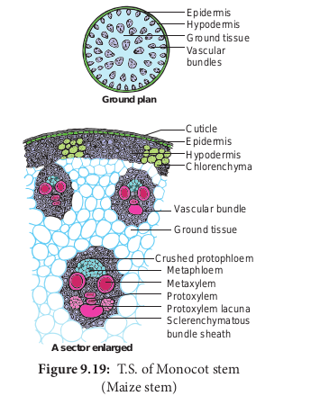
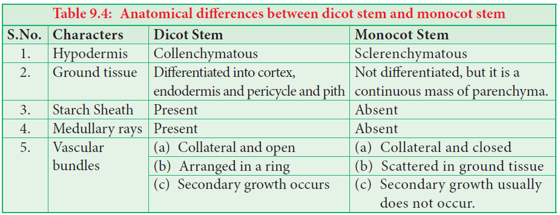
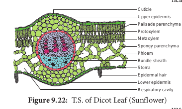
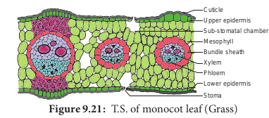

**Primary Structure of Dicot Root – Bean Root**
The transverse section of the dicot root (Bean) shows the following plan of arrangement of tissues from the periphery to the centre.
**Piliferous Layer or Epiblema**
The outermost layer of the root is called **piliferous layer or epiblema.** It is made up of single layer of parenchyma cells which are arranged compactly without intercellular spaces. It is devoid of epidermal pores and cuticle. It possesses root hairs which are single celled. It absorbs water and mineral salts from the soil. The chief function of piliferous layer is **protection.**

**Cortex**
ortex consists of only parenchyma cells. These cells are loosely arranged with intercellular spaces to make gaseous exchange easier. These cells may store food reserves. The cells are oval or rounded in shape. Sometimes they are polygonal due to mutual pressure. Though chloroplasts are absent in the cortical cells, starch grain are stored in them. The cells also possess leucoplasts. The innermost layer of the cortex is endodermis. Endodermis is made up of single layer of barrel shaped parenchymatous cells. Stele is completely surrounded by endodermis. The radial and the inner tangential walls of endodermal cells are thickened with **suberin and lignin.** This thickening was first noted by **Robert** **Casparay** in 1965. So these thickenings are called **casparian strips.** But these casparian strips are absent in the endodermis cells which are located opposite the protoxylem elements. These thin-walled cells without casparian strips are called **passage cells** through which water and mineral salts are conducted from the cortex to the xylem elements. Water cannot pass through other endodermal cells due to the presence of casparian thickenings.
**Stele**
All the tissues present inside endodermis comprise the stele. It includes pericycle and vascular system.
**Pericycle**
Pericycle is generally a single layer of parenchymatous cells found inner to the endodermis. It is the outermost layer of the stele. Lateral roots originate from the pericycle. Thus, the lateral roots are endogenous in origin.

**Vascular System**
Vascular tissues are in **radial arrangement**. The tissue by which xylem and phloem are separated is called **conjunctive tissue**. In bean, the conjuctive tissue is composed of parenchyma tissue. Xylem is in **exarch condition**. The number of protoxylem points is four and so the xylem is called **tetrach**. Each phloem patch consists of sieve tubes, companion cells and phloem parenchyma. Metaxylem vessels are generally polygonal in shape. But in monocot roots they are circular.

**Primary Structure of Monocot Root-maize Root**

The transverse section of the monocot root (maize) shows the following plan of arrangement of tissues from the periphery to the centre.

**Piliferous Layer or Epiblema**
The outermost layer of the root is known as **piliferous layer**. It consists of a single row of thin-walled parenchymatous cells without any intercellular space. Epidermal pores and cuticle are absent in the piliferous layer. Root hairs that are found in the piliferous layers are always unicellular. They absorb water and mineral salts from the soil. Root hairs are generally short lived. The main function of piliferous layer is protection of the inner tissues.

**Cortex**
The cortex is homogenous. i.e. the cortex is made up of only one type of tissue called parenchyma. It consists of many layers of thin-walled parenchyma cells with lot of intercellular spaces. The function of cortical cells is storage. Cortical cells are generally oval or rounded in shape. Chloroplasts are absent in the cortical cells, but they store starch. The cells are living and possess **leucoplasts.** The inner layer of the cortex is endodermis. It is composed of single layer of barrel shaped parenchymatous cells. This forms a complete ring around the stele. There is a band like structure made of **suberin** and **lignin** present in the radial and inner tangential walls of the endodermal cells. They are called **casparian strips** named after **casparay** who first noted the strips. The endodermal cells, which

**Anatomical differences between dicot root and Monocot root**

| S.NO |     Characters     |                         Dicot root                          |                                               Monocot root                                               |
| :--: | :----------------: | :---------------------------------------------------------: | :------------------------------------------------------------------------------------------------------: |
|  1.  |      Pericyle      | Gives rise to lateral phellogen and a par vascular cambium. |                                     Gives rise to lateral roots only                                     |
|  2.  |  Vascular tissue   |        Usually limited num xylem and phloem strips.         |                             Usually more number of xylem and phloem strips,                              |
|  3.  | Conjunctive tissue | Parenchymatous; It are differentiated in vascular cambium.  | Mostly sclerenchymatous but sometimes parenchymatous. It is never differentiated in to vascular cambium. |
|  4.  |      Cambium       | It appears as a secon meristem at the tim secondary growth. |                                         It is altogether absent.                                         |
|  5.  |       xylem        |                       Usually tetrach                       |                                             Usually polyarch                                             |

are opposite the protoxylem elements, are thin walled without casparian strips. These cells are called passage cells. Their function is to transport water and dissolved salts from the cortex to the xylem. Water cannot pass through other endodermal cells due to casparian strips. The main function of casparian strips in the endodermal cells is to prevent the re-entry of water into the cortex once water entered the xylem tissue.

**Stele**
All the tissues inside the endodermis comprise the stele. This includes pericycle, vascular system and pith.

**Pericycle**
Pericycle is the outermost layer of the stele and lies inner to the endodermis. It consists of single layer of parenchymatous cells.

**Vascular System**
Vascular tissues are seen in radial arrangement. The number of protoxylem groups is many. This arrangement of xylem is called polyarch. Xylem is in exarch condition, the tissue which is present between the xylem and the phloem, is called conjunctive tissue. In maize, the conjunctive tissue is made up of sclerenchymatous tissue.

**Pith**
The central portion is occupied by a large pith. It consists of thin-walled parenchyma cells with intercellular spaces. These cells are filled with abundant starch grains.
**Primary Structure of Dicot Stem (Sunflower stem)**
The transverse section of the dicot stem (Sunflower) shows the following plan of arrangement of tissues from the periphery to the centre.

**Epidermis**
It is protective in function and forms the outermost layer of the stem. It is a single layer of parenchymatous rectangular cells. The cells are compactly arranged without intercellular spaces. The outer walls of epidermal cells have a layer called cuticle. The cuticle checks the transpiration. The cuticle is made up of waxy substance known as cutin. Stomata may be present here and there. A large number of multicellular hairs occur on the epidermis.

**Cortex**
Cortex lies below the epidermis. The cortex is differentiated into three zones. Below the epidermis, there are few layers of collenchyma cells. This zone is called **hypodermis.** It gives mechanical strength of the Stem. These cells are living and thickened at the corners.

Inner to the hypodermis, a few layers of chlorenchyma cells are present with conspicuous intercellular spaces. This region performs photosynthesis. Some resin ducts also occur here. The third zone is made up of parenchyma cells. These cells store food materials. The innermost layer of the cortex is called **endodermis**. The cells of this layer are barrel shaped and arrange compactly without intercellular spaces. Since starch grains are abundant in these cells, this layer is also known a **starch sheath**. This layer is morphologically homologous to the endodermis found in the root. In most of the dicot stems, endodermis with casparian strips is not developed.

**Stele**
The central part of the stem inner to the endodermis is known as **stele**. It consists of pericyle, vascular bundles and pith. In dicot stem, vascular bundles are arranged in a ring around the pith. This type of stele is called **eustele.**

**Pericycle**
Pericycle is the layers of cells that occur between the endodermis and vascular bundles. In the stem of **sunflower (Helianthus),**a few layers of sclerenchyma cell occur in patches outside the phloem in each vascular bundle. This patch of sclerenchyma cell is called **Bundle cap or Hardbast**. The bundle caps and the parenchyma cells between them constitute the pericycle in the stem of sunflower.

**Vascular Bundles**
The vascular bundles consist of xylem, phloem and cambium. Xylem and phloem in the stem occur together and form the vascular bundles. These vascular bundles are **Wedge shaped**. They are arranged in the form of a ring. Each vascular bundle is **conjoint, collateral, open and endarch**.

**Phloem**
Phloem consists of sieve tubes, companion cells and phloem parenchyma. Phloem fibres are absent in the primary phloem. Phloem conducts organic food materials from the leaves to other parts of the plant body.

**Cambium**
Cambium consists of **brick shaped** and thin walled meristematic cells. It is one to four layers in thickness. These cells are capable of forming new cells during **secondary growth**.

**Xylem**
Xylem consists of xylem fibres, xylem parrenchyma vessels and tracheids. Vessels are thick walled and arranged in a few rows. Xylem conducts water and minerals from the root to the other parts of the plant body.
**Pith or medulla**
The large central portion of the stem is called pith. It is composed of parenchyma cells with intercellular spaces. The pith extends between the vascular bundles. are called primary pith rays or primary medullary rays. Function of the pith is **storage of food.**

**Primary Structure of Monocot Stem-maize Stem Epidermis**
It is the outermost layer of the stem. It is made up of single layer of tightly packed parenchymatous cells. Their outer walls are covered with thick cuticle. The continuity of this layer may be broken here and there by the presence of a few stomata. There are no epidermal outgrowths.

**Hypodermis**
A few layer of sclerenchymatous cells lying below the epidermis constitute the hypodermis. This layer gives mechanical strength to the plant. It is interrupted here and there by chlorenchyma cells.

**Ground Tissue**
There is no distinction into cortex, endodermis, pericycle and pith. The entire mass of parenchyma cells lying inner to the hypodermis forms the ground tissue.

The cell wall is made up of **cellulose**. The cells contain reserve food material like **starch**. The cells of the ground tissue next to the hypodermis are smaller in size, polygonal in shape and compactly arranged.

Towards the centre, the cells are loosely arranged, rounded in shape and bigger in size. The vascular bundles lie embedded in this tissue. The ground tissue stores food and performs gaseous exchange.

**Vascular Bundles**
Vascular bundles are **scattered ( atactostele)** in the parenchymatous ground tissue. Each vascular bundle is surrounded by a sheath of sclerenchymatous fibres called **bundle sheath**. The vascular bundles are **conjoint, collateral, endarch** and **closed**.Vascular

bundles are numerous, small and closely arranged in the peripheral portion. Towards the centre, the bundles are comparatively large in size and loosely arranged. Vascular bundles are **skull or oval shaped.**

**Phloem**
The phloem in the monocot stem consists of sieve tubes and companion cells. Phloem parenchyma and phloem fibres are absent. It can be distinguished into an outer crushed protophloem and an inner metaphloem.

**Xylem**
Xylem vessels are arranged in the form of **’Y’** the two metaxylem vessels are located at the upper two arms and one or two protoxylem vessels at the base. In a mature bundle, the lowest protoxylem disintegrates and forms a cavity known as **protoxylem lacuna**.

**Anatomy of a Dicot Leaf-sunflower Leaf**
Internal structure of dictoyledonous leaves reveal epidermis, Mesophyll and vascular tissues.

**Epidermis**
This leaf is generally **dorsiventral.** It has upper and lower epidermis. The epidermis is usually made up of a single layer of cells that are closely packed. The cuticle on the upper epidermis is thicker than that of lower epidermis. The minute openings found on the epidermis are called **stomata**. Stomata are more in number on the lower epidermis than on the upper epidermis. A stomata is surrounded by a pair of **bean shaped** cells called guard cells.

Each stoma internally opens into an air chamber. These guard cells contain chloroplasts, whereas other epidermal cells do not contain chloroplasts. The main function of the epidermis is to give protection to the inner tissue called **mesosphyll**. The cuticle helps to check transpiration. Stomata are used for transpiration and gas exchange.

**Mesophyll**
The entire tissue between the upper and lower epidermis is called the **mesophyll (GK meso** = **in the middle, phyllome** = **leaf).** There are two regions in the mesophyll. They are **palisade parenchyma and spongy parenchyma.** Palisade parenchyma cells are seen beneath the upper epidermis. It consists of vertically elongated cylindrical cells in one or more layers. These cells are compactly arranged and are generally without intercellular spaces. Palisade parenchyma cells contain more chloroplasts than the spongy parenchyma cells. The function of palisade parenchyma is **photosynthesis.** Spongy parenchyma lies below the palisade parenchyma. Spongy cells are irregularly shaped. These cells are very loosely arranged with numerous airspaces. As compared to palisade cells, the spongy cells contain lesser number of chloroplasts. Spongy cells facilitate the **exchange of gases** with the help of air spaces. The air space that is found next to the stomata is called **respiratory cavity or substomatal cavity**.

**Vascular Tissues**
Vascular tissues are present in the veins of leaf. Vascular bundles are **conjoint, Collateral and closed.** Xylem is present towards the upper epidermis, while the phloem towards the lower epidermis. Vascular bundles are surrounded by a compact layer of parenchymatous cells called **bundle sheath or border parenchyma**.

Xylem consists of metaxylem and protoxylem elements. Protoxylem is present towards the upper epidermis,while the phloem consists of sieve tubes, companion cells and phloem parenchyma. Phloem fibres are absent. Xylem consists of vessels and xylem parenchyma. Tracheids and xylem fibres are absent.

**Anatomy of a Monocot Leaf – Grass Leaf**
A transverse section of a grass leaf reveals the following internal structures.

**Epidermis**
The leaf has upper and lower epidermis. They are made up of a single layer of thin walled cells. The outer walls are covered by thick cuticle.

The number of stomata is more or less equal on both the epidermis. The stomata is surrounded by **dumb – bell shaped** guard cells. The guard cells-contain chloroplasts, whereas the other epidermal cells do not have them.

Some special cells surround the guard cells. They are distinct from other epidermal cells.

These cells are called **subsidiary cells.** Some cells of upper epidermis are large and thin walled. They are called **bulliform cells** or motor cells. These cells are helpful for the rolling and unrolling of the leaf according to the weather change.

Some of the epidermal cells of the grass are filled with silica. They are called **silica cells**.

**Mesophyll**
The ground tissue that is present between the upper and lower epidermis of the leaf is called **mesophyll.** Here, the mesophyll is not differentiated into **palisade and spongy parenchyma.** All the mesophyll cells are nearly isodiametric and thin walled. These cells are compactly arranged with limited intercellular spaces. They contain numerous chloroplasts.

**Vascular Bundles**
Vascular bundles differ in size. Most of the vascular bundles are smaller in size. Large bundles occur at regular intervals.Two patches of sclerenchyma are present above and below the large vascular bundles. These sclerenchyma patches give mechanical support to the leaf. The small vascular bundles do not have such sclerenchymatous patches. Vascular bundles are **conjoint, collateral and closed**. Each vascular bundle is surrounded by a parenchymatous bundle sheath. The cells of the bundle sheath generally contain starch grains. The xylem of the vascular bundle is

located towards the upper epidermis and the phloem towards the lower epidermis.In C4 grasses, the bundle sheath cells are living and involve in C4 photosynthesis. This sheath is called **Kranz sheath**.

