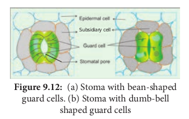

**Introduction**
_Epidermal tissue system_ is the outer most covering of plants. It is in direct contact with external environment. It consists of epidermis derived from protoderm.Epidermis is derived from two Greek words, namely ‘Epi’ and ‘Derma’. ‘Epi’ means _upon_ and ‘Derma’ means _skin_. It is made up of single layer of parenchyma cells which are arranged compactly without intercellular spaces. Although epidermis is a continuous outer layer, it is interrupted by stomata in many plants.

**Leaf Epidermis**
The leaf is generally _dorsiventral_. It has upper and lower epidermis. The epidermis is usually made up of a single layer of cells that are closely packed. Generally the cuticle on the upper epidermis is thicker than that of lower epidermis. The minute openings found on the epidermis are called **_stomata (singular: stoma)_.** A stoma is surrounded by a pair of specialised epidermal cells called guard cells. In most dicots and monocots the guard cells are bean-shaped. While in grasses and sedges, the guard cells are dumbbell- shaped. The guard cells contain chloroplasts, whereas the other epidermal cells normally do not have them.

**Subsidiary Cells**
Stomata are minute pores surrounded by two guard cells. The stomata occur mainly in the epidermis of leaves. In some plants addition to guard cells, specialised epidermal cells are present which are distinct from other epidermal cells. They are called **Subsidiary cells**. Based on the number and arrangement of subsidiary cells around the guard cells, the various types of stomata are recognised. The guard cells and subsidiary cells help in opening and closing of stomata during gaseous exchange and transpiration.

**Epidermal Outgrowths**
There are many types of epidermal outgrowths in stems. The unicellular or multicellular appendages that originate from the epidermal cells are called **trichomes**. Trichomes may be branched or unbranched and are one or more one celled thick. They assume many shapes and sizes. They may also be glandular (Example: _Rose, Ocimum_) or non-glandular.

>**Do You Know** The trichomes on the 
leaves of insectivorous 
plants secrete 
mucopolysaccharides 
that trap insects

Piliferous layer of the root has two types of epidermal cells, long cells and short cells. The short cells are called **trichoblasts**. Trichoblasts are elongate into root hairs. Epidermal hairs can also be in the form of stellate hairs (star shaped) present in plants. Example: styrax, many members of Malvaceae and Solanaceae.

**Prickles**
Prickles, are one type of epidermal emergences with no vascular supply. They are stiff and sharp in appearance. (Example: Rose). 

**Functions of Epidermal Tissue System**

1. This system in the shoot checks excessive loss of water due to the presence of cuticle.

2. Epidermis protects the underlying tissues.

3. Stomata is involved in transpiration and gaseous exchange.

4. Trichomes are also helpful in the dispersal of seeds and fruits, and provide protection against animals.

5. Prickles also provide protection against animals and they also check excessive transpiration

6. In some rose plants they also help in climbing.

7. Glandular hairs repel herbivorous animals.
