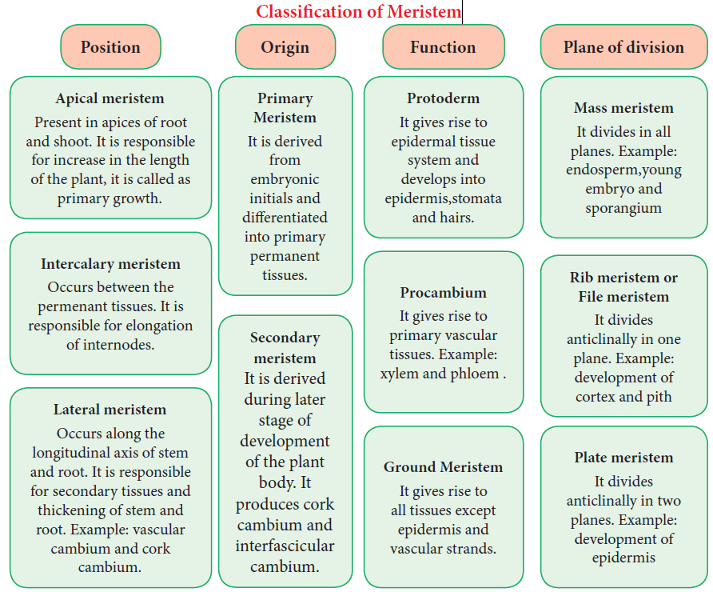
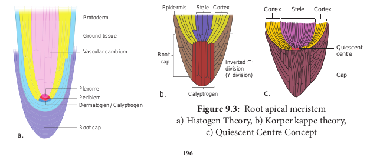

### Characteristics and classification

The characters of meristematic tissues:
(Gr\. Meristos-**Divisible**)

The term meristem was coined by **C. Nageli** 1858.

- The meristematic cells are isodiametric and they may be, oval, spherical or polygonal in shape.

- They generally have dense cytoplasm with prominent nucleus.

- Generally the vacuoles are either small or absent.

- Their cell wall is thin, elastic and made up of cellulose.

- These are most actively dividing cells.

- Meristematic cells are self-perpetuating.

**Classification of Meristem**

Meristem has been classified into several types on the basis of position, origin, function and division.

**Theories of Meristem Organization and Function**
Many anatomists illustrated the root and shoot apical meristems on the basis of number and arrangement and accordingly proposed the following theories – An extract of which is discussed below.

**Shoot Apical Meristem Apical Cell Theory** Apical cell theory is proposed by **Hofmeister** (1852) and supported by **Nageli** (1859). A single apical cell is the structural and functional unit.

This apical cell governs the growth and development of whole plant body. It is applicable in Algae, Bryophytes and in some Pteridophytes.

**Histogen Theory**
Histogen theory is proposed by **Hanstein** (1868) and supported by **Strassburgur.** The shoot apex comprises three distinct zones.

1. **Dermatogen:** It is the outermost layer. It gives rise to epidermis.
2. **Periblem:** It is middle layer. That gives rise
   to cortex.
3. **Plerome:** It is innermost layer. Which gives rise to stele

**Tunica Corpus Theory**
Tunica corpus theory is proposed by **A. Schmidt** (1924). Two zones of tissues are found in apical meris tem.

1. **The tunica**: It is the peripheral zone of shoot apex, that forms epidermis.

2. **The corpus**: It is the inner zone of shoot apex,that forms cortex and stele of shoot.

**Root Apical Meristem**
Root apex is present opposite to the shoot apex. The roots contain root cap at their apices and the apical meristem is present below the root cap. The different theories proposed to explain root apical meristem organization are given below.
**Apical Cell Theory**
Apical cell theory is proposed by **Nageli.** The single apical cell or apical initial composes the root meristem. The apical initial is tetrahedral in shape and produces root cap from one side. The remaining three sides produce epidermis, cortex and vascular tissues. It is found in vascular cryptogams.

**Histogen Theory**
Histogen theory is proposed by **Hanstein (1868)** and supported by **Strassburgur**. The histogen theory as appilied to the root apical meristem speaks of four histogen in the meristem. They are respectively,

i. **Dermatogen:** It is the outermost layer. It gives rise to root epidermis.

ii. **Periblem:** It is the middle layer. It gives rise to cortex.

iii. **Plerome:** It is innermost layer. It gives rise to stele

iv. **Calyptrogen:** It gives rise to root cap.

**Korper Kappe Theory**
Korper Kappe theory is proposed by **Schuepp**. There are two zones in root apex – Korper and Kappe

1. **Korper zone** forms the body.
2. **Kappe zone** forms the cap. This theory is equivalent to tunica corpus theory of shoot apex.The two divisions are distinguished by the type of T (also called Y) divisions. Korper is characterised by inverted T divisions and kappe by straight T divisions.

**Quiescent Centre Concept**
Quiescent centre concept was proposed by **Clowes** (1961) to explain root apical meristem activity. This centre is located between root cap and differentiating cells of the roots. The apparently inactive region of cells in root promeristem is called quiescent centre. It is the site of hormone synthesis and also the ultimate source of all meristematic cells of the meristem. 
