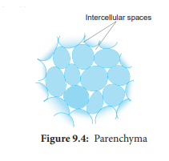
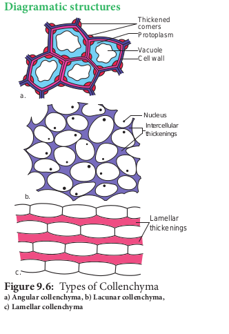
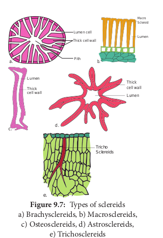
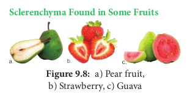
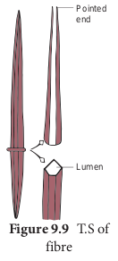
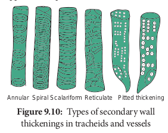

The Permanent tissues develop from apical meristem. They lose the power of cell division either permanently or temporarily. They are classified into two types:

1. Simple permanent tissues.
2. Complex permanent tissues.

**Simple Permanent Tissues**
Simple tissues are composed of one type of cells only. The cells are structurally and functionally similar. It is of three types.

1. Parenchyma
2. Collenchyma
3. Sclerenchyma

**Parenchyma (Gk: _Para_\-beside; _enehein_\- to pour)**

_Parenchyma_ is generally present in all organs of the plant. It forms the ground tissue in a plant. Parenchyma is a living tissue and made up of thin walled cells. The cell wall is made up of cellulose. Parenchyma cells may be oval, polyhedral, cylindrical, irregular, elongated or armed. The tissue normally has prominent intercellular spaces and may store various types of materials like, water, air, ergastic substances.

Occsionally Parenchyma cells which store resin, tannins, crystals of calcium carbonate, calcium oxalate are called idioblasts. Parenchyma is of different types and some of them are discussed as follows.

**Collenchyma (Gk. Colla-glue; enchyma – an infusion** Collenchyma is a simple, living mechanical tissue. Collenchyma generally occurs in hypodermis of dicot stem. It is absent in the roots and also occurs in petioles and pedicels. The cells are elongated and appear polygonal in cross section. The cell wall is unevenly thickened.It contains more of hemicellulose and pectin besides cellulose. It provides mechanical support and elasticity to the growing parts of the plant. Collenchyma consists of narrow cells. It has only a few small chloroplast or none. Tannin maybe present in collenchyma.Based on pattern of pectinisation of the cell wall, there are three types of collenchyma.

**Types of Collenchyma**

**1. Angular collenchyma** It is the most common type of collenchyma with irregular arrangement and thickening at the angles where cells meet. Example: Hypodermis of _Datura_ and _Nicotiana_

**2. Lacunar collenchyma** The collenchyma cells are irregularly arranged. Cell wall is thickened on the walls bordering intercellular spaces. Example: Hypodermis of _Ipomoea_

**3. Lamellar collenchyma** The collenchyma cells are arranged compactly in layers(rows). The Cell wall is thickened only at tangential wall. devoid of thickened at radial walls. These thickening appear as successsive tangential layers. Example: Hypodermis of Helianthus

**Diagramatic structures**

**Annular Collenchyma:** Duchaigne (1955) reported another type called Annular collenchyma in petiole of Nerium. The lumen is more or less circular in shape.

**Sclerenchyma (Gk. Sclerous- hard: enchyma-an infusion)**
The sclerenchyma is dead cell and lacks protoplasm. The cells are long or short, narrow thick walled and lignified secondary walls. The cell walls of these cells are uniformly and strongly thickened. sclerenchymatous cells are of two types:

1. Sclereids
2. Fibres

**Sclereids (Stone Cells)**
Sclereids are dead cells, usually these are isodiametric but some are elongated too. The cell wall is very thick due to lignification. Lumen is very much reduced. The pits may simple or branched. Sclereids are mechanical in function. They give hard texture to the seed coats, endosperms etc., Sclereids are classified into the following types.

**Sclerenchyma Found in Some Fruits**

**Fibres**
Fibres are very much elongated sclerenchyma cells with pointed tips. Fibres are dead cells and have lignified walls with narrow lumen. They have simple pits. They provide mechanical strength and protect them from the strong wind. It is also called supporting tissues. Fibres have a great commercial value in cottage and textile industries.

**Fibres are of five types**

1. **Wood Fibres or Xylary Fibres**
   These fibres are associated with the secondary xylem tissue. They are also called xylary fibres. These fibres are derived from the vascular cambium. These are of two types. a. Libriform fibres b. Fibre tracheids

2. **Bastfibres or Extra Xylary Fibres**
   These fibres are present in the phloem. Natural Bast fibres are strong and cellulosic. Fibres obtaining from the phloem or outer bark of jute, kenaf, flax and hemp plants. The so called pericyclic fibres are actually phloem fibres.

3. **Surface Fibres**
   These fibres are produced from the surface of the plant organs. Cotton and silk cotton are the examples.They occur in the testa of seeds.

4. **Mesocarp Fibres**
   Fibres obtained from the mesocarp of drupes like coconut.

5. **Leaf Fibres**
   Fibres obtained from the leaf of \_Musa, Agave and Sensciveria.

**Fibres in Our Daily Life**
Economically fibres may be grouped as follows

1. **Textile Fibres:** Fibres utilized for the manufacture of fabrics, netting and cordage etc.
   a. **Surface Fibres**: Example: Cotton.
   b. **Soft Fibres**: Example: Flax, Jute and Ramie
   c. **Hard fibres:** Example: Sisal, Coconut,Pineapple, Abaca _etc._

2. **Brush fibre:** Fibres utilized for the manufacture of brushes and brooms.

3. **Rough weaving fibres:** Fibres utilized in making baskets, chairs, mats etc.

4. **Paper making fibres:** Wood fibres utilized for paper making.

5. **Filling fibres:** Fibres used for stuffing cushions, mattresses, pillows, furniture etc. Example: _Bombax_ and Silk cotton.

**Complex Tissues**
A complex tissue is a tissue with several types of cells but all of them function together as a single unit. It is of two types – xylem and phloem.
**Xylem or Hadrome**
The xylem is the principal water conducting tissue in a vascular plant. The term xylem was introduced by **Nageli**(1858) and is derived from the Gk. _Xylos_ – wood. The xylem which is derived from Procambium is called **primary xylem** and the xylem which is derived from vascular cambium is called **secondary xylem**. Early formed primary xylem elements are called protoxylem, whereas the later formed primary xylem elements are called metaxylem.

Protoxylem lies towards the periphery and metaxylem that lies towards the centre is called **Exarch.** It is common in _roots._

Protoxylem lies towards the centre and meta xylem towards the periphery this condition is called **Endarch**. It is seen in _stems._

Protoxylem is located in the centre surrounded by the metaxylem is called **Centrarch**. In this type only one vascular strand is developed. Example: _Selaginella sp._

Protoxylem is located in the centre surrounded by the metaxylem is called **Mesarch**.In this type several vascular strands are developed. Example: _Ophioglossum sp._

**Xylem Consists of Four Types of Cells**

1. Tracheids

2. Vessels or Trachea

3. Xylem Parenchyma

4. Xylem Fibres

**Tracheids**
Tracheids are dead, lignified and elongated cells with tapering ends. Its lumen is broader than that of fibres. In cross section, the tracheids are polygonal.

There are different types of cell wall thickenings due to the deposition of secondary wall substances. They are annular (ring like), spiral (spring like), scalariform (ladder like) reticulate (net like) and pitted (uniformly thick except at pits). Tracheids are imperforated cells with bordered pits on their side walls. Only through this conduction takes place in Gymnosperms. They are arranged one above the other. Tracheids are chief water conducting elements in Gymnosperms and Pteridophytes. They also offer mechanical support to the plants.

**Vessels or Trachea**
Vessels are elongated tube like structure. They are dead cells formed from a row of vessel elements placed end to end. They are perforated at the end walls. Their lumen is wider than Tracheids. Due to the dissolution of entire cell wall, a single pore is formed at the perforation plate. It is called **simple perforation plate**, Example: _Mangifera_. If the perforation plate has many pores, it is called **multiple perforation plate**. Example _Liriodendron._

The secondary wall thickening of vessels are annular, spiral, scalariform, reticulate, or pitted as in tracheids, Vessels are chief water conducting elements in Angiosperms and absent in Pteridophytes and Gymnosperms. In G*netum* of Gymnosperm*,* vessels occur. The main function is conduction of water, minerals and also offers mechanical strength.

**Xylem Fibre**
The fibres of sclerenchyma associated with the xylem are known as xylem fibres. Xylem fibres are dead cells and have lignified walls with narrow lumen. They cannot conduct water but being stronger provide mechanical strength. They are present in both primary and secondary xylem. Xylem fibres are also called libriform fibres.

The fibres are abundantly found in many plants. They occur in patches, in continuous bands and sometimes singly among other cells. Between fibres and normal tracheids, there are many transitional forms which are neither typical fibres nor typical tracheids. The transitional types are designated as **fibre- tracheids**. The pits of fibre-tracheids are smaller than those of vessels and typical tracheids.

**Xylem Parernchyma**
The parenchyma cells associated with the xylem are known as xylem parenchyma. These are the only living cells in xylem tissue. The cell wall is thin and made up of cellulose. Parenchyma arranged longitudinally along the long axis is called **axial parenchyma**.

Ray parenchyma is arranged in radial rows. Secondary xylem consists of both axial and ray parenchyma, Parenchyma stores food materials and also helps in conduction of water.

**Phloem to leptome**
Phloem is the food conducting complex tissues of vascular plants. The term phloem was coined by **C. Nageli** (1858). The Phloem which is derived from procambium is called primary phloem and the phloem which is derived from vascular cambium is called secondary phloem. Early formed primary phloem elements are called **protophloem** whereas the later formed primary phloem elements are called **metaphloem**. Protophloem is short lived. It gets crushed by the developing metaphloem.

**Phloem Consists of Four Types of Cells**

1. Sieve elements

2. Companion cells

3. Phloem parenchyma

4. Phloem fibres

**Sieve Elements**
Sieve elements are the conducting elements of the phloem. They are of two types, namely sieve cells and sieve tubes.

**Sieve Cells**
These are primitive type of conducting elements found in Pteridophytes and Gymnosperms. Sieve cells have sieve areas on their lateral walls only. They are not associated with companion cells.

**Sieve Tubes** Sieve tubes are long tube like conducting elements in the phloem. These are formed from a series of cells called sieve tube elements. The sieve tube elements are arranged one above the other and form vertical sieve tube. The end wall contains a number of pores and it looks like a sieve. So it is called as sieve plate. The sieve elements show nacreous thickenings on their lateral walls. They may possess simple or compound sieve plates The function of sieve tubes are believed to be controlled by campanion cells.

In mature sieve tube, nucleus is absent. It contains a lining layer of cytoplasm. A special protein (P. Protein = Phloem Protein) called slime body is seen in it. In mature sieve tubes, the pores in the sieve plate are blocked by a substance called **callose** (callose plug). The conduction of food material takes place through cytoplasmic strands. Sieve tubes occur only in Angiosperms.

**Companion Cells**
The thin walled, elongated, specialized parenchyma cells, which are associated with the sieve elements, are called companion cells. These cells are living and they have cytoplasm and a prominent nucleus. They are connected to the sieve tubes through pits found in the lateral walls. Through these pits cytoplasmic connections are maintained between these elements. These cells are helpful in maintaining the pressure gradient in the sieve tubes. Usually the nuclei of the companion cells serve for the nuclei of sieve tubes as they lack them. The companion cells are present only in Angiosperms and absent in Gymnosperms and Pteridophytes. They assist the sieve tubes in the conduction of food materials.

**Phloem Parenchyma**
The parenchyma cells associated with the phloem are called phloem parenchyma. These are living cells. They store starch and fats. They also contain resins and tannins in some plants. Primary phloem consists of axial parenchyma and secondary phloem consists of both axial and ray parenchyma. They are present in Pteridophytes,Gymnosperms and Dicots.

**Phloem Fibres (or) Bast Fibres**
The fibres of sclerenchyma associated with phloem are called phloem fibres or bast fibres. They are narrow, vertically elongated cells with very thick walls and a small lumen. Among the four phloem elements, phloem fibres are the only dead tissue. These are the strengthening as well as supporting cells.

![![different types of tissues]](differenttypesoftissues.png)

**Difference Between Meristematic Tissue and Permanent Tissue**

|       Meristematic Tissue        |           Permanent Tissue           |
| :------------------------------: | :----------------------------------: |
|     Cells divide repeatedly      |            Do not divide             |
|    Cells are undifferentiated    |    Cells are fully differentiated    |
| Cells are small and Isodiametric | Cells are variable in shape and size |
| Intercellular spaces are absent  |   Intercellular spaces are present   |
|       Vacuoles are absent        |         Vacuoles are present         |
|       Cell walls are thin        |    Cell walls maybe thick or thin    |
| Inorganic inclusions are absent  |   Inorganic inclusions are present   |

**Difference Between Collenchyma and Sclerenchyma**

|              Collenchyma               |            Sclerenchyma            |
| :------------------------------------: | :--------------------------------: |
|              Living Cell.              |             Dead cell.             |
|          Contains Protoplas.           |       Do not have protoplas.       |
|       Cell walls are cellulosi.        |      Cell walls are lignifie.      |
| Thickening of cell wall is not unifor. | Thickening of cell wall is unifor. |
|       Keeps the plant body sof.        |  Keeps plant body stiff and har.   |
|      Sometimes it has chloroplast      |      Do not have chloroplast       |

**Difference between Fibre and Sclereids**

|               Fibre                |                       Sclereids                       |
| :--------------------------------: | :---------------------------------------------------: |
|             Long cell.             |                      Short cell.                      |
|   Narrow, Elongated pointed end.   |                Usually short and broa.                |
|         Occurs in bundle.          |        Occurs individually or in small group.         |
|        Commonly unbranche.         |                    Maybe branche.                     |
| Derived directly from meristematic | Develops from secondary sclerosis of parenchyma cells |

**Difference between Tracheids and Fibres**
| Tracheids | Fibres |
| :-------: | :----: |
| Not much elongate. | Very long cell. |
| Possess oblique end wall. | Possess tapering end wall. |
| Cell walls are not as thick as Fibre. | Cell wall are thick and lignifie. |
| Possess various types of thickening. | Possess only pitted thickening. |
| Responsible for the conduction and also mechanical support | Provide only mechanical support |

**Difference Between Sieve Cells and Sieve Tub**

|                             Sieve Cells                             |                                                     Sieve Tub                                                      |
| :-----------------------------------------------------------------: | :----------------------------------------------------------------------------------------------------------------: |
|                       Have no companion cell.                       |                                                Have companion cell.                                                |
|              The sieve areas do not form sieve plate.               |                                    The sieve areas are confined to sieve plate.                                    |
|             The sieve areas are not well differentiate.             |                                      The sieve areas are well differentiate.                                       |
| They are elongated cells and are quite long with tapering end walls | They consist of vertical cells placed one above the other forming long tubes connected at the walls by sieve pores |
|                 The sieve are smaller and numerou.                  |                                        The sieve pores are longer and fewe.                                        |
|               Found in Pteridophytes and Gymnosperms                |                                                Found in Angiosperms                                                |

