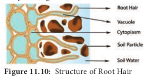

## 11.4 Absorption of Water

Terrestrial plants have to absorb water from the soil to maintain turgidity, metabolic activities and growth. Absorption of water from soil takes place in two steps:

1. From soil to root hairs – either actively or passively.

2. From root hairs further transport in the lateral direction to reach xylem, the superhighway of water transport.

### 11.4.1 Water Absorbing Organs

Usually, absorption of water occurs in plants through young roots. The zone of rapid water absorption is **root hairs**. They are delicate structures which get continuously replaced by new ones. Root hairs are unicellular extensions of epidermal cells without cuticle. Root hairs are extremely thin and numerous and they provide a large surface area for absorption (Figure 11.10).

### 11.4.2 Path of Water Across Root Cells

Water is first absorbed by root hair and other epidermal cells through imbibition from soil and moves radially and centripetally across the cortex, endodermis, pericycle and finally reaches xylem elements osmotically.

There are three possible routes of water (Figure 11.11). They are i) **Apoplast** ii) **Symplast** iii) **Transmembrane route**.

**1. Apoplast** The apoplast (Greek: apo = away; **_plast_** = cell) consists of everything external

to the plasma membrane of the living cell. The apoplast includes cell walls, extra cellular spaces and the interior of dead cells such as vessel elements and tracheids. In the apoplast pathway, water moves exclusively through the cell wall or the non-living part of the plant without crossing any membrane. The apoplast is a continuous system.

**2. Symplast** The symplast (Greek: sym = within; plast = cell) consists of the entire mass of cytosol of all the living cells in a plant, as well as the **plasmodesmata**, the cytoplasmic channel that interconnects them.

In the symplastic route, water has to cross plasma membrane to enter the cytoplasm of outer root cell; then it will move within adjoining cytoplasm through plasmodesmata around the vacuoles without the necessity to cross more membrane, till it reaches xylem.
**3. Transmembrane route** In transmembrane pathway water sequentially enters a cell on one side and exits from the cell on the other side. In this pathway, water crosses at least two membranes for each cell. Transport across the **tonoplast** is also involved.

### 11.4.3 Mechanism of Water Absorption

Kramer(1949) recognized two distinct mechanisms which independently operate in the absorption of water in plants. They are, i) active absorption ii) passive absorption.
**1\. Active Absorption**
The mechanism of water absorption due to forces generated in the root itself is called **active absorption**. Active absorption may be osmotic or non-osmotic.

**Concept Map Movement of water in an osmotic system based on various parameters**

**i. Osmotic active absorption** The theory of osmotic active absorption was postulated by **Atkins** (1916) and **Preistley** (1923). According to this theory, the first step in the absorption is soil water imbibed by cell wall of the root hair followed by osmosis. The soil water is hypotonic and cell sap is hypertonic. Therefore, soil water diffuses into root hair along the concentration gradient (endosmosis). When the root hair becomes fully turgid, it becomes hypotonic and water moves osmotically to the outer most cortical cell. In the same way, water enters into inner cortex, endodermis, pericycle and finally reaches protoxylem. As the sap reaches the protoxylem a pressure is developed known as root pressure. This theory involves the symplastic movement of water.

**Objections to osmotic theory**: 1.The cell sap concentration in xylem is not always high. 2. Root pressure is not universal in all plants especially in trees.

**ii. Non-Osmotic active absorption**
**Bennet-Clark** (1936), **Thimann** (1951) and Kramer (1959) observed absorption of water even if the concentration of cell sap in the root hair is lower than that of the soil water. Such a movement requires an expenditure of energy released by respiration (ATP). Thus, there is a link between water absorption and respiration. It is evident from the fact that when respiratory inhibitors like KCN, Chloroform are applied there is a decrease in the rate of respiration and also the rate of absorption of water.

**2. Passive Absorption**
In passive absorption, roots do not play any role in the absorption of water and is regulated by transpiration only. Due to transpiration, water is lost from leaf cells along with a drop in turgor pressure. It increases DPD in leaf cells and leads to withdrawal of water from adjacent xylem cells. In xylem, a tension is developed and is transmitted downward up to root resulting in the absorption of water from the soil.

In passive absorption (Table 11.3), the path of water may be symplastic or apoplastic. It accounts for about 98% of the total water uptake by plants.

**Table: 11.3 Differences between Active Absorption and Passive Absorption**

|                                         Active absorption                                         |                                                   Passive absorption                                                    |
| :-----------------------------------------------------------------------------------------------: | :---------------------------------------------------------------------------------------------------------------------: |
|               Active absorption takes place by the activity of root and root hairs                |                 The pressure for absorption is not developed in roots and hence roots play passive role                 |
|                         Transpiration has no effect on active absorption                          |                                          Absorption regulated by transpiration                                          |
| The root hairs have high DPD as compared to soil solution and therefore water is taken by tension | The absorption occurs due to tension created in xylem sap by transpiration pull, thus water is sucked in by the tension |
|                                     Respiratory energy needed                                     |                                             Respiratory energy not required                                             |
|                             It involves symplastic movement of water                              |                                  Both symplast and apoplast movement of water involved                                  |
