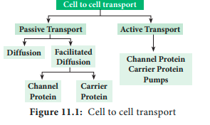

## 11.2 Cell to Cell Transport

Cell to cell or short distance transport covers the limited area and consists of few cells. They are the facilitators or tributaries to the long- distance transport. The driving force for the cell to cell transport can be passive or active (Figure 11.1). The following chart illustrate the various types of cell to cell transport

### 11.2.1 Passive Transport

**1. Diffusion**
When we expose a lightened incense stick or mosquito coil or open a perfume bottle in a closed room, we can smell the odour everywhere in the room. This is due to the even distribution of perfume molecules throughout the room. This process is called diffusion.

In **diffusion**, the movement of molecules is continuous and random in order in all directions (Figure 11.2).

_**Diffusion:** The net movement of molecules from a region of their higher concentration to a region of their lower concentration along a concentration gradient until an equilibrium is attained._

**Characteristics of diffusion**

**i.** It is a passive process, hence no energy expenditure involved.

**ii.** It is independent of the living system.

**iii.** Diffusion is obvious in gases and liquids.

**iv.** Diffusion is rapid over a shorter distance but extremely slow over a longer distance.

**v.** The rate of diffusion is determined by temperature, concentration gradient and relative density.

**Significance of diffusion in Plants**

**i.** Gaseous exchange of O2 and CO2 between the atmosphere and stomata of leaves takes place by the process of diffusion. O2 is absorbed during respiration and CO2 is absorbed during photosynthesis.

**ii.** In transpiration, water vapour from intercellular spaces diffuses into atmosphere through stomata by the process of diffusion.

**iii.** The transport of ions in mineral salts during passive absorption also takes place by this process.

**2. Facilitated Diffusion**
Cell membranes allow water and nonpolar molecules to permeate by simple diffusion. For transporting polar molecules such as ions, sugars, amino acids, nucleotides and many cell metabolites is not merely based on concentration gradient. It depends on,

**_i. Size of molecule:_** Smaller molecules diffuse faster.

**_ii. Solubility of the molecule_:** Lipid soluble substances easily and rapidly pass through the membrane. But water soluble substances are difficult to pass through the membrane. They must be facilitated to pass the membrane.

In facilitated diffusion, molecules cross the cell membrane with the help of special membrane proteins called transport proteins, without the expenditure of ATP.

There are two types of transport proteins present in the cell membrane. They are channel protein and a carrier protein.
**I. Channel Protein**
Channel protein forms a channel or tunnel in the cell membrane for the easy passage of molecules to enter the cell. The channels are either open or remain closed. They may open up for specific molecules. Some channel proteins create larger pores in the outer membrane. Examples: Porin and Aquaporin.

**i.Porin**
Porin is a large transporter protein found in the outer membrane of plastids, mitochondria and bacteria which facilitates smaller molecules to pass through the membrane.
**ii.Aquaporin**
Aquaporin is a water channel protein embedded in the plasma membrane. It regulates the massive amount of water transport across the membrane (Figure 11.3). Plants contain a variety of aquaporins. Over 30 types of aquaporins are known from maize. Currently, they are also recognized to transport substrates like glycerol, urea, CO2, NH3, metalloids, and **Reactive Oxygen Species** (ROS) in addition to water. They increase the permeability of the membrane to water. They confer drought and salt stress tolerance.

**II. Carrier Protein**
Carrier protein acts as a vehicle to carry molecules from outside of the membrane to inside the cell and vice versa (Figure 11.4). Due to association with molecules to be transported, the structure of carrier protein gets modified until the dissociation of the molecules.

There are 3 types of carrier proteins classified on the basis of handling of molecules and direction of transport (Figure 11.5). They are, i) **Uniport** ii) **Symport** iii) **Antiport.**

**_i. Uniport:_** In this molecule of a single type move across a membrane independent of other molecules in one direction.

**_ii. Symport or co-transport:_** The term **symport** is used to denote an integral membrane protein that simultaneously transports two types of molecules across the membrane in the same direction.

**_iii. Antiport or Counter Transport:_** An **antiport** is an integral membrane transport protein that simultaneously transports two different molecules, in opposite directions, across the membrane.

### 11.2.2 Active Transport

The main disadvantage of passive transport processes like diffusion is the lack of control over the transport of selective molecules. There is a possibility of harmful substances entering the cell by a concentration gradient in the diffusion process. But selective permeability of cell membrane has a great control over entry and exit of molecules. Active transport is the entry of molecules against a concentration gradient and an uphill process and it needs energy which comes from ATP. Passive transport uses kinetic energy of molecules moving down a gradient whereas, active transport uses cellular energy to move them against a gradient. The transport proteins discussed in facilitated diffusion can also transport ions or molecules against a concentration gradient with the expenditure of cellular energy as an active process. Pumps use a source of free energy such as ATP or light to drive the thermodynamically uphill transport of ions or molecules. The pump action is an example of active transport. Example: Na+-K+-ATPase pump (Table 11.1).

table 11.1 comparison of different transport mechanisms

| Property  | Passive transport  | Facilitated diffusion               | Active transport |
|---|---|---|---|
| Nature of process            | Physical           | Biological              | Biological  |
| Requirement                  | No                              | Yes                                 | Yes |
| for presence of membrane protein |
| Selectivity of               | No                              | Yes                                 | Yes |
| molecule |
| Saturation of                | No                              | Yes                                 | Yes |
| transport |
| Uphill transport             | No                               | No                                 | Yes |
| Energy                       | No                               | No                                 | Yes |
| requirement (ATP) |
| Sensitivity to               | No                              | Yes                                 | Yes |
| inhibitors |