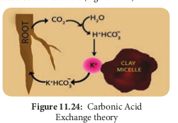
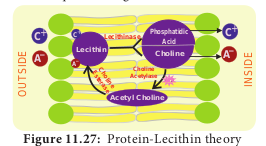

## 11.8 Mineral Absorption

Minerals in soil exist in two forms, either dissolved in soil solution or adsorbed by colloidal clay particle. Previously, it was mistakenly assumed that absorption of mineral salts from soil took place along with absorption of water. But absorption of minerals and ascent of sap are identified as two independent processes. Minerals are absorbed not only by root hairs but also by the cells of epiblema.

Plasma membrane of root cells are not permeable to all ions and also all ions of same salt are not absorbed in equal rate. Penetration and accumulation of ions into living cells or tissues from surrounding medium by crossing membrane is called **mineral absorption**. Movement of ions into and out of cells or tissues is termed as transport or **flux**. Entry of the ion into cell is called **influx** and exit is called **efflux**. Various theories have been put forward to explain this mechanism. They are categorized under passive mechanisms (without the involvement of metabolic energy) and active mechanisms (involvement of metabolic energy).

### 11.8.1 Passive Absorption

**1. Ion-Exchange:**
Ions of external soil solution were exchanged with same charged (anion for anion or cation for cation) ions of the root cells. There are two theories explaining this process of ion exchange namely: i. Contact exchange and ii. Carbonic acid exchange.

i. **Contact Exchange Theory:**

According to this theory, the ions adsorbed on the surface of root cells and clay particles (or clay micelles) are not held tightly but oscillate within a small volume of space called **oscillation volume**. Due to small space, both ions overlap each other’s oscillation volume and exchange takes place (Figure 11.23).

ii. **Carbonic Acid Exchange Theory:**
According to this theory, soil solution plays an important role by acting as a medium for ion exchange. The CO2 released during respiration of root cells combines with water to form carbonic acid (H2CO3). Carbonic acid dissociates into H+ and HCO3 – in the soil solution. These H+ ions exchange with cations adsorbed on clay particles and the cations from micelles get released into soil solution and gets adsorbed on root cells (Figure 11.24).

### Active Absorption

Absorption of ions against the concentration gradient with the expenditure of metabolic energy is called **active absorption**. In plants, the vacuolar sap shows accumulation of anions and cations against the concentration gradient which cannot be explained by theories of passive absorption. Mechanism of active absorption of salts can be explained through carrier concept.

**Carrier Concept:**
This concept was proposed by **Van den Honert** in 1937. The cell membrane is largely impermeable to free ions. However, the presence of **carrier molecules** in the membrane acts as a vehicle to pick up or bind with ions to form **carrier-ion-complex,** which moves across the membrane. On the inner surface of the membrane, this complex breaks apart releasing ions into cell while carrier goes back to the outer surface to pick up fresh ions (Figure 11.25).

**1. Lundegardh’s Cytochrome Pump Theory:**
**Lundegardh** and **Burstrom** (1933) observed a correlation between respiration and anion absorption. When a plant is transferred from water to a salt solution the rate of respiration increases which is called as **anion respiration** or **salt respiration**. Based on this observation **Lundegardh** (1950 and 1954) proposed cytochrome pump theory which is based on the following assumptions:

i. The mechanism of anion and cation absorption are different.

ii. Anions are absorbed through cytochrome chain by an active process, cations are absorbed passively.

iii. An oxygen gradient responsible for oxidation at the outer surface of the membrane and reduction at the inner surface. According to this theory, the enzyme _dehydrogenase_ on inner surface is responsible for the formation of protons (H+) and electrons (e–). As electrons pass outward through electron transport chain there is a corresponding inward passage of anions. Anions are picked up by oxidized cytochrome oxidase and are transferred to other members of chain as they transfer the electron to the next component (Figure 11.26).

The theory assumes that cations (C+)move passively along the electrical gradient created by the accumulation of anions (A–) at the inner surface of the membrane. Main defects of the above theory are:

(i) Cations also induce respiration.
(ii) Fails to explain the selective uptake of ions.
(iii) It explains absorption of anions only.

**2. Bennet-Clark’s Protein-Lecithin Theory:**
In 1956, **Bennet-Clark** proposed that the carrier could be a protein associated with **phosphatide called as lecithin. The carrier** is **amphoteric** (the ability to act either as an acid or a base) and hence both cations and anions combine with it to form **Lecithin- ion complex** in the membrane. Inside the membrane, Lecithin-ion complex is broken down into **phosphatidic acid** and **choline** along with the liberation of ions. Lecithin again gets regenerated from _phosphatidic acid_ and _choline_ in the presence of the enzyme _choline acetylase_ and _choline esterase_ (Figure 11.27). ATP is required for regeneration of lecithin.

### Donnan equilibrium

Within the cell, some of the ions never diffuse out through the membrane. They are trapped within the cell and are called fixed ions. But they must be balanced by the ions of opposite charge. Assuming that a concentration of fixed anions is present inside the membrane, more cations would be absorbed in addition to the normal exchange to maintain the equilibrium. Therefore, the cation concentration would be greater in the internal than in the external solution. This electrical balance or equilibrium controlled by electrical as well as diffusion phenomenon is known as the **Donnan equilibrium**.
