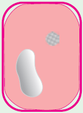
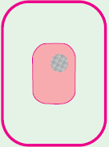
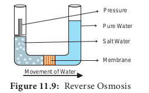

## 11.3 Plant Water Relations

Water plays an essential role in the life of the plant. The availability of water influences the external and internal structures of plants as protoplasm is made of 60-80% water. Water is a **universal solvent** since most of the substances get dissolved in it and the high tensile strength of water molecule is helpful in the ascent of sap. Water maintains the internal temperature of the plant as well as the turgidity of the cell.

### 11.3.1 Imbibition

Colloidal systems such as **gum, starch, proteins, cellulose, agar, gelatin** when placed in water, will absorb a large volume of water and swell up. These substances are called **imbibants** and the phenomenon is **imbibition**.

**Examples:** 1. The swelling of dry seeds 2. The swelling of wooden windows, tables, doors due to high humidity during the rainy season.

**Significance of imbibition**
**i.** During germination of seeds, imbibition increases the volume of seed enormously and leads to bursting of the seed coat.

**ii.** It helps in the absorption of water by roots at the initial level.

### 11.3.2 Water Potential (Ψ)

The concept of water potential was introduced in 1960 by **Slatyer** and **Taylor**. Water potential is potential energy of water in a system compared to pure water when both temperature and pressure are kept the same. It is also a measure of how freely water molecules can move in a particular environment or system. Water potential is denoted by the Greek symbol **Ψ** (psi) and measured in **Pascal** (Pa). At standard temperature, the water potential of pure water is **zero**. Addition of solute to pure water decreases the kinetic energy thereby decreasing the water potential. Comparatively a solution always has low water potential than pure water. In a group of cells with different water potential, a water potential gradient is generated. Water will move from higher water potential to lower water potential.

Water potential (**Ψ**) can be determined by,

1. Solute concentration or Solute potential(**ΨS**)
2. Pressure potential (**ΨP**)

By correlating two factors, water potential is written as,

**ΨW = ΨS + ΨP**

Water Potential = Solute potential + Pressure potential

**1. Solute Potential (ΨS)**
Solute potential, otherwise known as **osmotic potential denotes the effect of dissolved solute** on water potential. In pure water, the addition of solute reduces its free energy and lowers the water potential value from zero to negative. Thus the value of solute potential is always negative. In a solution at standard atmospheric pressure, water potential is always equal to solute potential (**ΨW= ΨS**).
**2. Pressure Potential (ΨP)**
Pressure potential is a mechanical force working against the effect of solute potential. Increased pressure potential will increase water potential and water enters cell and cells become **turgid** This positive hydrostatic pressure within the cell is called **Turgor pressure**. Likewise, withdrawal of water from the cell decreases the water potential and the cell becomes flaccid.
**3. Matric Potential (ΨM)**
Matric potential represents the attraction between water and the **hydrating colloid or gel-like organic molecules in the cell wall** which is collectively termed as **matric potential**. Matric potential is also known as **imbibition pressure**. The matric potential is maximum (most negative value) in a dry material. **Example**: The swelling of soaked seeds in water.

### 11.3.3 Osmotic Pressure and Osmotic Potential

When a solution and its solvent (pure water) are separated by a semipermeable membrane, a pressure is developed in the solution, due to the presence of dissolved solutes. This is called **osmotic pressure** (**OP**). Osmotic pressure is increased with the increase of dissolved solutes in the solution. More concentrated solution (low **Ψ** or Hypertonic) has high osmotic pressure. Similarly, less concentrated solution (high **Ψ** or Hypotonic) has low osmotic pressure. The osmotic pressure of pure water is always **zero** and it increases with the increase of solute concentration. Thus osmotic pressure always has a positive value and it is represented as π.

**Osmotic potential** is defined as the ratio between the number of solute particles and the number of solvent particles in a solution. Osmotic potential and osmotic pressure are numerically equal. Osmotic potential has a negative value whereas on the other hand osmotic pressure has a positive value.

### 11.3.4 Turgor Pressure and Wall Pressure

When a plant cell is placed in pure water (hypotonic solution) the diffusion of water into the cell takes place by endosmosis. It creates a positive hydrostatic pressure on the rigid cell wall by the cell membrane. Henceforth the pressure exerted by the cell membrane towards the cell wall is **Turgor Pressure (TP).**

The cell wall reacts to this turgor pressure with **equal and opposite force**, and the counter-pressure exerted by the cell wall towards cell membrane is **wall pressure (WP).**

Turgor pressure and wall pressure make the cell fully turgid.

**TP + WP = Turgid.**

### 11.3.5 Diffusion Pressure Deficit (DPD) or Suction Pressure (SP)

Pure solvent (hypotonic) has higher diffusion pressure. Addition of solute in pure solvent lowers its diffusion pressure. The difference between the diffusion pressure of the solution and its solvent at a particular temperature and atmospheric pressure is called as **Diffusion Pressure Deficit (DPD)** termed by **Meyer (1938**). DPD is increased by the addition of solute into a solvent system. Increased DPD favours endosmosis or it sucks the water from hypotonic solution; hence **Renner** (1935) called it as **Suction pressure**. It is equal to the difference of osmotic pressure and turgor pressure of a cell. The following three situations are seen in plants.

- **DPD in normal cell:** DPD = OP – TP.
- **DPD in fully turgid cell**: Osmotic pressure is always equal to turgor pressure in a fully turgid cell.
- OP = TP or OP-TP =0. Hence DPD of fully turgid cell is zero.
- **DPD in flaccid cell**: If the cell is in flaccid condition there is no turgor pressure or TP=0. Hence DPD = OP.

### 11.3.6 Osmosis

Osmosis (Latin: _Osmos_-impulse, urge) is a **special type of diffusion**. It represents the movement of **water or solvent molecules** through a selectively permeable membrane **from the place of its higher concentration(high water potential) to the place of its lower concentration (low water potential).**

Types of Solutions based on concentration

**_i. Hypertonic_** (_Hyper_ = High; _tonic_ = solute): This is a strong solution (low solvent/ high solute / low **Ψ**) which **attracts solvent** from other solutions.

**_ii. Hypotonic_** (_Hypo_ = low; _tonic_ = solute): This is a weak solution (high solvent /low or zero solute / high **Ψ**) and it **diffuses water** out to other solutions ( Figure 11.7).

**_iii. Isotonic_** (_Iso_ = identical; _tonic_ = soute): It refers to two solutions having same concentration. In this condition the net movement of water molecule will be zero. The term hyper, hypo and isotonic are **relative terms** which can be used only in comparison with another solution.

**1. Types of osmosis**
Based on the direction of movement of water or solvent in an osmotic system, two types of osmosis can occur, they are **_Endosmosis_** and **_Exosmosis_**.
**_i. Endosmosis_**: Endosmosis is defined as the osmotic entry of solvent into a cell or a system when it is placed in a pure water or hypotonic solution.

For example, dry raisins (high solute and low solvent) placed in the water, it swells up due to turgidity.

**_ii. Exosmosis_**: Exosmosis is defined as the osmotic withdrawal of water from a cell or system when it is placed in a hypertonic solution. Exosmosis in a plant cell leads to **plasmolysis**.

**2. Plasmolysis (_Plasma_ = cytoplasm; _lysis_ = breakdown)**

When a plant cell is kept in a hypertonic solution, water leaves the cell due to **exosmosis**. As a result of water loss, protoplasm shrinks and the cell membrane is pulled away from the cell wall and finally, the cell becomes flaccid. This process is named as plasmolysis.

Wilting of plants noticed under the condition of water scarcity is an indication of plasmolysis. Three types of plasmolysis occur in plants: i) **_Incipient plasmolysis ii) Evident plasmolysis_ and _iii) Final plasmolysis_**. Differences among them are given in table 11.2.

**Significance**
Plasmolysis is exhibited only by living cells and so it is used to test whether the cell is living or dead.

**3. Deplasmolysis** The effect of plasmolysis can be reversed, by transferring them back into water or **hypotonic solution**. Due to endosmosis, the cell becomes turgid again. It regains its original shape and size. This phenomenon of the revival of the plasmolysed cell is called **deplasmolysis**. Example: Immersion of dry raisin in water.

**4. Reverse Osmosis**
Reverse Osmosis follows the same principles of osmosis, but in the reverse direction. In this process movement of water is reversed by applying pressure to force the water against a concentration gradient of the solution. In regular osmosis, the water molecules move from the higher concentration (pure water = hypotonic) to lower concentration (salt water = hypertonic). But in reverse osmosis, the water molecules move from the lower concentration (salt water = hypertonic) to higher concentration (pure water = hypotonic) through a selectively permeable membrane (Figure 11.9).

**Table 11.2: Difference between plasmolysis types.**
| Incipient plasmolysis | Evident plasmolysis | Final plasmolysis |
| :-----------: | :---------: | :----------: |
| No morphological symptoms appear in plants. | Wilting of leaves appear. | Severe wilting and drooping of leaves appear. |
| The plasma membrane separates only at the corner from the cell wall of cells. | Plasma membrane completely detaches from the cell wall. | Plasma membrane completely detaches from cell wall with maximum shrinkage of volume. |
| It is reversible. | It is reversible. | It is irreversible. |
|  |  |  |

**Uses:** Reverse osmosis is used for purification of drinking water and desalination of sea water.

