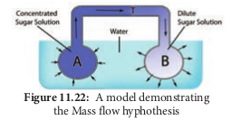

## 11.7 Translocation of Organic Solutes

Leaves synthesize food material through photosynthesis and store in the form of starch grains. When required the starch is converted into simple sugars. They must be transported to various parts of the plant system for further utilization. However, the site of food production (leaves) and site of utilization are separated far apart. Hence, the organic food has to be transported to these areas.

The phenomenon of food transportation from the site of synthesis to the site of utilization is known as **translocation of organic solutes**. The term **solute** denotes food material that moves in a solution.

### 11.7.1 Path of Translocation

It has now been well established that phloem is the path of translocation of solutes. Ringing or girdling experiment will clearly demonstrate the translocation of solute by phloem.

### Ringing or girdling experiment

The experiment involves the removal of all the tissue outside to vascular cambium (bark, cortex, and phloem) in woody stems except xylem. Xylem is the only remaining tissue in the girdled area which connects upper and lower part of the plant. This setup is placed in a beaker of water. After some time, it is observed that a swelling on the upper part of the ring appears as a result of the accumulation of food material (Figure 11.20). If the experiment continues within days, the roots die first. It is because, the supply of food material to the root is cut down by the removal of phloem. The roots cannot synthesize their food and so they die first. As the roots gradually die the upper part (stem), which depends on root for the ascent of sap, will ultimately die.

### 11.7.3 Direction of Translocation

Phloem translocates the products of photosynthesis from leaves to the area of growth and storage, in the following directions,

**_Downward direction:_** From leaves to stem and roots.

**_Upward direction:_** From leaves to developing buds, flowers, fruits for consumption and storage. Germination of seeds is also a good example of upward translocation.

**_Radial direction:_** From cells of pith to cortex and epidermis, the food materials are radially translocated.

### 11.7.4 Source and Sink

Source is defined as any organ in plants which are capable of exporting food materials to the areas of metabolism or to the areas of storage. Examples: Mature leaves, germinating seeds.

**Sink** is defined as any organ in plants which receives food from source.Example: Roots, tubers, developing fruits and immature leaves (Figure 11.21).

### 11.7.5 Phloem Loading

The movement of **_photosynthates_** (products of photosynthesis) from mesophyll cells to phloem sieve elements of mature leaves is known as **phloem loading**. It consists of three steps.

i. Sieve tube conducts **sucrose** only. But the _photosynthate_ in chloroplast mostly in the form of starch or triose-phosphate which has to be transported to the cytoplasm where it will be converted into sucrose for further translocation.

ii. Sucrose moves from mesophyll to nearby sieve elements by short distance transport.

iii. From sieve tube to sink by long-distance transport.

### 11.7.6 Phloem Unloading

From sieve elements sucrose is translocated into sink organs such as roots, tubers, flowers and fruits and this process is termed as **phloem unloading**. It consists of three steps:
**1. _Sieve element unloading:_** Sucrose leave from sieve elements.
**_2. Short distance transport:_**: Movement of sucrose to sink cells.
**_3. Storage and metabolism_**: The final step when sugars are stored or metabolized in sink cells.

### 11.7.7 Mechanism of Translocation

Several hypotheses have been proposed to explain the mechanism of translocation. Some of them are given below:
**1. Diffusion hypothesis** As in diffusion process, this theory states the translocation of food from higher concentration (from the place of synthesis) to lower concentration (to the place of utilization) by the simple physical process.

However, the theory was rejected because the speed of translocation is much higher than simple diffusion and translocation is a biological process which any poison can halt.
**2. Activated diffusion theory** This theory was first proposed by Mason and **Maskell** (1936). According to this theory, the diffusion in sieve tube is accelerated either by activating the diffusing molecules or by reducing the protoplasmic resistance to their diffusion.
**3. Electro-Osmotic theory** The theory of electro osmosis was proposed by **Fenson** (1957) and **Spanner** (1958). According to this, an electric-potential across the sieve plate causes the movement of water along with solutes. This theory fails to explain several problems concerning translocation.
**4. Munch Mass Flow hypothesis** Mass flow theory was first proposed by **Munch (1930) and elaborated by Crafts** (1938). According to this hypothesis, organic substances or solutes move from the region of high osmotic pressure (from mesophyll) to the region of low osmotic pressure along the turgor pressure gradient. The principle involved in this hypothesis can be explained by a simple physical system as shown in figure 11.22.

Two chambers “A” and “B” made up of semipermeable membranes are connected by tube “T” immersed in a reservoir of water. Chamber “A” contains highly concentrated sugar solution while chamber “B” contains dilute sugar solution. The following changes were observed in the system,

i. The high concentration sugar solution of chamber “A” is in a hypertonic state which draws water from the reservoir by endosmosis.

ii. Due to the continuous entry of water into chamber “A”, turgor pressure is increased.

iii. Increase in turgor pressure in chamber “A” force, the mass flow of sugar solution to chamber “B” through the tube “T” along turgor pressure gradient.

iv. The movement of solute will continue till the solution in both the chambers attains the state of isotonic condition and the system becomes inactive.

v. However, if new sugar solution is added in chamber “A”, the system will start to run again.

A similar analogous system as given in the experiment exists in plants:

Chamber “A” is analogous to mesophyll cells of the leaves which contain a higher concentration of food material in soluble form. In short “A” is the production point called “**source**”.

Chamber “B” is analogous to cells of stem and roots where the food material is utilized. In short “B” is consumption end called “**sink**”. Tube “T” is analogous to the sieve tube of phloem.

Mesophyll cells draw water from the xylem (reservoir of the experiment) of the leaf by endosmosis leading to increase in the turgor pressure of mesophyll cell. The turgor pressure in the cells of stem and the roots are comparatively low and hence, the soluble organic solutes begin to flow _en masse_ from mesophyll through the phloem to the cells of stem and roots along the gradient turgor pressure.

In the cells of stem and roots, the organic solutes are either consumed or converted into insoluble form and the excess water is released into xylem (by turgor pressure gradient) through cambium.

**Merits:**
i. When a woody or herbaceous plant is girdled, the sap contains high sugar containing exudates from cut end.

ii. Positive concentration gradient disappears when plants are defoliated.

**Objections:**
i. This hypothesis explains the unidirectional movement of solute only. However, bidirectional movement of solute is commonly observed in plants.

ii. Osmotic pressure of mesophyll cells and that of root hair do not confirm the requirements.

iii. This theory gives passive role to sieve tube and protoplasm, while some workers demonstrated the involvement of ATP.
