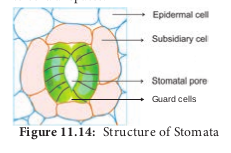
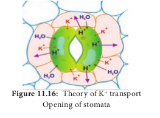
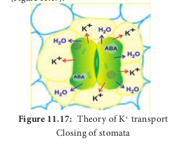
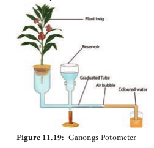

## 11.6 Transpiration

Water absorbed by roots ultimately reaches the leaf and gets released into the atmosphere in the form of vapour. Only a small fraction of water (less than 5%) is utilized in plant development and metabolic process.

The loss of excess of water in the form of vapour from various aerial parts of the plant is called **transpiration**. Transpiration is a kind of evaporation but differs by the involvement of biological system. The amount of water transpired is astounding (Table 11.4). The water may move through the xylem at a rate as fast as 75cm /min.

**Table: 11.4 Rate of Transpiration in some plants**

|     Plant      | Transpiration per day |
| :------------: | :-------------------: |
| **Corn plant** |       2 Litres        |
| **Sunflower**  |       5 Litres        |
| **Maple tree** |      200 Litres       |
| **Date palm**  |      450 Litres       |

### 11.6.1 Types of Transpiration

Transpiration is of following three types:

**1. Stomatal transpiration**
Stomata are microscopic structures present in high number on the lower epidermis of leaves. This is the most dominant form of transpiration and being responsible for most of the water loss (90 - 95%) in plants.
**2. Lenticular transpiration**
In stems of woody plants and trees, the epidermis is replaced by periderm because of secondary growth. In order to provide gaseous exchange between the living cells and outer atmosphere, some pores which looks like lens-shaped raised spots are present on the surface of the stem called Lenticels. The loss of water from lenticels is very insignificant as it amounts to only 0.1% of the total.
**3. Cuticular transpiration**
The cuticle is a waxy or resinous layer of cutin, a fatty substance covering the epidermis of leaves and other plant parts. Loss of water through cuticle is relatively small and it is only about 5 to 10 % of the total transpiration. The thickness of cuticle increases in xerophytes and transpiration is very much reduced or totally absent.

### 11.6.2 Structure of Stomata

The epidermis of leaves and green stems possess many small pores called **stomata**. The length and breadth of stomata is about 10-40µ and 3-10µ respectively. Mature leaves contain between 50 and 500 stomata per square mm. Stomata are made up of two **guard cells**, special semi-lunar or kidney- shaped living epidermal cells in the epidermis. Guard cells are attached to surrounding epidermal cells known as **subsidiary cell**s or **accessory cells**. The guard cells are joined together at each end but they are free to separate to form a pore between them. The inner wall of the guard cell is thicker than the outer wall (Figure 11.14). The stoma opens to the interior into a cavity called **sub-stomatal cavity** which remains connected with the intercellular spaces.

### 11.6.3 Mechanism of Stomatal Movement

Stomatal movements are regulated by the change of turgor pressure in guard cells. When water enters the guard cell, it swells and its unevenly thickened walls stretch up resulting in the opening of stomata. This is due to concave non-elastic nature of inner wall pulled away from each other and stretching of the convex elastic natured outer wall of guard cell.

Different theories have been proposed regarding opening and closing of stomata. The important theories of stomatal movement are as follows,

1. _Theory of Photosynthesis in guard cells_
2. _Starch – Sugar interconversion theory_
3. _Active potassium transport ion concept_

**1. Theory of Photosynthesis in guard cells Von Mohl**(1856) observed that stomata open in light and close in the night. According to him, chloroplasts present in the guard cells photosynthesize in the presence of light resulting in the production of carbohydrate (Sugar) which increases osmotic pressure in guard cells. It leads to the entry of water from other cell and stomatal aperture opens. The above process vice versa in night leads to closure of stomata.

**Demerits**

1. Chloroplast of guard cells is poorly developed and incapable of performing photosynthesis.

2. The guard cells already possess much amount of stored sugars.

**2. Starch – Sugar Interconversion theory**
i. According to **Lloyd** (1908), turgidity of guard cell depends on interconversion, of starch and sugar. It was supported by **Loftfield (1921) as he found guard cells** containing sugar during the daytime when they are open and starch during the night when they are closed.

ii. **Sayre** (1920) observed that the opening and closing of stomata depends upon change in pH of guard cells. According to him stomata open at high pH during day time and become closed at low pH at night. Utilization of CO2 by photosynthesis during light period causes an increase in pH resulting in the conversion of starch to sugar. Sugar increase in cell favours endosmosis and increases the turgor pressure which leads to opening of stomata. Likewise, accumulation of CO2 in cells during night decrease the pH level resulting in the conversion of sugar to starch. Starch decreases the turgor pressure of guard cell and stomata close.

iii. The discovery of enzyme **phosphorylase** in guard cells by **Hanes** (1940) greatly supports the starch-sugar interconversion theory. The enzyme _phosphorylase_ hydrolyses starch into sugar and high pH followed by endosmosis and the opening of stomata during light. The _vice versa_ takes place during the night.

iv. **Steward** (1964) proposed a slightly modified scheme of starch-sugar interconversion theory. According to him, Glucose-1-phosphate is osmotically inactive. Removal of phosphate from Glucose-1-phosphate converts to Glucose which is osmotically active and increases the concentration of guard cell leading to opening of stomata (Figure 11.15).

**Objections to Starch-sugar interconversion theory**

i. In monocots, guard cell does not have starch.

ii. There is no evidence to show the presence of sugar at a time when starch disappears and stomata open.

iii. It fails to explain the drastic change in pH from 5 to 7 by change of CO2.

**3. Theory of K+ transport** This theory was proposed by **Levit** (1974) and elaborated by **Raschke** (1975). According to this theory, the following steps are involved in the stomatal opening:

**In light**
i. In guard cell, starch is converted into organic acid (malic acid).

ii. Malic acid in guard cell dissociates to malate anion and proton (H+).

iii. Protons are transported through the membrane into nearby subsidiary cells with the exchange of K+ (Potassium ions) from subsidiary cells to guard cells. This process involves an electrical gradient and is called **ion exchange**.

iv. This ion exchange is an active process and consumes ATP for energy.

v. Increased K+ ions in the guard cell are balanced by Cl– ions. Increase in solute concentration decreases the water potential in the guard cell.

vi. Guard cell becomes hypertonic and favours the entry of water from surrounding cells.

vii. Increased turgor pressure due to the entry of water opens the stomatal pore (Figure 11.16).

**In Dark**

i. In dark, photosynthesis stops and respiration continues with accumulation of CO2 in the sub-stomatal cavity.

ii. Accumulation of CO2 in cell lowers the pH level.

iii. Low pH and a shortage of water in the guard cell activate the stress hormone **Abscisic acid** (ABA).

iv. ABA stops further entry of K+ ions and also induce K+ ions to leak out to subsidiary cells from guard cell.

v. Loss of water from guard cell reduces turgor pressure and causes closure of stomata (Figure 11.17).

### 11.6.4 Factors Affecting Rate of Transpiration

The factors affecting the rate of transpiration can be categorized into two groups. They are 1. External or Environmental factors and 2. Internal or plant factors.

**1. External or Environmental factors**
**i. Atmospheric humidity:** The rate of transpiration is greatly reduced when the atmosphere is very humid. As the air becomes dry, the rate of transpiration is also increased proportionately.

**ii. Temperature:** With the increase in atmospheric temperature, the rate of transpiration also increases. However, at very high-temperatures stomata closes because of flaccidity and transpiration stop.

**iii. Light:** Light intensity increases the temperature. As in temperature, transpiration is increased in high light intensity and is decreased in low light intensity. Light also increases the permeability of the cell membrane, making it easy for water molecules to move out of the cell.

**iv. Wind velocity:** In still air, the surface above the stomata get saturated with water vapours and there is no need for more water vapour to come out. If the wind is breezy, water vapour gets carried away near leaf surface and DPD is created to draw more vapour from the leaf cells enhancing transpiration. However, high wind velocity creates an extreme increase in water loss and leads to a reduced rate of transpiration and stomata remain closed.

**v. Atmospheric pressure:** In low atmospheric pressure, the rate of transpiration increases. Hills favour high transpiration rate due to low atmospheric pressure. However, it is neutralized by low temperature prevailing in the hills.

**vi. Water:** Adequate amount of water in the soil is a pre-requisite for optimum plant growth. Excessive loss of water through transpiration leads to wilting. In general, there are three types of wilting as follows,

**_a. Incipient wilting:_** Water content of plant cell decreases but the symptoms are not visible.

**_b. Temporary wilting:_** On hot summer days, the freshness of herbaceous plants reduces turgor pressure at the day time and regains it at night.

**_c. Permanent wilting:_** The absorption of water virtually ceases because the plant cell does not get water from any source and the plant cell passes into a state of permanent wilting.

**2. Internal factors**
**i. Leaf area:** If the leaf area is more, transpiration is faster and so xerophytes reduce their leaf size.

**ii. Leaf structure:** Some anatomical features of leaves like sunken stomata, the presence of hairs, cuticle, the presence of hydrophilic substances like gum, mucilage help to reduce the rate of transpiration. In xerophytes the structural modifications are remarkable. To avoid transpiration, as in **_Opuntia_** the stem is flattened to look like leaves called **Phylloclade**. **Cladode** or **cladophyll** in **_Asparagus_** is a modified stem capable of limited growth looking like leaves. In some plants, the petioles are flattened and widened, to become **phyllodes** example **_Acacia melanoxylon._**

### 11.6.5 Plant Antitranspirants

The term **antitranspirant** is used to designate any material applied to plants for the purpose of retarding transpiration. An ideal antitranspirant checks the transpiration process without disturbing the process of gaseous exchange. Plant antitranspirants are two types:
**1. To act as a physical barrier above the stomata**
**Colourless plastics, Silicone oil** and **low viscosity waxes** are sprayed on leaves forming a thin film to act as a physical barrier (for transpiration) for water but permeable to CO2 and O2. The success rate of a physical barrier is limited.

**2. Induction of Stomata closure**
**Carbon-di-oxide** induces stomatal closure and acts as a natural antitranspirant. Further, the advantage of using CO2 as an antitranspirant is its inhibition of photorespiration. **Phenyl Mercuric Acetate** (PMA), when applied as a foliar spray to plants, induces partial stomatal closure for two weeks or more without any toxic effect. Use of **abscisic acid** highly induces the closing of stomata. **Dodecenyl succinic acid** also effects on stomatal closure.

_Uses:_.

- Antitranspirants reduce the enormous loss of water by transpiration in crop plants.

- Useful for seedling transplantations in nurseries. ### Guttation

During high humidity in the atmosphere, the rate of transpiration is much reduced. When plants absorb water in such a condition root pressure is developed due to excess water within the plant. Thus excess water exudates as liquid from the edges of the leaves and is called **guttation**. Example: Grasses, tomato, potato, brinjal and _Alocasia._ Guttation occurs through stomata like pores called **hydathodes** generally present in plants that grow in moist and shady places. Pores are present over a mass of loosely arranged cells with large intercellular spaces called **epithem** (Figure 11.18). This mass of tissue lies near vein endings (xylem and Phloem). The liquid coming out of hydathode is not pure water but a solution containing a number of dissolved substances.

### 11.6.7 Measurement of Transpiration

**1. Ganongs potometer**
Ganongs potometer is used to measure the rate of transpiration indirectly. In this, the amount of water absorbed is measured and assumed that this amount is equal to the amount of water transpired.

Apparatus consists of a horizontal graduated tube which is bent in opposite directions at the ends. One bent end is wide and the other is narrow. A reservoir is fixed to the horizontal tube near the wider end. The reservoir has a stopcock to regulate water flow. The apparatus is filled with water from reservoir. A twig or a small plant is fixed to the wider arm through a split cock. The other bent end of the horizontal tube is dipped into a beaker containing coloured water. An air bubble is introduced into the graduated tube at the narrow end (Figure 11.19). keep this apparatus in bright sunlight and observe.As transpiration takes place, the air bubble will move towards the twig. The loss is compensated by water absorption through the xylem portion of the twig. Thus, the rate of water absorption is equal to the rate of transpiration.

**2. Cobalt chloride (CoCl2) paper method**
Select a healthy dorsiventral leaf and clean its upper and lower surface with dry cotton. Now place a dry Cobalt chloride (**CoCl2**) strips on both surface and immediately cover the paper with glass slides and immobilize them. It will be observed after some time that the CoCl2 strip of lower epidermis turns pink. This indicates that CoCl2 becomes hydrated (CoCl2.2H2O or CoCl2.4H2O) due to water vapours coming out through stomata. The rate of transpiration is more on the lower surface than in the upper surface of the dorsiventral leaf.

### 11.6.8 Significance of transpiration

Transpiration leads to loss of water, as stated earlier in this lesson 95% of absorbed water is lost in transpiration. It seems to be an evil process to plants. However, number of process like absorption of water, ascent of sap and mineral absorption directly rely on the transpiration. Moreover plants withstand against scorching sunlight due to transpiration. Hence the transpiration is a “**necessary evil**” as stated by **Curtis**.
