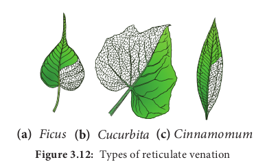
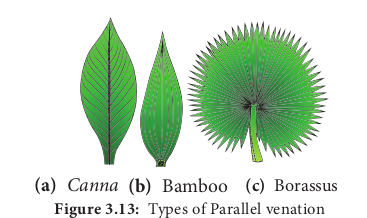
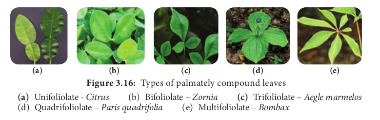

# Leaf

Leaves are green, thin flattened lateral outgrowths of the stem. Leaves are the primary photosynthetic organs and the main site of transpiration. All the leaves of a plant together are referred to as **phyllome**.

**I. Characteristics of leaf**

1. Leaf is a lateral appendage of the stem.
2. It is borne at the node of the stem.
3. It is exogenous in origin.
4. It has limited growth.
5. It does not posses apical bud.
6. It has three main parts namely, leaf base,petiole and lamina.
7. Lamina of the leaf is traversed by vascular strands, called **veins.**

**II. Functions of the leaf**
**Primary functions**

1. Photosynthesis
2. Transpiration
3. Gaseous exchange
4. Protection of buds
5. Conduction of water and dissolved solutes.

**Secondary functions**

1. Storage – Example: _Aloe, Agave_.
2. Protection – Example: _Opuntia, Argemone_ _mexicana_.
3. Support – Example: _Gloriosa, Nepenthes._
4. Reproduction - Example:_Bryophyllum,_ _Begonia, Zamia._

## Parts of the leaf

Three main parts of a typical leaf are:

i. Leaf base (Hypopodium)
ii. Petiole (Mesopodium)
iii. Lamina (Epipodium)

**I. Leaf base (hypopodium)**

The part of the leaf attached to the node of the stem is called **leaf base.** Usually it protects the growing buds at its axil. **Pulvinus:** In legumes leaf base become broad and swollen which is known as **pulvinus.** Example: _Clitoria, Lablab, Cassia, Butea_. **Sheathing leafbase: In many monocot families** such as Arecaceae, Musaceae, Zingiberaceae and Poaceae the leafbase extends into a sheath and clasps part or whole of the internode. Such leafbase also leave permanent scars on the stem when they fall.

**II. Petiole (stipe or mesopodium)** It is the bridge between lamina and stem. Petiole or leaf stalk is a cylindrical or sub cylindrical or flattened structure of a leaf which joins the lamina with the stem. A leaf with petiole are said to be **petiolate.** Example: _Ficus, Hibiscus._ Leaves that do not possess petiole is said to be **sessile**. Example*: Calotropis.*

**Figure 3.11: (a)** Parts of the leaf **(b)** Pulvinus leaf base **(c)** Sheathing leaf base

**III. Lamina (Leaf blade)** The expanded flat green portion of the leaf is the blade or lamina. It is the seat of photosynthesis,gaseous exchange, transpiration and most of the metabolic reactions of the plant. The lamina is traversed by the midrib from which arise numerous lateral veins and thin veinlets. The lamina shows great variations in its shape, margin, surface, texture, colour, venation and incision.

**Stipules**

In most of the dicotyledonous plants, the leaf base bears one or two lateral appendages called the **stipules**. Leaves with stipules are called **stipulate**. The leaves without stipules are called **exstipulate or estipulate**. The stipules are commonly found in dicotyledons. In some grasses (Monocots) an additional out growth is present between leaf base and lamina. It is called **Ligule.** Sometimes, small stipule like outgrowths are found at the base of leaflets of a compound leaf. They are called **stipels.** The main function of the stipule is to protect the leaf in the bud condition.

## Venation

The arrangement of veins and veinlets on the leaf blade or lamina is called **venation.** Internally, the vein contains vascular tissues. Conventionally venation is classified into two types namely, Reticulate venation and Parallel venation.

**I. Reticulate venation** 
In this type of venation leaf contain a prominent midrib from which several secondary veins arise that branch and anastomose like a network. This type of venation is common in all dicot leaves. It is of two types.

1. **Pinnately reticulate venation (unicostate):**

In this type of venation there is only one midrib in the centre which forms many lateral branches to form a network. Example: _Mangifera indica._

2. **Palmately reticulate venation (multicostate):** In this type of venation there are two or more principal veins arising from a single point and they proceed outwards or upwards. The two types of palmate reticulate venation are

**(a)** Pinnately reticulate 
**(b)** Palmately reticulate (Divergent) 
**(c)** Palmately reticulate (Convergent)

i. **Divergent type:** When all principal veins originate from the base and diverge from one another towards the margin of the leaf as in _Carica papaya_.

ii. **Convergent:** When the veins converge to the apex of the leaf, as in Indian plum (_Zizyphus_), bay leaf (_Cinnamomum_).

**II. Parallel venation** Veins run parallel and do not form a prominent reticulum. It is a characteristic feature of monocot leaves. It is classified into two sub types.

**1. Pinnately Parallel Venation (Unicostate)** When there is a prominent midrib in the center, from which arise many veins perpendicularly and run parallel to each other. Example: _Musa_, Zinger.

**2. Palmate Parallel Venation (Multicostate)** In this type several veins arise from the tip of the petiole and they all run parallel to each other and unite at the apex. It is of two sub types.

**i.Divergent type:** All principal veins originate from the base and diverge towards the margin, the margin of the leaf as in fan palm (_Borassus flabelliformis_)

**ii.Convergent type:** All principal veins run parallel to each other from the base of the lamina and join at the apex as in Bamboos, rice, water hyacinth.

## Phyllotaxy

The mode of arrangement of leaves on the stem is known as **phyllotaxy (Gk. Phyllon** \= **leaf ; taxis** \= **arrangement**)**.** Phyllotaxy is to avoid over crowding of leaves and expose the leaves maximum to the sunlight for photosynthesis. The four main types of phyllotaxy are (1) Alternate (2) Opposite (3) Ternate (4) Whorled.

**1. Alternate phyllotaxy**

In this type there is only one leaf per node and the leaves on the successive nodes are arranged alternate to each other. Spiral arrangement of leaves show vertical rows are called **orthostichies**. They are of two types.
a) **Alternate spiral:** In which the leaves are arranged alternatively in a spiral manner. Example: _Hibiscus, Ficus_.
b) **Alternate distichous** or **Bifarious**: In which the leaves are organized alternatively in two rows on either side of the stem. Example: _Monoon longifolium_ (_Polyalthia longifolia_).

**2. Opposite phyllotaxy** In this type each node possess two leaves opposite to each other. They are organized in two different types.

i. **Opposite superposed:** The pair of leaves arranged in succession are in the same direction, that is two opposite leaves at a node lie exactly above those at the lower node. Example: _Psidium_ (Guava), _Quisqualis_ (Rangoon creeper).

ii. **Opposite decussate:** In this type of phyllotaxy one pair of leaves is placed at right angles to the next upper or lower pair of leaves. Example: _Calotropis_, _Ocimum_

**3. Ternate phyllotaxy**

In this type there are three leaves attached at each node. Example: _Nerium_

**4. Whorled (verticillate) type of phyllotaxy**

In this type more than three leaves are present in a whorl at each node forming a circle or whorl. Example: _Allamanda_.

## Leaf mosaic

In leaf mosaic leaves tend to fit in with one another and adjust themselves in such a way that they may secure the maximum amount of sunlight with minimum amount of overlapping. The lower leaves have longer petioles and successive upper leaves possess shorter petioles. Example: _Acalypha._

## Leaf type

The pattern of division of a leaf into discrete components or segments is termed leaf type. Based on the number of segments 

**I. Simple leaf** A leaf is said to be simple when the petiole bears a single lamina; lamina may be entire(undivided) Example: Mango or incised to any depth but not upto the midrib or petiole. Example: _Cucurbita_.

**II. Compound leaf** 
Compound leaf is one in which the main rachis bears more than one lamina surface, called **leaflets.** Compound leaves have evolved to increase total lamina surface. There is one axillary bud in the axil of the whole compound leaf. The leaflets however, do not possess axillary buds.
**1. Pinnately compound leaf** A pinnately compound leaf is defined as one in which the rachis, bears laterally a number of leaflets, arranged alternately or in an opposite manner, as in Tamarindus, _Cassia._

i. **Unipinnate:** The rachis is simple and unbranched which bears leaflets directly on its sides in alternate or opposite manner. Example: _Rose_, _Neem_. Unipinnate leaves are of two types.

a. when the leaflets are even in number, the leaf is said to be **paripinnate**. Example: _Tamarindus_.

b. when the leaflets are odd in number, the leaf is said to be **imparipinnate.** Example: _Azadirachta_ (Neem).

ii. **Bipinnate:** The primary rachis produces secondary rachii which bear the leaflets. The secondary rachii are known as **pinnae.** Number of pinnae varies depending on the species. Example: _Delonix_.

iii. **Tripinnate:** When the rachis branches thrice the leaf is called **tripinnate.** (i.e) the secondary rachii produce the tertiary rachii which bear the leaflets. Example: _Moringa_.

iv. **Decompound:** When the rachis of leaf is branched several times it is called **decompound.** Example: _Daucus carota, Coriandrum sativum._

**2. Palmately compound leaf**

A palmately compound leaf is defined as one in which the petiole bears terminally, one or more leaflets which seem to be radiating from a common point like fingers from the palm.

i. **Unifoliolate:** When a single leaflet is articulated to the petiole is said to be unifoliolate. Example: _Citrus._

ii. **Bifoliolate:** When there are two leaflets articulated to the petiole it is said to be bifoliolate. Example: _Zornia diphylla_

iii. **Trifoliolate:** There are three leaflets articulated to the petiole it is said to be trifoliolate. Example: wood apple (_Aegle marmelos_), Clover (_Trifolium_).

iv. **Quadrifoliolate:** There are four leaflets articulated to the petiole it is said to be quadrifoliolate. Example: _Paris quadrifolia, Marsilia_

v. **Multifoliolate or digitate:** Five or more leaflets are joined and spread like fingers from the palm, as in _Cleome pentaphylla, Bombax ceiba_

## Modification of Leaf

The main function of the leaf is food preparation by photosynthesis. Leaves modified to perform some specialized functions. They are described below.

**I. Leaf tendrils**

In some plants stem is very weak and hence they have some special organs for attachment to the support. So some leaves are partially or wholly modified into tendril. Tendril is a slender wiry coiled structure which helps in climbing the support. Some of the modification of leaf tendrils are given below: Entire leaf—_Lathyrus,_ stipules—_Smilax,_ terminal leaflet—_Naravelia,_ Leaf tip— _Gloriosa_, Apical leaflet—_Pisum,_ petiole— _Clematis._

**II. Leaf hooks**

In some plants, leaves are modified into hook-like structures and help the plant to climb. In cat,s nail (_Bignonia unguis-cati)_ an elegant climber, the terminal leaflets become modified into three, very sharp, stiff and curved hooks, very much like the nails of a cat. These hooks cling to the bark of a tree and act as organs of support for climbing. The leaf spines of _Asparagus_ also act as hooks.  

**III. Leaf Spines and Prickles**

Leaves of certain plants develop spinesent structures. Either on the surface or on the margins as an adaptation to herbivory and xeric conditions. Example: _Zyzypus Argemone mexicana_ (Prickly poppy), _Solanum trilobatum_. In xerophytes such as _Opuntia_ (Prickly pear) and _Euphorbia_ leaves and stipules are modified into spines.

Prickles are small, sharp structure which are the outgrowths from epidermal cells of stem or leaf. It helps the plant in scrambling over other plants. It is also protective against herbivory. Example: _Rosa spp._

**IV. Storage Leaves**

Some plants of saline and xerophytic habitats and members of the family Crassulaceae commonly have fleshy or swollen leaves. These succulent leaves store water, mucilage or food material. Such storage leaves resist desiccation. Example: _Aloe, Agave, Bryophyllum_.

**V. Phyllode**

Phyllodes are flat, green-coloured leaf- like modifications of petioles or rachis. The leaflets or lamina of the leaf are highly reduced or caducous. The phyllodes perform photosynthesis and other functions of leaf. Example: _Acacia auriculiformis_ (Australian _Acacia_), _Parkinsonia._

**VI. Pitcher**

The leaf becomes modified into a pitcher in _Nepenthes_ and _Sarracenia_. In _Nepenthes_ the basal part of the leaf is laminar and the midrib continues as a coiled tendrillar structure. The apical part of the leaf is modified into a pitcher the mouth of the pitcher is closed by a lid which is the modification of leaf apex.

**VII. Bladder**

In bladderwort (_Utricularia_), a rootless free- floating or slightly submerged plant common in many water bodies, the leaf is very much segmented. Some of these segments are modified to form bladder-like structures, with a trap-door entrance that traps aquatic animalcules.

**VIII Floral leaves**

Floral parts such as sepals, petals, stamens and carpels are modified leaves. Sepals and petals are leafy. They are protective in function and considered non-essential reproductive parts. Petals are usually coloured which attract the insects for pollination. Stamens are considered pollen bearing microsporophylls and carpels are ovule bearing megasporophylls.

## Leaf duration

Leaves may stay and function for few days to many years, largely determined by the adaptations to climatic conditions.

**Caducuous (Fagacious)**

Falling off soon after formation. Example: _Opuntia, Cissus quadrangularis._ Leaf hooks-_Bignonia_ Leaf spines- _Opuntia_

**Deciduous**

Falling at the end of growing season so that the plant (tree or shrub) is leafless in winter/ summer season. Example: _Maple_, _Plumeria, Launea, Erythrina_.

**Evergreen**

Leaves persist throughout the year, falling regularly so that tree is never leafless. Example: _Mimusops, Calophyllum_.

**Marcescent**
Leaves not falling but withering on the plant as in several members of Fagaceae.
