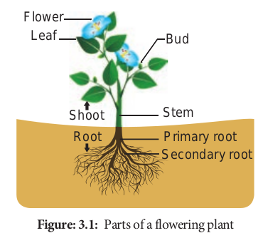

# Parts of a flowering plant

Flowering plants are called **“Angiosperms”** or **Magnoliophytes**. They are sporophytes consisting of an axis with an underground **“Root system”** and an aerial **“Shoot System”.** The shoot system has a stem, branches and leaves. The root system consists of root and its lateral branches.

**Figure: 3.1:** Parts of a flowering plant
