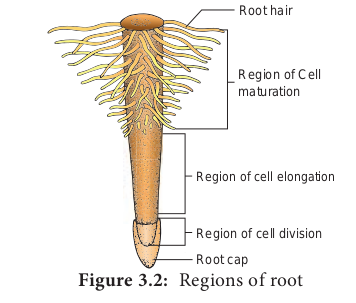

# Root System

The root is non-green, cylindrical descending axis of the plant that usually grows into the soil (positively geotropic). It develops from the radicle which is the first structure that comes out when a seed is placed in the soil. Root is responsible for absorption of water and nutrients and anchoring the plant. 
**I. Characteristic features**

- Root is the descending portion of the plant axis.
- Generally non-green in colour as it lacks chlorophyll.
- Does not possess nodes, internodes and buds (Exception in sweet potato and members of Rutaceae, roots bear buds which help in vegetative propagation)
- It bears root hairs (To absorb water and minerals from the soil)
- It is positively geotropic and negatively phototropic in nature.

**II. Regions of root**

Root tip is covered by a dome shaped structure made of parenchymatous cells called **root cap.**

It protects the meristematic cells in the apex. In _Pandanus_ multiple root cap is present. In _Pistia_ instead of root cap, root pocket is present. A few millimeters above the root cap the following three distinct zones have been classified based on their meristematic activity.

1. Meristematic Zone
2. Zone of Elongation
3. Zone of Maturation

## Types of root system

**I. Tap root system**

Primary root is the direct prolongation of the radicle. When the primary root persists and continues to grow as in dicotyledons, it forms the main root of the plant and is called the **Tap root.** Tap root produces lateral roots that further branches into finer roots. Lateral roots along with the branches together called as **secondary roots**.

**II. Adventitious root system**

Root developing from any part of the plant other than radicle is called **adventitious** root. It may develop from the base of the stem or nodes or internodes. Example: _Monstera deliciosa, Piper nigrum_. In most of the monocots the primary root of the seedling is short lived and lateral
**Table 3.1: Root zones**
|Feature|1. Meristematic Zone (Region of cell division )|2. Zone of Elongation|2. Zone of Maturation|
|---|---|---|---|
|Position|It lies just above the root caps|It lies just above the meristematic zone|It lies above the zone of elongation|
|Type Of Cells|Meristematic cells, actively divide and continuously increase in number|Elongated cells|Mature differentiated cells|
|Functions|This is the main growing tip of the root|The cells increase the length and cause enlargement of the root. |The cells differentiate into various tissues like epidermis, cortex and vascular bundles. It also produces root hairs which absorb water and minerals from the soil|

roots arise from various regions of the plant body. These are bunch of thread-like roots nearly equal in size which are collectively called **fibrous** root system generally found in grasses. Example: _Oryza sativa, Eleusine coracana_.

+-------------------+
| Root Modification  |
+-------------------+
          |
          v
+---------+---------+
| Tap Root | Adv. Root|
+---------+---------+
          |
          v
+----------------------+
| Modification Type      |
+----------------------+
          |
          v
  Select Modification ->
          |
          v
+-------------------------+  +-----------------------+
| Conical (Carrot)        |  | Storage (Sweet Potato) |
| Fusiform (Radish)       |  | Breathing (Mangrove)   |
| Napiform (Turnip)       |  | Prop (Maize)            |
+-------------------------+  |  Stilt (Screwpine)      |
                             |  Buttress (Banyan)     |
                             |  Climbing (Ivy)        |
                             |  Suckering (Banana)   |
                             |  Foliar (Orchid)       |
                             |  Photosynthetic        |
                             |  Annulated             |
                             +-----------------------+  

### Functions of root

Root performs two kinds of functions namely primary and secondary functions.

**Primary function**

1. Absorb water and minerals from soil.
2. Help to anchor the plant firmly in the soil.

**Secondary function**

In some plants roots perform additional functions. These are called **secondary functions.** To perform additional functions, structure of roots are modified.

### Modifications of root

I. Tap root modification

a. Storage roots

**1. Conical Root**

These are cone like, broad at the base and gradually tapering towards the apex. Example: _Daucus carota_.

**2. Fusiform Root**

These roots are swollen in the middle and tapering towards both ends. Example: _Raphanus sativus_

**3. Napiform Root**

It is very broad at the apex and suddenly tapers like a tail at the base. Example: _Beta vulgaris_

**b. Breathing root**

Some mangrove plants like **_Avicennia, Rhizophora, Bruguiera_** develop special kinds of roots (Negatively geotropic) for respiration because the soil becomes saturated with water and aeration is very poor. They have a number of breathing pores on pneumatophores for exchange of gases.

**II. Adventitious root modification**

**a. Storage roots**

**1. Tuberous root**
These roots are swollen without any definite shape. Tuberous roots are produced singly and not in clusters. Example: _Ipomoea batatas._
**2. Fasciculated root**
These roots are in cluster from the base of the stem Example: _Dahlia, Asparagus._
**3. Nodulose root**
In this type of roots, swelling occurs only near the tips. Example: _Maranta_ (Arrow root) _Curcuma amada_ (Mango ginger), _Curcuma longa_ (Turmeric)
**4. Moniliform or Beaded root**
These roots swell at frequent intervals giving them a beaded appearance. Example: _Vitis, Portulaca, Momordica._
**5. Annulated root**
These roots have a series of ring- like swelling on their surface at regular intervals. Example: _Psychotria_ (Ipecac)

**b. Mechanical support**

**1. Prop (Pillar) root**
These roots grow vertically downward from the lateral branches into the soil. Example: _Ficus benghalensis_ (banyan tree), Indian rubber.
**2. Stilt (Brace) root**
These are thick roots growing obliquely from the basal nodes of the main stem. These provide mechanical support. Example: _Saccharum officinarum, Zea mays, Pandanus and Rhizophora_.
**3. Climbing (clinging) roots**
These roots are produced from the nodes of the stem which attach themselves to the support and help in climbing. To ensure a foothold on the support they secrete a sticky juice which dries up in air, attaching the roots to the support. Example: _Piper betel_.
**4. Buttress root**
In certain trees broad plank like outgrowths develop towards the base all around the trunk. They grow obliquely downwards and give support to huge trunks of trees. This is an adaptation for tall rain forest trees. Example: _Bombax ceiba_ (Red silk cotton tree), _Ceiba pentandra_ (white silk cotton tree), _Delonix regia, Bombax._

**c. Vital functions**

**1. Epiphytic or velamen root**

Some epiphytic orchids develop a special kind of aerial roots which hang freely in the air. These roots develop a spongy tissue called **velamen** which helps in absorption of moisture from the surrounding air. Example: _Vanda, Dendrobium_.

**2. Foliar root**

Roots are produced from the veins or lamina of the leaf for the formation of new plant. Example: _Bryophyllum,_ _Begonia_.

**3. Sucking or Haustorial roots**
These roots are found in parasitic plants. Parasites develop adventitious roots from stem which penetrate into the tissue of host plant and suck nutrients.
Example: _Cuscuta_ (dodder), _Cassytha_, _Orobanche_ (broomrape), _Viscum_ (mistletoe), _Dendrophthoe_.

**4. Photosynthetic or assimilatory roots**
Roots of some climbing or epiphytic plants develop chlorophyll and turn green which help in photosynthesis. Example: _Tinospora_, _Trapa natans_ (water chestnut), _Taeniophyllum_.
